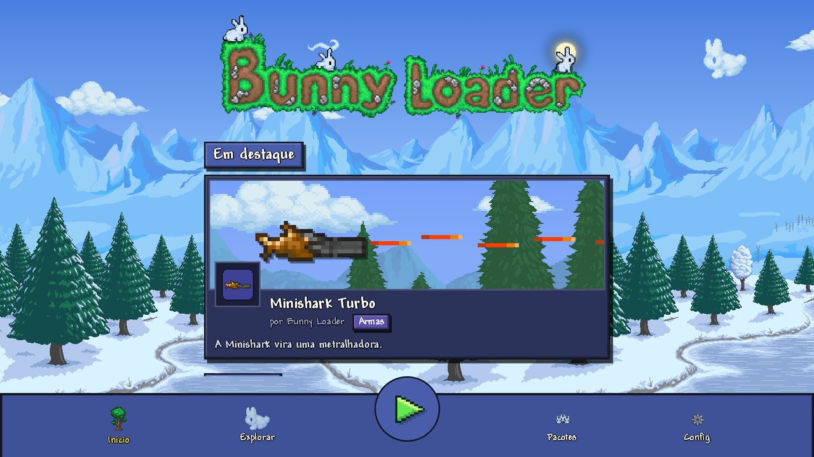
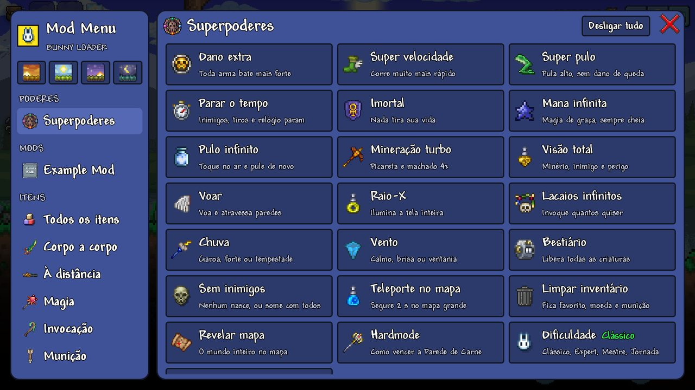

# Bunny Loader

Loader de mods para o **Terraria Mobile**. É um app Android que sobe o jogo
dentro do próprio processo, intercepta métodos do código nativo gerado pelo
IL2CPP e roda mods escritos em **JavaScript**, no formato do tModLoader
(`ModItem`, `ModNPC`, `ModProjectile`, `SetDefaults`, `AI`...).



- Mods em JavaScript (motor [QuickJS](https://github.com/quickjs-ng/quickjs),
  sem JIT), com acesso direto às classes do jogo e `hook()` em qualquer método.
- Conteúdo novo como no tModLoader: itens, armas, projéteis, pets, lacaios,
  inimigos, moradores com loja, chefes com música, blocos, buffs, receitas.
- Save limpo: o conteúdo de mod vai ao lado do save do jogo, pelo nome, e o
  mundo abre sem o mod.
- Mod Menu dentro do jogo: itens e NPCs de cada mod, e superpoderes.



> Este repositório **não** inclui os binários nem os assets do Terraria
> (`libil2cpp.so`, `libunity.so`, os dados do jogo): eles ficam fora do Git e
> são integrados localmente, e o jogo só abre para quem tem o Terraria oficial
> da Play instalado. Os dumps em `refs/` são gerados localmente e nunca
> publicados. Algumas texturas da interface (fundos, ícones do menu, capas dos
> mods de exemplo) são recortes da arte do Terraria, gerados por
> `tools/ui-sprites.py` e `tools/mod-art.py`.

## Documentação

Tudo em [`docs/`](docs/README.md):

- **[Criando mods](docs/mods/README.md)**: do primeiro hook ao chefe com
  música, em 11 guias.
  1. [Hooks: mudar o que o jogo já tem](docs/mods/01-hooks-do-zero.md)
  2. [`ref` e `out`](docs/mods/02-ref-e-out.md)
  3. [Custo e desempenho](docs/mods/03-custo-e-desempenho.md)
  4. [Conteúdo novo: as ideias](docs/mods/04-conteudo-novo.md)
  5. [Itens](docs/mods/05-itens.md) · 6. [Projéteis](docs/mods/06-projeteis.md) ·
     7. [NPCs](docs/mods/07-npcs.md) · 8. [Jogador e buffs](docs/mods/08-jogador-e-buffs.md) ·
     9. [Blocos](docs/mods/09-blocos.md) · 10. [Sons e música](docs/mods/10-sons-e-musica.md)
  11. [Conversa entre mods](docs/mods/11-conversa-entre-mods.md)
- **Referência**: [o que cada classe tem hoje](docs/referencia/classes.md) e
  [a ponte e o `bl`](docs/referencia/ponte-e-bl.md).
- **[O núcleo nativo](docs/nucleo/README.md)**, para quem mexe no Bunny
  Loader: [hooks](docs/nucleo/hooks.md), [threads e o motor JS](docs/nucleo/threads-e-motor-js.md),
  [a ponte](docs/nucleo/ponte.md), [conteúdo novo](docs/nucleo/conteudo.md).
- **[Histórico](docs/historico/README.md)**: decisões, investigações e
  medições.

Os mods instalados ficam em `Android/data/com.bunnyloader/bunny_packs/<uid>/`,
e o jogo carrega de lá: dá para editar um mod direto no aparelho e só reabrir
o jogo.

## Um mod em 10 linhas

```js
// content/main.js: toda arma bate o dobro
Terraria.Item['void SetDefaults(int Type, ItemVariant variant)'].hook((original, self, type, variant) => {
    original(self, type, variant);
    if (self.damage > 0) self.damage *= 2;
});

bl.log('Dano em Dobro: ativo');
```

Os exemplos completos estão em [`samples/`](samples), do menor
([`DobroDeDano`](samples/DobroDeDano)) ao [`ExampleMod`](samples/ExampleMod),
o do tModLoader portado.

## Stack

| Camada | Tecnologia |
|---|---|
| App e launcher | Kotlin + Jetpack Compose |
| Núcleo nativo | C++20 (NDK + CMake) → `libbunny.so` |
| Hooks | [ShadowHook](https://github.com/bytedance/android-inline-hook) (inline, ARM64), com cadeia própria |
| IL2CPP | a API de embutir (`il2cpp_*`), por `dlsym`; tudo resolvido por nome |
| Motor de mod | QuickJS (quickjs-ng) |
| Dump do jogo | Il2CppDumper |

## Estrutura

```
app/src/main/
  kotlin/dev/bunnyloader/   App Android: launcher e a GameActivity que sobe a Unity
  cpp/                      Núcleo nativo (libbunny.so); mapa em docs/nucleo/README.md
  res/                      Recursos Android
samples/                    Mods de exemplo, do mais simples ao ExampleMod
docs/                       Documentação (guias, referência, núcleo, histórico)
tools/                      Ferramentas de PC: build rápido, dump, testes, benchmark
refs/                       Dump local do jogo (NÃO versionado)
```

## Build

Abra a pasta no Android Studio e deixe o **Gradle Sync** rodar: ele baixa o
Gradle e oferece instalar a plataforma SDK que faltar.

1. SDK Manager → aba **SDK Tools** → instale **NDK (Side by side)** e
   **CMake**.
2. Clone o QuickJS em `app/src/main/cpp/third_party/quickjs/` (ver o
   [README de lá](app/src/main/cpp/third_party/README.md)). Sem ele, o build
   passa e o motor de mods fica em modo stub.
3. O runtime do jogo (as `.so` em `app/src/main/jniLibs/arm64-v8a/` e os
   dados em `terraria1456_assets/`) não está no repositório; ver o
   [README da pasta](app/src/main/jniLibs/arm64-v8a/README.md). Sem ele, o app
   compila e instala, e a `GameActivity` diz que o runtime falta.

Atalhos:

| | |
|---|---|
| `-Pbl.nativeBuild=false` | Só o launcher, sem NDK nem CMake. |
| `-Pbl.uiOnly=true` | Sem os assets e as `.so` do jogo: o ciclo de interface cai para ~6 s ([`tools/ui.sh`](tools/ui.sh)). |

### Dump do jogo

```bash
tools/dump.sh
```

Gera `refs/` (o `dump.cs` com todas as classes, campos e métodos do jogo) a
partir do Terraria instalado. Ver [`refs/README.md`](refs/README.md).

### Testes

Os testes são mods em [`tools/tests/`](tools/tests), rodados no emulador por
[`tools/bench/run.sh`](tools/bench/run.sh). Ver [`tools/README.md`](tools/README.md).
O desenvolvimento é feito no MuMu Player (que roda o ARM do jogo por tradução,
e onde os hooks funcionam) e conferido em aparelho ARM de verdade.
