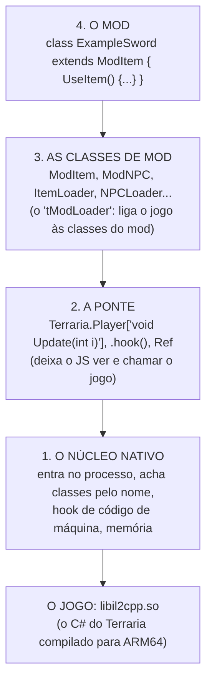
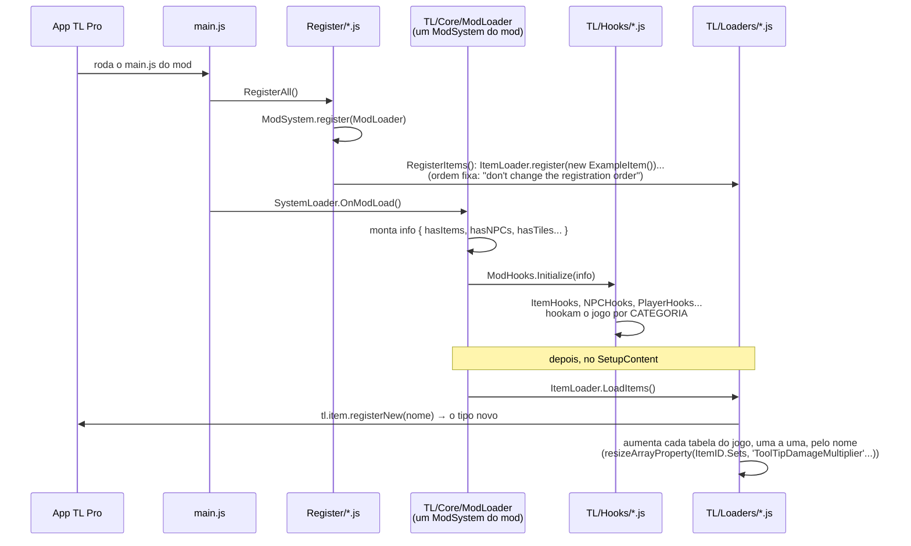
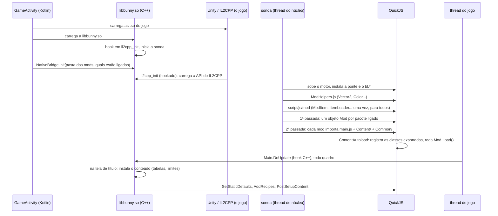
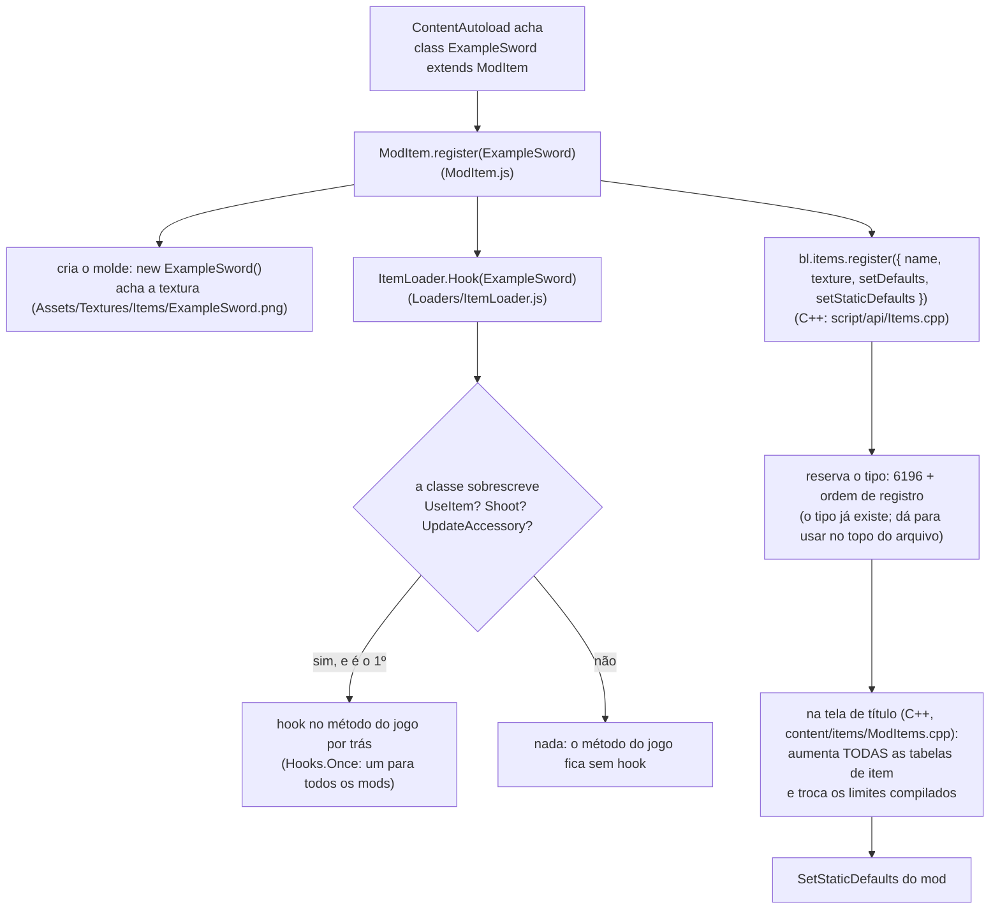
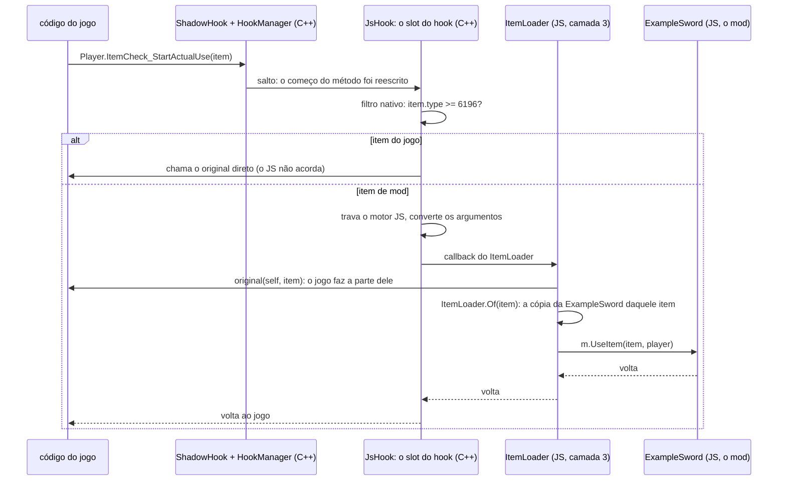

# 0. Como funciona: do TL Pro ao Bunny Loader

Quem vem do TL Pro escreve mod do mesmo jeito aqui: `class X extends ModItem`,
`SetDefaults`, `Terraria.Item['void SetDefaults(int Type, ItemVariant variant)'].hook(...)`.
O que muda é **quem faz o quê por baixo**. Este guia mostra o fluxo inteiro
nos dois: o do TL Pro, pelo Example Mod dele (o ExMod v1.7.1, de GST378 e
Animatak_), e o do Bunny Loader, do boot ao `UseItem` de uma espada.

Não é preciso ler para fazer um mod (os guias 1 a 12 bastam). É para
entender de onde vem cada coisa, e por que o Bunny Loader tem C++ e JS.

## As quatro camadas

Todo loader de mods de Terraria Mobile tem as mesmas peças. A diferença é
onde cada uma mora.



| Camada | O que faz | No TL Pro | No Bunny Loader |
|---|---|---|---|
| 1. Núcleo | Sobe junto com o jogo, hook inline, memória | O app TL Pro | `libbunny.so` (C++) |
| 2. Ponte | `Terraria.*`, `.hook()`, `new Ref()` | O app TL Pro (`tl.*`, `NativeClass`) | `libbunny.so` (`script/bridge/`) + `bl.*` |
| 3. Classes de mod | `ModItem`, `ItemLoader`, os hooks do jogo | **Dentro de cada mod** (a pasta `TL/`) | **Dentro do loader** (`script/js/mod/`), uma vez para todos |
| 4. Conteúdo | As classes do autor, texturas, textos | O mod | O mod |

A linha 3 é a diferença que importa. O resto deste guia é ela em detalhe.

### Por que existe C++

O Terraria do celular não tem C#. O IL2CPP converteu o jogo em código de
máquina (`libil2cpp.so`) antes de ir para a loja. Não há máquina virtual .NET
para carregar uma DLL, nem reflexão para trocar um método. Um método é só um
trecho de ARM64, e quem o chama salta direto para o endereço dele.

Então só código nativo consegue:

- **interceptar** um método: reescrever as primeiras instruções dele com um
  salto (hook inline, [ShadowHook](https://github.com/bytedance/android-inline-hook));
- **achar** classes e métodos pelo nome, pela API do IL2CPP
  (`il2cpp_class_from_name`...);
- **mexer na memória** com segurança: aumentar um array de 754 posições, trocar
  um `cmp #752` compilado dentro de um método, gravar arquivos ao lado do save;
- rodar o que precisa ser **rápido**: o que acontece para todo item, todo tile
  na tela, todo quadro.

### Por que existe JS

O mod é JavaScript (o motor é o [QuickJS](https://github.com/quickjs-ng/quickjs),
dentro do jogo). Para uma classe `ModItem` com `UseItem()` funcionar, alguém
precisa ligar "o jogador usou um item" a "chamar o `UseItem` daquela classe".
Esse alguém é a camada 3. Ela conversa o tempo todo com classes JS do mod, então
é natural que também seja JS.

## O fluxo no TL Pro (o ExMod v1.7.1)

### O pacote

```
ExMod_v1.7.1/
├── Settings.json            título, guid, autores, versão
└── Modified/
    ├── 1.json
    └── 1.mod/
        ├── main.js          a entrada
        ├── Register/        RegisterAll.js, RegisterItems.js, RegisterNPCs.js... (18 arquivos)
        ├── Content/         as classes do mod (ExampleItem.js, ExampleSword.js...)
        ├── Textures/, Localization/
        └── TL/              ← o framework: 104 arquivos, ~16,7 mil linhas
            ├── Core/        ModLoader.js, FileManager.js, Prototypes.js...
            ├── Loaders/     ItemLoader.js, NPCLoader.js, TileLoader.js... (21)
            ├── Hooks/       Item.js, NPC.js, Player.js, Main.js... (14)
            ├── Modules/     Vector2.js, Color.js, Rand.js...
            └── ModItem.js, ModNPC.js, ModSystem.js, GlobalItem.js...
```

A pasta `TL/` é o "tModLoader" do ExMod, e ela vem **dentro do mod**. Um
segundo mod feito a partir do ExMod leva a própria cópia.

### A carga



Em ordem:

1. O app TL Pro roda o `main.js`, que chama `RegisterAll()` e depois
   `SystemLoader.OnModLoad()`.
2. `RegisterAll()` registra **à mão**, arquivo por arquivo: primeiro o
   `ModLoader` (que no ExMod é um `ModSystem` do próprio mod), depois
   `RegisterBackgrounds()`, `RegisterBuffs()`, `RegisterNPCs()`,
   `RegisterItems()`... numa ordem que o autor não deve mudar. Cada
   `RegisterX.js` importa cada classe e registra (`new ExampleItem()`). Classe
   nova no mod = uma linha nova no `Register`.
3. `OnModLoad` monta um resumo (`hasItems`, `hasNPCs`...) e chama
   `ModHooks.Initialize(info)`: cada arquivo de `TL/Hooks/` hooka os métodos do
   jogo da **categoria** que o mod usa. Um mod com itens ganha todos os hooks
   de item, mesmo os que nenhum item dele usa.
4. No `SetupContent`, cada `Loader` cria o conteúdo: `tl.item.registerNew(nome)`
   (a função nativa do TL Pro) devolve o tipo novo, e o **JS do mod** aumenta
   as tabelas do jogo uma a uma, pelo nome. Só o `ItemLoader` do ExMod tem
   umas 120 linhas assim
   (`resizeArrayProperty(Terraria.ID.ItemID.Sets, 'CanGetPrefixes', nextItem, true)`...).
   Tabela que não está na lista fica curta.
5. Para vários mods conviverem, o `ModLoader` do ExMod conta os nomes que já
   existem (`ItemID.Search.Names.Count`) antes e depois, e desloca os próprios
   tipos por essa diferença (`ModData`).

### Em jogo

O hook de `Item.SetDefaults` do ExMod (`TL/Hooks/Item.js`) é o exemplo típico:

```js
Terraria.Item['void SetDefaults(int Type, ItemVariant variant)'].hook((original, self, type, variant) => {
    const flag = ItemLoader.isModType(type);
    if (!flag) original(self, type, variant);
    ...
});
```

**Todo** item do jogo que nasce (cada drop, cada item de loja, cada slot do
inventário) entra no JS, e só lá dentro o mod descobre que não era dele.

### O que isso causa

- **Cada mod carrega o framework inteiro** (~16,7 mil linhas). Corrigir um bug
  no `ItemLoader` é atualizar todo mod que o copiou.
- **Dois mods = dois frameworks.** Cada um hooka o `Item.SetDefaults`, cada um
  aumenta as tabelas, cada um conta os tipos do outro para não colidir.
- **O custo é por categoria, não por uso.** Os hooks entram no JS para toda
  entidade do jogo, e o filtro ("é meu?") é feito em JS.
- **O autor mantém o `Register/`** na mão e na ordem certa.
- **As tabelas são uma lista escrita à mão.** Uma versão nova do jogo com uma
  tabela nova (ou uma que o autor esqueceu) quebra em silêncio: o jogo lê além
  do fim.

## O fluxo no Bunny Loader

### O pacote

```
MeuMod/
├── manifest.json        uid, id, nome, versão, versão do jogo
└── content/
    ├── main.js          export default class MeuMod extends Mod { }
    ├── Content/         as classes (Items/ExampleSword.js...)
    ├── Common/          ModPlayer, ModSystem, Global*
    ├── Assets/          Textures/, Sounds/, Music/
    └── Localization/    en-US.json, pt-BR.json...
```

Não tem `TL/`, nem `Register/`. A camada 3 está no loader, e o registro é
automático: toda classe exportada em `Content/` e `Common/` que estende uma
classe de mod é registrada sozinha (`static Autoload = false` deixa uma de
fora).

### Onde mora cada camada

| Camada | Onde | O que tem |
|---|---|---|
| Kotlin | `app/src/main/kotlin/` | O launcher (lista de mods, importar) e a `GameActivity`, que sobe o jogo. |
| 1. Núcleo (C++) | `app/src/main/cpp/` (`boot/`, `hook/`, `il2cpp/`, `content/`) | Boot, hooks inline, tabelas, limites compilados, saves, Mod Menu. |
| 2. Ponte (C++) | `app/src/main/cpp/script/bridge/`, `script/api/` | `Terraria.*`, `.hook()`, `Ref`, e as funções `bl.*` (`bl.items.register`...). |
| Ajudantes (JS) | `app/src/main/cpp/script/js/ModHelpers.js` | `Vector2`, `Color`, `MathHelper`, `Rand`, `ItemRarityID`. |
| 3. Classes de mod (JS) | `app/src/main/cpp/script/js/mod/` | Na raiz a API (`ModItem.js`, `ModTile.js`...), em `Loaders/` os hooks do jogo (`ItemLoader`, `TileLoader`...), em `Core/` o comum (`Safe`, `Hooks`, `Ready`, `ModNet`, `ContentAutoload`), em `Enums/` as constantes. |
| 4. O mod (JS) | `Android/data/com.bunnyloader/bunny_packs/<uid>/` | O pacote acima. |

O JS das camadas 2 e 3 é **embutido na `libbunny.so`** na compilação (o CMake
junta os arquivos numa função só, na ordem da lista `BL_MOD_CLASSES_PARTS` do
`CMakeLists.txt`). Nenhum mod vê as classes internas (`ItemLoader`, `Safe`...):
só as exportadas (`ModItem`, `ModContent`, `SoundStyle`...).

### O boot



1. **Kotlin.** A `GameActivity` carrega o jogo e a `libbunny.so`, e passa a
   configuração (`boot/jni_entry.cpp`).
2. **`il2cpp_init`.** A `libbunny` espera o IL2CPP terminar e carrega a API
   dele (`boot/LibWatcher.cpp`, `il2cpp/Api.cpp`).
3. **A sonda** (`boot/Probe.cpp`), uma thread do núcleo, espera o jogo assentar
   e sobe o QuickJS: primeiro a ponte, depois o `ModHelpers.js`, depois as
   classes de mod (`script/js/mod`). Tudo isso roda **uma vez**, antes de
   qualquer mod.
4. **Os mods, em duas passadas** (`mods/ModLoader.cpp`). Na primeira, todo mod
   ligado ganha o objeto `Mod` dele (por isso `ModLoader.TryGetMod` acha um mod
   que ainda não carregou). Na segunda, cada mod é importado como **módulo ES**
   (escopo próprio: dois mods com um `const x` não colidem), e o
   `ContentAutoload` (`Core/ContentAutoload.js`) registra as classes
   exportadas numa ordem fixa por tipo (buffs, jogador, NPCs, projéteis,
   itens, tiles, sistemas, globais) e roda o `Load()` da classe `Mod`.
5. **A thread do jogo.** Um hook C++ no `Main.DoUpdate` roda todo quadro. Na
   tela de título ele **instala** o conteúdo registrado (as tabelas, os limites,
   os nomes) e chama o `SetStaticDefaults` de cada classe; depois, o
   `onContentReady` roda os `AddRecipes` e `PostSetupContent`.

### O registro de um item

O que acontece quando o `ContentAutoload` acha `export class ExampleSword extends ModItem`:



Três diferenças para o TL Pro:

- **O tipo vem do núcleo, um para todos.** `bl.items.register` reserva os tipos
  de todos os mods numa sequência só. Ninguém precisa contar os tipos do outro.
- **As tabelas são achadas, não listadas.** O núcleo (`content/common/TypeTables.cpp`)
  procura, nas classes do jogo, **todo** array estático com exatamente
  `ItemID.Count` posições (~127 para itens, ~220 para tiles) e aumenta todos. A
  lista de classes foi conferida contra toda alocação desse tamanho na
  `libil2cpp.so`. O autor do mod não mantém lista nenhuma.
- **Os limites compilados são trocados.** Parte do jogo tem o número escrito no
  código de máquina (`if (type > 752) return false` no `PlaceTile`). O núcleo
  acha essas comparações (`hook/CodePatch.cpp`) e troca o número pelo total
  novo. Isso não existe em JS.

### Quem faz os hooks

Três fontes. Todas terminam no mesmo mecanismo do C++.

| Quem | Onde | Quando | Exemplo |
|---|---|---|---|
| **O núcleo** | C++, `hook::install` (ou um slot com callback em C++) | Sempre | O tick do `Main.DoUpdate`, o save do mundo e do personagem, o `Item.SetDefaults` dos itens de mod (`script/api/Items.cpp`), o desenho dos móveis. |
| **As classes de mod** | JS, `script/js/mod/Loaders/` | Só se **alguma** classe sobrescreve o método, e **uma vez** para todos os mods | `ItemLoader` hooka `Player.ItemCheck_StartActualUse` se alguém tem `UseItem`. |
| **O próprio mod** | JS, `.hook()` no `Load()` ou no topo | Quando o autor quer | `Terraria.Player['void Update(int i)'].hook(...)`, como no TL Pro. |

Cada hook JS com tipo usa um **filtro nativo**: o C++ lê o `type` do objeto
antes de acordar o JS. Item do jogo passa direto para o original, e o JS nem é
chamado:

```js
// Loaders/ItemLoader.js: só item de mod (type >= 6196) entra no JS.
P['void ItemCheck_StartActualUse(Item sItem)'].hook((original, self, item) => { ... }, { minType: FIRST_ITEM, on: 0 });
```

Os mods também podem usar os filtros (`minType`, `on`, `tile`, `tileAt`); ver o
[guia 3](03-custo-e-desempenho.md#filtros-nativos).

### Uma chamada, do jogo ao `UseItem`

O jogador usa a `ExampleSword`:



- **ShadowHook** reescreveu o começo do método e guarda as instruções
  originais num trampolim, que é o `original()`.
- **HookManager** deixa vários hooks no mesmo método, em cadeia (o do
  `ItemLoader`, o de um `GlobalItem`, o de um mod).
- **JsHook** tem uma função pronta por hook (os slots). Ela confere o filtro,
  trava o motor JS (que é um só para todos os mods), converte `Item` em objeto
  JS e chama o callback.
- **`ItemLoader.Of(item)`** acha a instância da `ExampleSword` daquele item: cada
  `Item` de mod tem a própria cópia do molde (o `Clone`), guardada ao lado do
  objeto do jogo.
- Um erro no `UseItem` do mod vira uma linha de log (`Safe.Run`): o jogo segue.

Os detalhes de cada peça estão em [hooks por dentro](../nucleo/hooks.md) e
[threads e o motor JS](../nucleo/threads-e-motor-js.md).

### O save

O mundo e o personagem do jogo **nunca** levam conteúdo de mod. O que é de mod
vai em arquivos ao lado, pelo nome (`<uid do mod>/<Classe>`), não pelo número:

| Arquivo | O que guarda |
|---|---|
| `<personagem>.plr.bl` | Os itens de mod do inventário, equipamento, tinturas e baús pessoais, e os buffs de mod ativos. A lixeira não é salva. |
| `<personagem>.plr.bl.json` | O `SaveData` de cada `ModPlayer`. |
| `<mundo>.wld.bl` | Os itens de mod nos baús do mundo. |
| `<mundo>.wld.tiles.bl` | Os tiles de mod (posição, quadro). |
| `<mundo>.wld.bl.json` | O `SaveWorldData` de cada `ModSystem`. |

Sem o mod, o mundo e o personagem abrem no jogo puro, e os arquivos ao lado
guardam o conteúdo para quando o mod voltar. A ordem dos mods pode mudar: o
conteúdo volta pelo nome.

## Lado a lado

| | TL Pro (ExMod v1.7.1) | Bunny Loader |
|---|---|---|
| Onde fica o framework (`ModItem`, `ItemLoader`, hooks) | Em cada mod (`TL/`, ~16,7 mil linhas) | No loader (`script/js/mod/`), um para todos |
| Registro | À mão, no `Register/`, em ordem fixa | Automático: toda classe exportada em `Content/` e `Common/` |
| Entrada | `main.js` chama `RegisterAll()` | `main.js` exporta `class X extends Mod` |
| Tipo novo | `tl.item.registerNew`, e o mod conta os tipos dos outros | `bl.items.register`, uma sequência só para todos |
| Tabelas do jogo | Listadas à mão no `Loader` (~120 só de item) | Achadas pelo tamanho (~127 de item, ~220 de tile) |
| Limites compilados (`type > 752`) | Não | Trocados no código de máquina |
| Quando um hook é instalado | Por categoria (tem itens → todos os hooks de item) | Por método (só se alguma classe sobrescreve) |
| Filtro "é meu?" | Em JS, dentro do hook | Nativo, antes do JS |
| Dois mods no mesmo método | Dois frameworks, dois hooks | Um hook da camada 3, em cadeia com os dos mods |
| Save | Pelo framework do mod (`TL/WorldDB.js`, `TL/PlayerDB.js`) | Pelo núcleo, ao lado do `.plr`/`.wld`, pelo nome; o jogo abre sem o mod |
| Escopo de cada arquivo | Módulo ES | Módulo ES |
| Sintaxe da ponte | `Terraria.X['assinatura'].hook(...)` | A mesma, com os nomes exatos dos parâmetros ([ponte](../referencia/ponte-e-bl.md)) |

## Trazendo um mod do TL Pro

O código de conteúdo (`SetDefaults`, `AI`, `UseItem`...) quase não muda. O que
sai:

- a pasta **`TL/` inteira**: `ModItem`, `ModNPC`, `ModContent`, `Vector2`,
  `Color`... já são globais;
- a pasta **`Register/`**: exporte as classes (`export class ExampleSword extends ModItem`);
- o **`main.js`** vira a classe do mod (`export default class MeuMod extends Mod {}`),
  com os hooks próprios no `Load()`;
- `tl.*` vira `bl.*` ([a ponte e o `bl`](../referencia/ponte-e-bl.md));
- os imports entre arquivos do mod continuam valendo (`import { X } from './Y.js'`).

A lista do que cada classe tem hoje, e do que ainda falta em relação ao
tModLoader, está na [referência](../referencia/classes.md).
