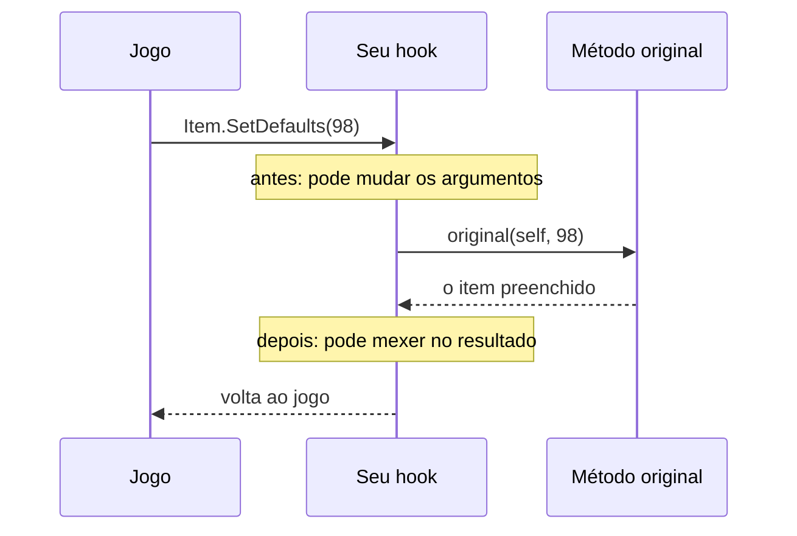
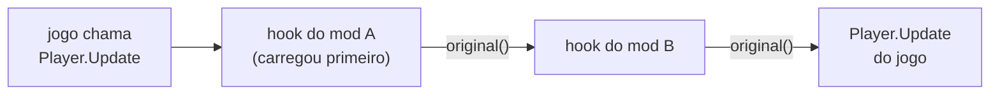

# 1. Hooks: mudar o que o jogo já tem

Este guia faz um mod do zero e, no caminho, mostra tudo o que a **ponte**
entre o JavaScript e o Terraria oferece: achar classes, ler e escrever campos,
chamar métodos e, principalmente, **interceptar** métodos com hooks.

É o guia base. Os de conteúdo novo (itens, NPCs...) usam tudo daqui.

## O que é um hook

O Terraria é feito de métodos: `Player.Update` atualiza o jogador a cada
quadro, `Item.SetDefaults` preenche os atributos de um item novo, `NPC.AI`
move cada inimigo. Um **hook** é um desvio num desses métodos: toda vez que o
jogo chamar o método, ele chama primeiro uma função **sua**. Dentro dela, você
decide:

- deixar o jogo fazer o que já fazia (chamar o **original**), e mexer no
  resultado depois;
- mudar o que entra (os argumentos) antes de o jogo processar;
- trocar o que sai (o retorno);
- ou não deixar o método do jogo rodar.



O hook pega **toda** chamada ao método, venha de onde vier: do jogo, de outro
mod ou do seu próprio código. É a ferramenta mais poderosa do Bunny Loader, e
também a mais fácil de usar mal (ver o [guia de custo](03-custo-e-desempenho.md)).

**Hook ou classe de mod?** Para mudar o que o jogo **já tem** (a Minishark, o
dano de toda arma, a queda), use hook. Para **criar** algo novo (um item, um
inimigo), use as classes de mod do [guia 4](04-conteudo-novo.md): elas
instalam os hooks certos por você, já filtrados.

## O primeiro mod: dano em dobro

Crie esta pasta:

```
DanoEmDobro/
  manifest.json
  content/
    main.js
```

`manifest.json` (gere um `uid` seu, ver o [README](README.md#o-manifestjson)):

```json
{
  "uid": "0b8f2a64-3c1d-4e7a-9f50-6d2e8c1b4a73",
  "id": "danoemdobro",
  "name": "Dano em Dobro",
  "version": "1.0.0",
  "author": "Você",
  "category": "Armas",
  "summary": "Toda arma bate o dobro.",
  "blVersion": 1,
  "entry": "main.js"
}
```

`content/main.js`:

```js
const SetDefaults = Terraria.Item['void SetDefaults(int Type, ItemVariant variant)'];

SetDefaults.hook((original, self, type, variant) => {
    original(self, type, variant);   // o jogo preenche o item primeiro
    if (self.damage > 0) {
        self.damage = self.damage * 2;
    }
});

bl.log('Dano em Dobro: ativo');
```

Instale (ver o [README](README.md#instalando)), abra o jogo, e toda arma nasce
com o dobro do dano. O log (`Android/data/com.bunnyloader/logs/`, ou
`adb logcat -s BunnyLoader`) mostra `Dano em Dobro: ativo`.

### A anatomia

As linhas do hook são o esqueleto de quase todo mod:

1. **pegar o método** do jogo, pela classe e pela assinatura
   (`Terraria.Item['void SetDefaults(...)']`);
2. **pendurar um hook** nele (`.hook(callback)`);
3. **chamar o original**, para o jogo fazer o que já fazia;
4. **mexer** no resultado.

`Item.SetDefaults` é onde o Terraria preenche um item novo: dano, cadência,
tamanho da pilha. Ele roda uma vez para cada item criado, então mudar aqui
vale para tudo: o que você fabrica, o que cai de inimigo, o que já está no
baú quando o mundo carrega.

## Achando classes e métodos

O jogo é C# compilado para código nativo (IL2CPP). Os nomes de classe, campo e
método são os do C#, e você os encontra no **dump** do jogo: o `refs/dump.cs`,
gerado por [`tools/dump.sh`](../../tools/dump.sh) a partir do jogo instalado
(ver [`refs/README.md`](../../refs/README.md)). Para ler uma classe inteira:

```bash
tools/dumpgrep.sh Player Terraria
```

No JS, as classes ficam na árvore de namespaces do C#, sem declarar nada:

```js
Terraria.Player
Terraria.Item
Terraria.ID.ItemID
Microsoft.Xna.Framework.Vector2
Terraria.GameContent.ItemDropRules.ItemDropRule
System.Threading.Thread
```

- Classe **sem namespace** (a interface do celular: `GUIBuffs`, `GUIInstance`,
  `GUIChest`...) é global, pelo nome: `GUIBuffs['void Draw()']`.
- Classe **aninhada** é propriedade da de fora: `SpriteFont.Glyph`,
  `Terraria.Player.Hooks`.
- Quando a árvore não chega numa classe (nome gerado pelo compilador), use
  `bl.classOf('Terraria', 'Player')` (sem namespace:
  `bl.classOf('', 'GUIBuffs')`).

Um caminho que não leva a nada dá erro no acesso final, com o caminho
completo na mensagem.

## Campos

Campo é propriedade JS. Estático na classe, de instância no objeto:

```js
Terraria.Main.dayTime                  // estático: true de dia
Terraria.ID.ItemID.Minishark           // constante: 98

const p = Terraria.Main.player[Terraria.Main.myPlayer];
p.statLife = p.statLifeMax2;           // de instância: vida cheia
```

- **Propriedade C#** (`get_X`/`set_X`) também vira propriedade:
  `Terraria.Main.myPlayer` chama `get_myPlayer()` por baixo.
- **O tipo do campo decide a escrita.** `item.shootSpeed = 10` grava um
  `float`, `item.useTime = 4` um `int`. Um valor do tipo errado (texto onde se
  espera número) dá `TypeError`, nunca vira 0 calado.
- **Enum** é número: `Terraria.PartyHatColor.Pink` é `2`.
- **Array** é array: `Terraria.Main.player[0]`, `Terraria.Main.npc.length`.
  Onde o jogo espera um array (`int[]`, `string[]`), um array JS também serve.
- **Objeto** é um objeto JS que embrulha o do jogo, e o mesmo objeto do jogo
  é sempre o mesmo objeto JS: `Main.player[0] === self` dá `true`.
- `bl.log(objeto)` mostra a classe: `[Player]`.

### Structs são vistas, não cópias

`Vector2`, `Color`, `Rectangle` são **structs**: valores guardados dentro do
objeto, não objetos à parte. Lidos de um campo, eles são uma **vista** para
dentro do dono. Escrever na vista altera o jogo:

```js
npc.position.X = 100;          // move o NPC
item.color.R = 255;
npc.position = outroVector2;   // troca o struct inteiro
bl.log(npc.position);          // Vector2(X=100, Y=42)
```

Duas exceções, que são a semântica de valor do C#: o struct que um **método
devolve** e o que chega como **argumento de um hook** são **cópias**. Escrever
neles não muda nada no jogo.

Structs de números iguais (`proj.ai`, `proj.localAI`, `proj.oldPos`) aceitam
índice como um array: `proj.ai[0]++`, `proj.oldPos[3].X`. Fora do tamanho, é
`RangeError`.

## Métodos

Pela **assinatura**, copiada do dump como está lá:

```js
const Update = Terraria.Player['void Update(int i)'];
Terraria.Main['int get_myPlayer()']();
item['void SetDefaults(int Type, ItemVariant variant)'](98, null);
```

- O objeto é o `this`, como em qualquer método JS: `item['...'](98, null)`.
  Chamando pela variável, o objeto vai como primeiro argumento:
  `Update(player, 0)`.
- Se o método tem **um só** overload, o nome basta:
  `Terraria.Recipe.UpdateWhichItemsAreCrafted()`, `entry.Info.Add(x)`. Com mais
  de um, o nome sozinho é **recusado**, com a lista dos overloads na mensagem.
  Nunca é escolhido um ao acaso.
- `null` vale para qualquer objeto. **Nullable** (`float?`, `Rectangle?`) é
  `null` ou o valor, e na assinatura vale qualquer grafia (`float?`,
  `Nullable<float>`, ``Nullable`1``):

  ```js
  Terraria.Main['void StartRain(bool instant, float? strengthOverride, bool garenteeCoinRain)'](true, null, false);
  ```

- Um método do jogo que lança exceção vira exceção JS (`InternalError`), que
  dá para pegar com `try`/`catch`.

### Criando objetos

`new Item()` do C# é `.new()` e depois o construtor, pela assinatura:

```js
const it = Terraria.Item.new();
it['void .ctor()']();

const v = Microsoft.Xna.Framework.Vector2.new();
v['void .ctor(float x, float y)'](5, 10);
```

Para os structs mais comuns há atalhos globais: `Vector2.new(5, 10)`,
`Color.new(255, 0, 0)`, `Rectangle.new(0, 0, 16, 16)` (ver os
[ajudantes](04-conteudo-novo.md#ajudantes)).

## Hooks

### O callback

`.hook(callback)` instala o hook. O callback recebe, em ordem:

1. `original`: a função que roda o método do jogo;
2. `self`: o objeto (só em método de **instância**);
3. os argumentos do método, na ordem da assinatura.

```js
// método de instância: self vem antes dos argumentos
Terraria.Player['void Update(int i)'].hook((original, self, i) => {
    original(self, i);
});

// método estático: não há self
Terraria.Main['int DamageVar(float dmg, float luck)'].hook((original, dmg, luck) => {
    return original(dmg, luck);
});
```

### Chamar ou não o original

É a decisão central de todo hook:

```js
// DEPOIS: o jogo faz o dele, você ajusta. O mais comum.
Update.hook((original, self, i) => {
    original(self, i);
    self.moveSpeed *= 1.5;
});

// ANTES: você prepara a entrada, o jogo processa.
const Hurt = Terraria.Player['double Hurt(PlayerDeathReason damageSource, int Damage, int hitDirection, bool pvp, bool quiet, bool Crit, int cooldownCounter, bool dodgeable)'];
Hurt.hook((original, self, source, damage) => {
    return original(self, source, Math.floor(damage / 2));   // metade do dano; o resto como veio
});

// NO LUGAR: o método do jogo não roda.
Terraria.Player['void DropTombstone(long coinsOwned, NetworkText deathText, int hitDirection)']
    .hook(() => {});   // morrer não deixa lápide
```

**`original` aceita argumentos novos.** Cada um substitui o seu, na ordem
(`self` primeiro, se houver); o que você não passar fica como veio.
`original()` sem nada reexecuta com os argumentos exatos que chegaram.

```js
Dano.hook((original, self, dano) => original(self, dano * 2));
```

**O que o callback devolve vira o retorno** do método: número, bool, objeto
ou struct pequeno. Se ele não devolve nada (`undefined`) e chamou o original,
vale o retorno do original.

```js
Distancia.hook((original, a, b) => original(a, b) * 10);
```

`original` só vale **dentro do próprio hook, durante a chamada**. Guardada
numa variável e chamada depois, ela lança `TypeError`.

### Hook roda para todos

`Player.Update(int i)` é chamado para **cada** jogador do mundo. Sozinho, só
existe você; no multijogador, os outros também passam por ali. Para mexer só
no seu personagem:

```js
Terraria.Player['void Update(int i)'].hook((original, self, i) => {
    original(self, i);
    if (i !== Terraria.Main.myPlayer) return;
    if (self.statLife < self.statLifeMax2) self.statLife = self.statLifeMax2;
});
```

O mesmo vale para NPC, projétil e item: o hook pega **todos**, não só os
seus. Confira o `type` (ou o `whoAmI`, o `owner`) antes de mexer. Quando só
os de mod interessam, o filtro nativo `minType` evita até entrar no JS (ver
[custo](03-custo-e-desempenho.md#filtros-nativos)).

### O hook vê as chamadas do próprio mod

Um hook pega também a chamada que o **seu** código fizer ao método, fora do
callback. Com o hook de dano em dobro instalado, um `item.SetDefaults(98)`
feito pelo mod também sai com o dobro.

**Dentro** do callback é diferente: chamar o **mesmo** método hookado (criar
outro item com `SetDefaults` dentro do hook de `SetDefaults`, por exemplo)
**não** dispara o seu callback de novo. A chamada de dentro vai direto ao
método do jogo. Sem essa regra, um método que chama a si mesmo dispararia o
callback em cascata até estourar a pilha.

### Erros dentro do hook

Um erro dentro do callback não derruba o jogo:

- ele vai para o log com o nome do método e a pilha JS
  (`hook Item.SetDefaults: excecao no callback: ...`), **a cada chamada**,
  então um erro num hook de todo quadro enche o log rápido;
- se o callback quebrou **antes** de chamar o `original`, o Bunny Loader chama
  o original por você, e o jogo segue como se o hook não existisse.

Um callback que termina sem erro e sem chamar o `original` está suprimindo o
método de propósito, e isso é respeitado.

### Vários hooks no mesmo método

Dois mods (ou o mesmo mod duas vezes) podem hookar o mesmo método. Eles se
**encadeiam**: o `original` do primeiro hook instalado chama o segundo, e
assim por diante até o método do jogo.



- O mod carregado **antes** vê a chamada antes, e o que ele passar ao
  `original()` é o que o próximo recebe.
- Os mods carregam em ordem de `uid`, que é aleatório: não conte com uma
  ordem entre mods.
- Cada hook da cadeia fica aninhado dentro do anterior e gasta pilha do motor
  JS. No teste ([`tools/tests/hookslots`](../../tools/tests/hookslots)), **55**
  hooks encadeados no mesmo método couberam; os que passam disso dão erro no
  log e o original roda por eles.

### Opções do hook

`.hook(callback, opções)` aceita filtros que decidem **antes** do JS. São o
assunto do [guia de custo](03-custo-e-desempenho.md#filtros-nativos):

| Opção | O callback só roda quando... |
|---|---|
| `{ minType: N }` | o `type` do `self` é ≥ `N` (só conteúdo de mod, por exemplo). |
| `{ minType: N, on: i }` | o `type` do **parâmetro** `i` é ≥ `N`. |
| `{ minType: N, on: i, field: 'shoot' }` | o campo `shoot` do parâmetro `i` é ≥ `N`. |
| `{ minType: N, tile: i }` / `tileAt: [i, j]` | o bloco do mundo (pelo `Tile` ou pela posição) é de tipo ≥ `N`. |
| `{ whileIn: outroMetodo }` | a thread está dentro do hook JS de `outroMetodo`. |
| `{ ifBusy: 'original' \| 'skip' }` | (não filtra) o que fazer se o motor JS estiver com outra thread. |

### `ref` e `out`

Um parâmetro `ref`/`out` chega no hook como um `Ref`, preso à variável de
quem chamou: `.value` lê e escreve a variável do jogo. É o equivalente ao
`ref int damage` do tModLoader:

```js
Terraria.Main['bool TryGetBuffTime(int buffSlotOnPlayer, out int buffTimeValue)'].hook((original, slot, tempo) => {
    const r = original(slot, tempo);
    tempo.value += 60;   // quem perguntou vê um segundo a mais
    return r;
});
```

O [guia 2](02-ref-e-out.md) trata disso com calma: chamar com `ref`/`out`,
struct por `ref`, e por que o `Ref` "se solta" depois do hook.

### Quantos hooks cabem

Cada `.hook()` ocupa um **slot**, e os slots são separados pela forma do
retorno do método:

| Retorno | Slots |
|---|---:|
| `void`, `int`, `bool`, objeto, string | 1024 |
| `float` | 64 |
| `double` | 64 |
| struct pequeno (`Vector2`, `Color`, `Rectangle`...) | 32 por forma |

Os hooks das classes de mod (`ModItem`, `ModTile`...) são instalados uma vez e
servem a todos os mods; o que gasta slot é cada `.hook()` escrito direto num
mod. Com o Example Mod e todos os mods de teste juntos, são cerca de 80.

Um hook instalado **não custa nada** enquanto o método não for chamado. O que
custa é o JS rodar a cada chamada (ver o [guia de custo](03-custo-e-desempenho.md)).

### O que ainda não dá para hookar

- Método com mais de **16 argumentos inteiros** (8 em registrador e 8 na
  pilha, contando o `this` e cada `ref`/`out`) ou mais de **8 de ponto
  flutuante**. É recusado, com mensagem. O `Player.Hurt`, com 10, funciona.
- Método que devolve struct **grande** (mais de 16 bytes, ou mais de 4
  floats): também recusado, dizendo o tipo e o tamanho.

Como tudo isso funciona por dentro (os slots, a cadeia, o despachante) está em
[hooks por dentro](../nucleo/hooks.md).

## Texturas e desenho

`bl.loadTexture('caminho.png')` carrega um PNG ou JPG do mod como `Texture2D`
do jogo. O caminho é relativo a `content/`. Duas regras, que vêm da Unity:

1. só funciona com o jogo rodando, **na thread do jogo**: carregue dentro de
   um hook, na primeira chamada, nunca no topo do `main.js` (que roda na carga,
   noutra thread);
2. desenhar exige um `SpriteBatch` aberto.

```js
let tex = null;
Terraria.Main['void DrawInterface(GameTime gameTime)'].hook((original, self, gt) => {
    original(self, gt);
    if (!tex) tex = bl.loadTexture('meu.png');
    const sb = Terraria.Main.spriteBatch;
    sb['void Begin(SpriteSortMode sortMode, bool defferedBatch)'](0, true);
    sb['void Draw(Texture2D texture, Vector2 position, Color color)'](tex, Vector2.new(100, 100), Color.White);
    sb['void End()']();
});
```

Para o que o jogo guarda como `Asset<Texture2D>` (as tabelas `TextureAssets`),
`bl.loadTextureAsset(caminho)`, ou o `ModContent.Request` do
[guia 4](04-conteudo-novo.md#modcontent), que carrega uma vez só.

## Vários arquivos

Um mod pode se dividir em arquivos com `import`/`export`, sempre com caminho
**relativo** e dentro do próprio mod:

```js
// content/util/dano.js
export function dobra(item) { item.damage *= 2; }

// content/main.js
import { dobra } from './util/dano.js';
```

Cada arquivo é um **módulo**: o que um mod declara (`const Update = ...`) não
colide com o de outro mod. `bl.readJson('config.json')` lê um JSON do mod (ou
`undefined`, se não existe).

## Arquivos e dados

Caminho relativo é relativo à pasta do `main.js`; absoluto vale como está.

```js
bl.mod.name            // "Dano em Dobro" (do manifest.json)
bl.mod.id              // "danoemdobro"
bl.mod.version         // "1.0.0"
bl.mod.uuid            // o uid
bl.mod.path            // a pasta do main.js
bl.mod.root            // a pasta do pacote (a do manifest.json)
bl.mod.dataDirectory   // Android/data/com.bunnyloader/mod_data/<uid>

bl.info.appDirectory   // Android/data/com.bunnyloader (Players/, Worlds/...)
bl.info.logsDirectory
bl.info.terrariaVersionCode

bl.file.exists('config.json')
bl.file.read('config.json')              // texto, ou undefined
bl.file.readBytes('dados.bin')           // Uint8Array, ou undefined
bl.file.write(caminho, 'texto')          // ou Uint8Array; cria as pastas
bl.file.append(caminho, 'mais texto')
bl.file.delete(caminho)                  // true se apagou

bl.directory.exists('Textures')
bl.directory.create(caminho)             // com as pastas do meio
bl.directory.delete(caminho)             // e tudo dentro
bl.directory.listFiles('Textures/Bg')    // ['Textures/Bg/a.png', ...]
bl.directory.listDirectories('Textures')

bl.path.join('a', 'b', 'c.png')          // 'a/b/c.png'
bl.path.getName('x/y/z.png')             // 'z.png'
bl.path.getParentPath('x/y/z.png')       // 'x/y'
bl.path.getExtension('z.png')            // '.png'
```

Para guardar dados do mod (configuração, progresso), use `bl.mod.dataDirectory`:
a pasta do pacote é trocada inteira quando o mod é atualizado.

## Próximos passos

- [Guia 2: `ref` e `out`](02-ref-e-out.md), para métodos que devolvem por
  parâmetro (pesca, spawn, colisão).
- [Guia 3: custo e desempenho](03-custo-e-desempenho.md), antes de hookar
  qualquer método de todo quadro.
- [Referência da ponte e do `bl`](../referencia/ponte-e-bl.md): tudo deste
  guia numa tabela.
- O comentário do topo de [`samples/HelloMod/content/main.js`](../../samples/HelloMod/content/main.js)
  tem esta mesma API com mais exemplos, inclusive os casos de borda.
