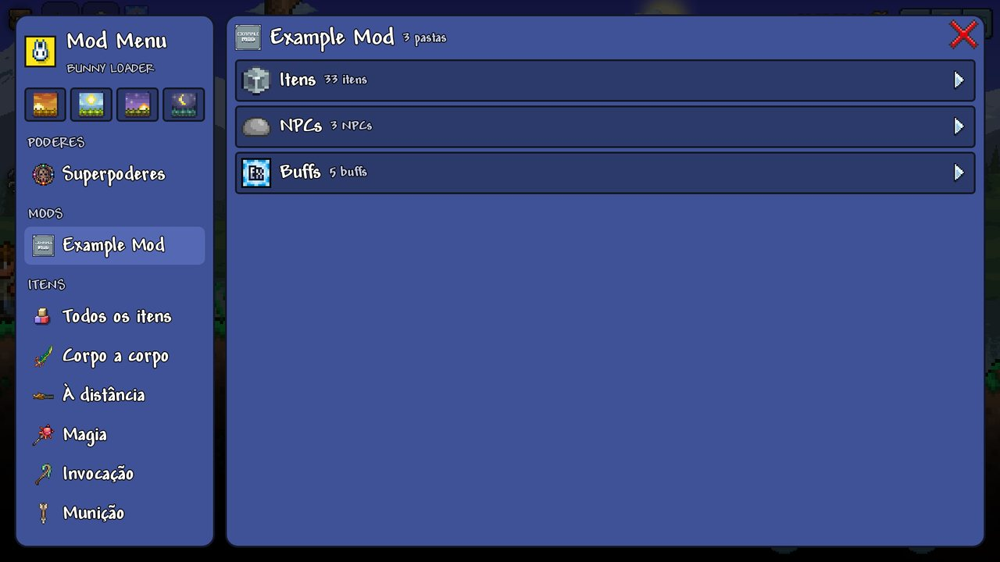
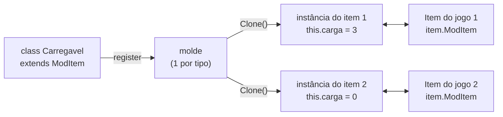
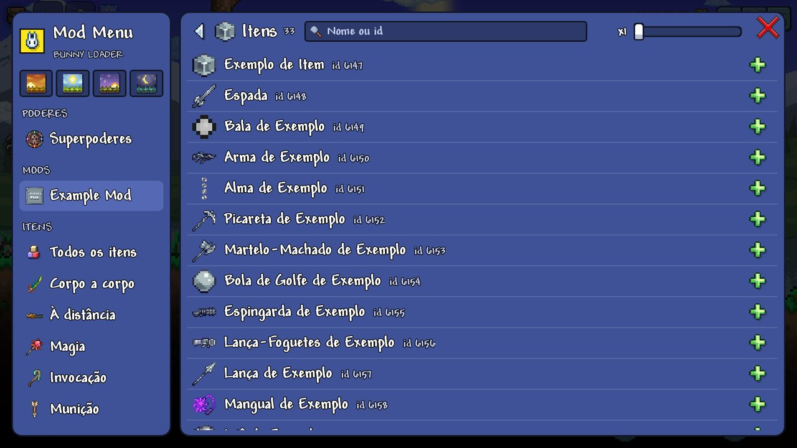

# 4. Conteúdo novo: as ideias

Para **criar** o que o jogo não tem (um item, uma arma que atira um projétil
seu, um inimigo com drop e spawn natural, um chefe, um morador, um bloco), o
Bunny Loader traz as classes no formato do **tModLoader**: o mod **estende** a
classe, preenche o que quer e **registra**. O Bunny Loader dá um número ao tipo
novo, põe a textura e o nome no jogo, e instala os hooks por você.

Este guia explica as ideias que valem para todas as classes. Os seguintes
tratam de cada uma:

| Guia | Classes |
|---|---|
| [5. Itens](05-itens.md) | `ModItem`, `ModPrefix`, `ModRecipe`, `ModSystem`, tooltip, vara de pesca. |
| [6. Projéteis](06-projeteis.md) | `ModProjectile`; pets, lacaios e sentinelas. |
| [7. NPCs](07-npcs.md) | `ModNPC`: inimigos, drops, spawn, Bestiário, moradores, chefes. |
| [8. Jogador e buffs](08-jogador-e-buffs.md) | `ModPlayer`, `ModBuff`. |
| [9. Blocos](09-blocos.md) | `ModTile`. |
| [10. Sons e música](10-sons-e-musica.md) | `SoundStyle`, `SoundEngine`, `MusicLoader`. |

A lista completa do que cada classe oferece está na
[referência das classes](../referencia/classes.md).

Pré-requisito: o [guia 1](01-hooks-do-zero.md). Tudo de lá (campos, métodos,
structs) vale dentro das classes.

## O Example Mod

Os guias usam o [`samples/ExampleMod`](../../samples/ExampleMod) do começo ao
fim: abra-o ao lado. Ele é o `ExampleMod` do tModLoader portado para o Bunny
Loader, com itens, armas, munição, projéteis, pets, lacaios, NPCs, um morador
com loja, um chefe com música, blocos, buffs e receitas.



## A estrutura

A mesma do tModLoader:

```
ExampleMod/
  manifest.json
  icon.png
  content/
    main.js                      a classe do mod: export default class ExampleMod extends Mod
    Assets/
      Textures/
        Items/ExampleItem.png    as texturas, na mesma árvore do código
        Projectiles/ExampleBulletProjectile.png
        NPCs/ExampleSlimeNPC.png
      Sounds/, Music/            áudio (guia 10)
    Common/
      Players/ExampleDashPlayer.js     o que não é coisa nova: ModPlayer,
      Systems/DownedBossSystem.js      ModSystem, Global*
    Content/
      Items/ExampleItem.js       o que é novo, uma classe por arquivo
      Items/Weapons/Melee/ExampleMeleeWeapon.js
      Projectiles/ExampleBulletProjectile.js
      NPCs/ExampleSlimeNPC.js
    Localization/
      pt-BR.json                 nomes e descrições, por idioma
      en-US.json
```

O `main.js` só tem a classe do mod. Toda classe exportada em `Content/` e
`Common/` é registrada sozinha, e a textura dela fica **ao lado do arquivo**,
com o mesmo nome, como no tModLoader ([README](README.md#o-registro-automático)).

## Estender e registrar

Uma classe de conteúdo é uma classe JS que estende a base e sobrescreve os
métodos que interessam:

```js
// content/Content/Items/ExampleItem.js  (textura: Content/Items/ExampleItem.png)
export class ExampleItem extends ModItem {
    SetDefaults() {
        this.Item.maxStack = ModItem.CommonMaxStack;
        this.Item.value = Terraria.Item.buyPrice(0, 0, 1, 0);
    }
}
```

Exportar basta: o Bunny Loader carrega o arquivo e **registra** a classe. O
`main.js` fica só com a classe do mod:

```js
// content/main.js
export default class ExampleMod extends Mod {}
```

Para registrar na mão (uma classe com `static Autoload = false`, ou uma que só
existe se outro mod estiver instalado), chame o `register` no `Load()` do mod:
`ModItem.register(Classe)`.

As classes base são **globais**: `ModItem`, `ModProjectile`, `ModNPC`,
`ModBuff`, `ModTile`, `ModPlayer`, `ModSystem`, `ModRecipe`... Nada de
`import` para elas, nem para os [ajudantes](#ajudantes).

### Classes base do seu mod (as `abstract` do tModLoader)

Mod grande costuma ter uma classe intermediária que só serve de base para
outras: no Thorium, `abstract class BardItem : ModItem`, e todo instrumento a
estende. O C# tem `abstract`, e o tModLoader pula as classes abstratas sozinho.
O JavaScript não tem `abstract`: para o Bunny Loader, uma classe exportada que
estende `ModItem` é um item, e uma base exportada viraria um item a mais no
jogo, sem textura, com o nome da classe.

Marque a base com **`static Autoload = false`**:

```js
// content/Content/Items/Bard/BardItem.js
// Base dos instrumentos: não é um item.
export class BardItem extends ModItem {
    static Autoload = false;

    // O que todo instrumento tem; a filha muda o que precisar.
    InspirationCost = 1;

    SetDefaults() {
        this.Item.useStyle = 5;
        this.Item.useTime = this.Item.useAnimation = 20;
        this.Item.noMelee = true;
        this.Item.rare = ItemRarityID.Green;
    }

    // Um método escrito só aqui vale para todas as filhas.
    ModifyTooltips(item, tooltips) {
        tooltips.push(new TooltipLine(this.Mod, 'Inspiration', 'Custa ' + this.InspirationCost + ' de inspiração'));
    }
}
```

```js
// content/Content/Items/Bard/GrandPiano.js
import { BardItem } from './BardItem.js';

// Esta é registrada: um item, com a textura GrandPiano.png ao lado.
export class GrandPiano extends BardItem {
    InspirationCost = 3;

    SetDefaults() {
        super.SetDefaults();          // o comum, da base
        this.Item.damage = 40;        // o deste instrumento
        this.Item.width = 40;
        this.Item.height = 30;
    }
}
```

Como funciona:

- **O `Autoload = false` não passa para as filhas.** Ele só vale para a classe
  que o declara (a filha não o tem como seu), então a base fica de fora e
  `GrandPiano` entra normalmente. Uma filha que também deva ficar de fora (uma
  base de segundo nível, como `PercussionItem extends BardItem`) declara o
  dela.
- **Tudo da base vale na filha**: campos, métodos e `get`. Um método escrito só
  na base (o `ModifyTooltips` acima) instala o hook dele como se estivesse na
  filha; o `super.Metodo()` chama o da base.
- **A base não precisa de textura**: ela não é registrada. A de cada filha é a
  dela, ao lado do arquivo dela ([Texturas](#texturas)).
- **`instanceof` funciona**: para saber se um item do jogo é um instrumento do
  seu mod, de qualquer tipo, `ModContent.GetModItem(item.type) instanceof BardItem`.
- Vale para qualquer tipo de conteúdo: `ModNPC`, `ModProjectile`, `ModTile`,
  `ModBuff`, `GlobalItem`...

Outro jeito, sem a marca: deixar a base **fora** de `Content/` e `Common/`.
O registro automático só olha o arquivo de entrada e essas duas pastas; uma
base em `content/Bases/BardItem.js` é importada pelas filhas e nunca
registrada. Por outro lado, uma classe **sem** `export` não serve de base para
outro arquivo, porque ele não consegue importá-la.

Não use `export default` para isso: um arquivo só tem um, muitos arquivos
exportam várias classes (a armadura e o conjunto dela), e no arquivo de entrada
o `export default` é a classe `Mod`.

### O que o `register` faz

1. cria o **molde**: uma instância da sua classe;
2. reserva o **número** do tipo novo, na hora (o primeiro item de mod é o
   6196, logo depois dos do jogo), e o devolve;
3. guarda a textura, o nome e a tradução;
4. instala os hooks do jogo por trás dos métodos que a sua classe
   **sobrescreveu** (e só esses).

O jogo só fica sabendo do tipo novo um pouco depois, na tela de título,
quando as tabelas dele existem ([como](../nucleo/conteudo.md)). Por isso cada
classe tem momentos certos para cada coisa:

| Momento | Método | Para quê |
|---|---|---|
| no registro | (o construtor da classe) | Campos da classe: `Texture`, `DisplayName`... |
| tela de título | `SetStaticDefaults()` | Tabelas por tipo: `ItemID.Sets...[this.Type]`, `Main.npcFrameCount[this.Type]`. |
| cada entidade que nasce | `SetDefaults(entidade)` | Os atributos: dano, vida, tamanho. |
| conteúdo pronto | `AddRecipes()`, `SetBestiary(...)`, `PostSetupContent()` | O que depende de tudo existir: receitas, Bestiário, outros mods. |

### A ordem

O registro automático segue uma ordem fixa: buffs, jogadores, NPCs, projéteis,
itens, blocos, sistemas e globais; dentro de cada um, pelo caminho do arquivo.
Os números saem nessa ordem, e ela é a mesma em todo aparelho do
multijogador, desde que todos tenham os mesmos mods. Por isso a bala acha o
número do projétil no `SetDefaults` dela (`ModContent.ProjectileType(...)`):
todo projétil já foi registrado antes de qualquer item.

## O tipo de um conteúdo

Dá para pegá-lo de três jeitos:

```js
this.Type                                              // dentro da própria classe
ModItem.getTypeByName('ExampleItem');                  // pelo nome, dentro do mod
ModContent.ItemType(ExampleItem);                      // como no tModLoader
```

### ModContent

O `ModContent` do tModLoader, com os mesmos nomes. O tipo de um conteúdo de mod
sai pela **classe** (o `<T>` de lá), pelo **nome**, ou por `'mod/Nome'` (com o
`id` do manifesto de outro mod). Não achou, devolve 0:

```js
const boia = ModContent.ProjectileType(ExampleBobber);          // a classe
const mesmo = ModContent.ProjectileType('ExampleBobber');       // o nome
const deOutro = ModContent.ItemType('outromod/EspadaDeFogo');   // outro mod
```

Pelo nome, vale o do seu mod; se não houver, o único mod que tem um conteúdo
com esse nome (se dois têm, peça por `'mod/Nome'`, e o log avisa). Há
`ItemType`, `ProjectileType`, `NPCType`, `BuffType` e `TileType`.

O **modelo** (a instância do `register`) também:

```js
ModContent.GetInstance(ExampleItem);                  // pela classe
ModContent.Find(ModItem, 'examplemod/ExampleItem');   // pelo nome; lança se não há
const r = new Ref();
if (ModContent.TryFind(ModNPC, 'examplemod/ExampleBoss', r)) bl.log(r.value.Type);
ModContent.GetModItem(tipo);                          // pelo número
```

Todo modelo tem `this.Mod`, o `Mod` de quem registrou.

Todos de uma vez, como o `GetContent` do tModLoader: no `Mod`, os do próprio
mod; no `ModContent`, os de todos os mods. Vale para qualquer classe base
(`ModItem`, `ModNPC`, `ModProjectile`, `ModTile`, `ModBuff`, `ModSystem`...),
na ordem do registro. Chame do `PostSetupContent` em diante: antes dele os
tipos podem não ter saído.

```js
PostSetupContent() {
    const tipos = this.GetContent(ModItem).map((item) => item.Type);
    const npcs = this.GetContent(ModNPC);
    const todosOsItensDeMod = ModContent.GetContent(ModItem);
}
```

As texturas do mod carregam na primeira chamada; as seguintes reusam a mesma:

```js
const asset = ModContent.Request('Assets/Textures/brilho');   // Asset<Texture2D>
const tex = asset.Value;                                       // a Texture2D
const mesma = ModContent.Texture('Content/Items/Espada_Glow'); // atalho para o .Value
```

- `Request` devolve o `Asset<Texture2D>` **do jogo**, do mesmo tipo que as
  tabelas `TextureAssets` guardam: dá para pôr numa delas.
- O caminho é o do arquivo no mod, com ou sem `.png`, como no tModLoader:
  `'Content/Items/Espada'`, `'Assets/Textures/brilho'`. Com o id de um mod na
  frente (`'examplemod/Content/...'`), pega de outro mod. Os caminhos dos mods
  de antes, dentro de `Assets/Textures/` (`'Items/Espada'`), também valem.
  `ModContent.HasAsset(caminho)` diz se existe.
- Carrega sempre na hora (como o `ImmediateLoad` do tModLoader), e só na
  **thread do jogo**: num hook, no `SetStaticDefaults` ou no
  `PostSetupContent`.
- Só textura. Para som, `ModContent.SoundStyle(caminho, opções)`, que é o
  mesmo que `new SoundStyle(caminho, opções)` ([guia 10](10-sons-e-musica.md)).

## Molde e instância

Como no tModLoader, a classe que você registra é um **molde**. Cada item,
projétil ou NPC do jogo daquele tipo ganha a **própria** instância, copiada do
molde, e é nela que os métodos rodam.


```mermaid
flowchart LR
    C["class Carregavel<br/>extends ModItem"] -- "register" --> M["molde<br/>(1 por tipo)"]
    M -- "Clone()" --> I1["instância do item 1<br/>this.carga = 3"]
    M -- "Clone()" --> I2["instância do item 2<br/>this.carga = 0"]
    I1 <--> E1["Item do jogo 1<br/>item.ModItem"]
    I2 <--> E2["Item do jogo 2<br/>item.ModItem"]
```

- `this.Item`, `this.Projectile`, `this.NPC` é a entidade daquela instância;
- `item.ModItem`, `proj.ModProjectile`, `npc.ModNPC` é a instância da entidade;
- campo que você puser em `this` é **daquele** item: dá para guardar carga,
  contador, alvo, sem uma variável global indexada por item.

```js
export class Carregavel extends ModItem {
    SetDefaults() {
        this.carga = 0;               // cada item começa com a sua
    }
    UseItem(item, player) {
        this.carga++;                 // só deste item
    }
}

// de fora: o ModItem de um item qualquer
const m = player.inventory[0].ModItem;
if (m instanceof Carregavel) bl.log(m.carga);
```

`ModItem.getModItem(tipo)` e `ModContent.GetInstance(Classe)` devolvem o
**molde**, não a instância de um item.

Quando o jogo copia um item (`Item.Clone`), a cópia ganha um `Clone()` da
instância do original, com o estado dela. O `Clone` padrão copia os campos
rasos (o `MemberwiseClone` do C#); sobrescreva se tiver array ou objeto seu
que precise de cópia própria:

```js
Clone(newItem) {
    const c = super.Clone(newItem);
    c.historico = [...this.historico];
    return c;
}
```

O estado da instância **não** vai para o save nem para a rede, e se perde
quando o item passa por um baú (que guarda só tipo, pilha e prefixo): nesses
casos a entidade nasce de novo pelo `SetDefaults`. Para o que o jogador deve
lembrar, use o `SaveData` do `ModPlayer` ([guia 8](08-jogador-e-buffs.md#dados-salvos)).

### Campos em classes do jogo

O `item.ModItem` é um caso de algo geral: `bl.defineField` põe um campo novo
numa classe do jogo, para o mod guardar o que quiser em cada objeto:

```js
bl.defineField(Terraria.Player, 'combo');
const p = Terraria.Main.player[Terraria.Main.myPlayer];
p.combo = (p.combo || 0) + 1;
```

O valor fica numa tabela ao lado do objeto (o jogo não deixa a classe crescer)
e some sozinho quando o jogo descarta o objeto. Vale também para as classes
filhas: um campo em `Terraria.Entity` aparece em `Player`, `NPC` e
`Projectile`.

`bl.defineMethod` faz o mesmo com um método; `this` é o objeto do jogo. É daí
que sai o `player.GetModPlayer(...)`.

```js
bl.defineMethod(Terraria.Player, 'estaNoChao', function () {
    return this.velocity.Y === 0;
});
if (player.estaNoChao()) { /* ... */ }
```

Um nome que a classe já tem (campo ou método do jogo) vence o do mod.

## Texturas

Como no tModLoader, a textura de uma classe fica **ao lado do arquivo dela**,
com o mesmo nome: `Content/Items/ExampleItem.js` usa
`Content/Items/ExampleItem.png`. As derivadas ficam do lado também
(`ExampleItem_Glow.png`, `ExampleHelmet_Head.png`, `ExampleWorkbench_Highlight.png`).
Isso é só o padrão: `Texture` escolhe outro arquivo, o caminho no mod **sem**
`.png`, em qualquer pasta:

```js
// como o `public override string Texture => "...";` do tModLoader
get Texture() { return 'Content/Items/ExampleItem'; }   // a imagem de outro item

// ou no construtor
constructor() {
    super();
    this.Texture = 'Arte/Espadas/Lamina';
}
```

O id do mod na frente também vale (`'examplemod/Content/Items/ExampleItem'`).
`Assets/` fica para o que não é de uma classe: fundos, sons, música e o que o mod
carrega por conta própria (`ModContent.Request`).

Os mods de antes guardavam as texturas em `Assets/Textures/`, no espelho do
arquivo (`Content/Items/X.js` -> `Assets/Textures/Items/X.png`). Se o arquivo
não está ao lado do `.js`, vale o de lá (e o log avisa uma vez por mod).

| Conteúdo | Formato |
|---|---|
| Item | O sprite do item. Com animação (`SetItemAnimation`), os quadros numa tira vertical. |
| Projétil | O sprite. Com `Main.projFrames[this.Type] = n`, `n` quadros numa tira vertical. |
| NPC | `Main.npcFrameCount[this.Type] = n` quadros numa tira vertical. |
| Buff | 32x32. |
| Bloco | A folha de quadros do jogo: 288x270, quadros de 16x16 com 2 px de margem. |

As texturas são desenhadas como pixel art (sem suavização), como as do jogo.

## Tradução

`Localization/<idioma>.json`, um por idioma (`pt-BR`, `en-US`, `es-ES`,
`de-DE`, `fr-FR`, `it-IT`, `ru-RU`, `pl-PL`, `ja-JP`, `ko-KR`, `zh-Hans`,
`zh-Hant`):

```json
{
  "ItemName":       { "ExampleItem": "Exemplo de Item" },
  "ItemTooltip":    { "ExampleItem": "Descrição do item" },
  "ProjectileName": { "ExampleBulletProjectile": "Bala de Exemplo" },
  "NPCName":        { "ExampleSlimeNPC": "Slime de Exemplo" },
  "BuffName":       { "ExampleDefenseBuff": "Defesa de Exemplo" },
  "BuffDescription":{ "ExampleDefenseBuff": "+{0} de defesa" },
  "Bestiary":       { "ExampleSlimeNPC": "Um slime azul-claro." }
}
```

A chave é o nome da **classe**. O jogo mostra o idioma dele; sem esse idioma,
vale o `en-US`, e sem nada, o nome da classe. Os campos `DisplayName` e
`Tooltip` da classe, se preenchidos, vencem o arquivo (texto, ou
`{ 'pt-BR': ..., 'en-US': ... }`).

Toda chave do arquivo, em qualquer profundidade (`TownNPCMood.ExamplePerson.Content`),
entra no jogo como `Mods.<id do mod>.<Secao>.<Chave>`, como no tModLoader:
`Language.GetText('Mods.examplemod.CustomText.WelcomeMessage').Value` funciona
direto, e o texto acompanha a troca de idioma.

Um texto pode trazer outro, como no tModLoader:

| | |
|---|---|
| `{$Mods.examplemod.Common.X}` | A chave inteira, de qualquer mod ou do jogo (`{$CommonItemTooltip.Whips}`). |
| `{$Common.X}` | Relativa: procura a partir da chave do próprio texto (em `Mods.examplemod.Items.Espada.Tooltip`, acha `Mods.examplemod.Common.X`). |
| `{$Chave@2}` | Soma 2 aos `{0}`, `{1}`... do texto trazido. |

Chave que não existe fica como o nome dela. Os textos entram pelo mesmo caminho
dos arquivos do jogo, então cada chave fica na categoria do jogo (tudo antes do
último ponto): `Language.RandomFromCategory('Mods.examplemod.Dialogue.ExamplePerson')`
sorteia uma fala, e `"Chave$Variante"` vira variante (`Language.TryGetVariation`).
Nos `ItemName`/`ItemTooltip`/`NPCName`/`BuffName`... de cada idioma, um
`{$chave}` do **jogo** sai no idioma em que o mod carregou: o jogo só tem um
idioma na memória.

Para um texto seu (a fala de um morador, a plaquinha do Bestiário):

| | |
|---|---|
| `ModLocalization.Translate('Secao.Chave')` | O **texto**, no idioma do jogo (como no TL). Sem texto, o próprio caminho. |
| `ModLocalization.TryTranslate('Secao.Chave')` | O mesmo, mas `''` quando não há texto. |
| (onde procura) | Nos `Localization/*.json` do mod de quem chama. Chamado de fora de um mod (o console do Editor), a chave completa `Mods.<id>.Secao.Chave` acha o mod dela, e a curta vale se só um mod a tem. `{0}` não é trocado: use `.replace('{0}', x)`. |
| `ModLocalization.GetTextValue(chave)` | O texto do mod ou, se ele não tem, o do jogo (`'LegacyInterface.28'`). |
| `ModLocalization.GetText(chave)` | O `LocalizedText` (do mod ou do jogo). |
| `ModLocalization.Key('Secao.Chave')` | A **chave** `Mods.<id>.Secao.Chave`, para o que o jogo pede por chave (Bestiário, moeda). |
| `ModLocalization.Exists(chave)` | Se o mod ou o jogo tem o texto. |
| `ModLocalization.Register(chave, texto)` | Um texto (ou `{ cultura: texto }`) sob uma chave qualquer. |

## O Mod Menu

Todo item, NPC e buff registrado já aparece no **Mod Menu** (o coelho na tela
do jogo): em *Mods*, numa entrada com o nome do mod, nas pastas *Itens*,
*NPCs* e *Buffs*, com o nome traduzido e o sprite (e também nas categorias do
jogo, em *Itens*, *NPCs* e *Buffs*):



Para separar em mais pastas:

```js
const armas = bl.menu.itemCategory('Armas', 'Content/Items/Weapons/Ranged/ExampleGun.png');
bl.menu.addItem(armas, ModItem.getTypeByName('ExampleGun'));
```

(`bl.menu.npcCategory` e `bl.menu.addNpc` para NPCs.)

Para **esconder** um item, NPC ou buff do Mod Menu (das pastas do mod e das
listas gerais), diga no `SetStaticDefaults`:

```js
SetStaticDefaults() {
    this.HideFromModMenu = true;   // ModItem, ModNPC ou ModBuff
}
```

O jeito do tModLoader também esconde, e o jogo o entende nas listas dele:
`ItemID.Sets.Deprecated[this.Type] = true` para item, e um
`NPCBestiaryDrawModifiers` com `Hide = true` no
`NPCID.Sets.NPCBestiaryDrawOffset` para NPC (que também some do Bestiário).

## Saves: desligar o mod não perde nada

Conteúdo de mod é salvo **pelo nome** (mod + classe), num arquivo ao lado do
save do jogo. O arquivo do jogo nunca leva um tipo de mod. Por isso:

- **desligar o mod não perde nada**: o item vira um "?" no inventário, o bloco
  vira ar, o morador some; ao religar, tudo volta;
- o mundo e o personagem **abrem no Terraria sem o Bunny Loader**;
- a ordem dos mods pode mudar à vontade: o conteúdo volta pelo nome, não pelo
  número.

Detalhes de cada save em [conteúdo por dentro](../nucleo/conteudo.md#os-saves-o-mundo-abre-sem-o-mod).

## Arrays do jogo

Um array do jogo (`Main.recipe`, `ItemID.Sets.IsAMaterial`...) tem índice,
`.length` e `cloneResized(n)`: uma cópia do mesmo tipo com `n` posições. O que
cabe vem do original, e o resto fica 0/null. Para trocar a tabela do jogo,
atribua:

```js
Terraria.Main.recipe = Terraria.Main.recipe.cloneResized(4000);
```

Tem também `fill`, `empty` e `find`, como os do Array do JS:

```js
player.buffImmune.fill(false);              // todas as posições; muda o jogo
player.buffImmune.fill(true, 10, 20);       // de 10 até 19 (início e fim, negativo conta do fim)
const vazio = Main.recipe.empty();          // Recipe[0], novo (o cloneResized(0))
const espada = player.inventory.find((it) => it.type === 4);   // o primeiro, ou undefined
```

`fill` devolve o próprio array. `find` recebe `(elemento, índice, array)` e,
num array de struct, devolve a vista: escrever nela muda o array. Para os
outros métodos do JS (`map`, `filter`...), copie antes com `Array.from(arr)`.

Onde o jogo espera um array (`int[]`, `string[]`...), um array JS também serve:
`new RecipeGroup(nome, [1, 2, 3])` recebe um `int[]` montado na hora.

Para ter o array do jogo na mão (guardar num campo, passar a um parâmetro
`object`/`Array`, mexer depois), `makeGeneric` na lista, como no TL Pro:

```js
const ids = [1, 2, 3].makeGeneric('int');            // int[]
const bytes = new Uint8Array(dados).makeGeneric('byte'); // byte[], numa cópia só
const nomes = ['a', 'b'].makeGeneric('string');       // string[]
const pontos = [Vector2.new(1, 2)].makeGeneric(Vector2);  // Vector2[]
const itens = [item].makeGeneric(Terraria.Item);      // Item[] (ou 'Terraria.Item')
```

O tipo vai pelo nome do C# (`'bool'`, `'byte'`, `'sbyte'`, `'short'`,
`'ushort'`, `'int'`, `'uint'`, `'long'`, `'ulong'`, `'float'`, `'double'`,
`'char'`, `'string'`, `'object'`), pelo nome completo (`'Terraria.Item'`) ou
pela classe. Um valor que não converte lança dizendo a posição. O array JS
original não muda.

Sem valores, `Classe.newArray(n)` é o `new T[n]` do C# (tudo 0/null):
`Terraria.Item.newArray(10)`, `System.Int32.newArray(5)`. Com uma lista,
`System.Int32.newArray([4, 5, 6])` faz o mesmo que o `makeGeneric`.

## Genéricos

`List<Vector2>`, `Dictionary<int, int>`: `makeGeneric` na classe genérica, com
as classes dos tipos:

```js
const List = System.Collections.Generic.List.makeGeneric(Vector2.Type);
const pontos = List.new();
pontos['void .ctor()']();

const Dict = System.Collections.Generic.Dictionary.makeGeneric(System.Int32, System.Int32);
```

Só vale para uma combinação que o próprio jogo usa (o código dela precisa
existir no binário); para as outras, `makeGeneric` lança dizendo qual.

## Ajudantes

Globais, com os nomes do tModLoader:

| | |
|---|---|
| `Vector2` | `Vector2.new(x, y)`, `Add`, `Subtract`, `Multiply`, `Divide` (vetor ou número), `Length`, `Distance`, `Normalize`, `SafeNormalize`, `DirectionTo`, `RotatedBy`, `RotatedByRandom`, `ToRotation`, `ToRotationVector2`, `Lerp`, `Dot`, `ToTileCoordinates`, `Clone`. Devolvem o `Vector2` do jogo; aceitam também `{ X, Y }`. |
| `MathHelper` | `Pi`, `TwoPi`, `PiOver2`, `ToRadians`, `ToDegrees`, `Clamp`, `Lerp`, `SmoothStep`, `WrapAngle`. |
| `Rand` | O sorteio do jogo: `Next(max)`, `Next(min, max)`, `NextFloat()`, `NextFloat(max)`, `NextBool(umEm)`, `NextChance(p)`, `NextSign()`, `NextFromList(lista)`, `NextVector2Circular(rx, ry)`, `NextVector2Unit()`. |
| `Color` | `Color.new(r, g, b, a)`, `Color.White`, `Color.SkyBlue`... (qualquer cor do XNA, sempre uma cópia), `Multiply`, `Lerp`, `ToVector3`. |
| `Rectangle` | `Rectangle.new(x, y, w, h)`, `Size`, `Center`, `Contains`, `Intersects`. |
| `ItemRarityID`, `ProjAIStyleID`, `NPCAIStyleID` | Os números que este Terraria não traz: `ItemRarityID.Pink`, `ProjAIStyleID.GolfBall`, `NPCAIStyleID.Slime`... |
| `Terraria.ID.DustID` | Além dos nomes do jogo, os que o tModLoader acrescenta: `DustID.PinkFairy`, `DustID.Firework_Blue`... |

```js
Shoot(item, player, position, velocity, type, damage, knockBack) {
    for (let i = 0; i < 8; i++) {
        let v = Vector2.RotatedByRandom(velocity, MathHelper.ToRadians(15));
        v = Vector2.Multiply(v, 1 - Rand.NextFloat(0.3));
        NewProjectile(player.GetProjectileSource_Item(item), position.X, position.Y, v.X, v.Y,
                      type, damage, knockBack, player.whoAmI, 0, 0, 0, null);
    }
    return false;
}
```

## Vindo do tModLoader

O formato é o mesmo, com as diferenças do JavaScript e do celular:

| tModLoader (C#) | Bunny Loader (JS) |
|---|---|
| `public class ExampleMod : Mod` | `export default class ExampleMod extends Mod` no `main.js` |
| `public class X : ModItem` | `export class X extends ModItem` (em `Content/`, registrada sozinha) |
| `[Autoload(false)]` | `static Autoload = false` |
| `abstract class BardItem : ModItem` (base) | `export class BardItem extends ModItem { static Autoload = false; }` ([Classes base](#classes-base-do-seu-mod-as-abstract-do-tmodloader)) |
| textura ao lado do `.cs` | textura ao lado do `.js` (o mesmo nome) |
| `Item.damage = 10;` | `this.Item.damage = 10;` |
| `ModContent.ItemType<X>()` | `ModContent.ItemType(X)` |
| `public override string Texture => "...";` | `get Texture() { return '...'; }` |
| `ref int damage` | `Ref` com `.value` ([guia 2](02-ref-e-out.md)) |
| `Texture => "Mod/Items/X"` | `this.Texture = 'Items/X'` |
| `.hjson` | `Localization/<idioma>.json` |
| `player.HasBuff(t)` | `player.FindBuffIndex(t) >= 0` (o celular não tem `HasBuff`) |
| `Main.ActiveNPCs` | percorrer `Terraria.Main.npc` pulando `!npc.active` |
