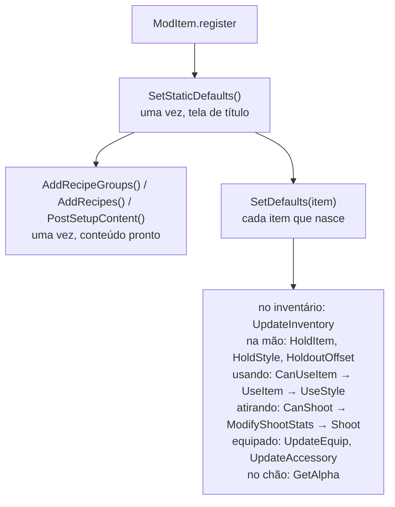
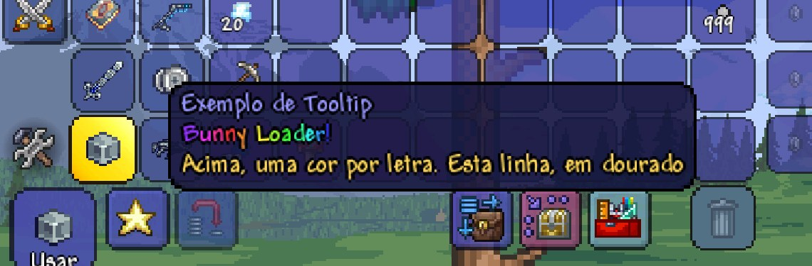

# 5. Itens

Um item novo é uma classe que estende `ModItem`. Este guia cobre o item em si
(atributos, uso, tiro, acessório), o tooltip, a vara de pesca, as receitas e o
`ModSystem`. Antes, leia as [ideias do guia 4](04-conteudo-novo.md): molde e
instância, `register`, texturas, tradução.

A lista completa de campos e métodos está na
[referência](../referencia/classes.md#moditem).

## O item mais simples

```js
export class ExampleItem extends ModItem {
    constructor() {
        super();
        this.Texture = 'Items/' + this.constructor.name;   // Textures/Items/ExampleItem.png
    }

    SetDefaults() {
        this.Item.width = 20;
        this.Item.height = 20;
        this.Item.maxStack = ModItem.CommonMaxStack;        // 9999
        this.Item.value = Terraria.Item.buyPrice(0, 0, 1, 0);
    }

    AddRecipes() {
        this.CreateRecipe(999)
            .AddIngredient(Terraria.ID.ItemID.DirtBlock, 10)
            .AddTile(Terraria.ID.TileID.WorkBenches)
            .Register();
    }
}

ModItem.register(ExampleItem);
```

`this.Item` é o `Item` do jogo desta instância: todo campo do C# está ali
(`damage`, `useTime`, `shoot`, `rare`...). Ele também chega como argumento,
`SetDefaults(item)`.

O nome e a descrição vêm de `ItemName.ExampleItem` e `ItemTooltip.ExampleItem`
em `Localization/<idioma>.json`, ou dos campos `DisplayName` e `Tooltip` da
classe.

## Quando cada método roda

A vida de um item de mod, do registro ao uso:



| Método | Quando |
|---|---|
| `SetStaticDefaults()` | Uma vez, com o tipo já no jogo. Para tabelas por tipo (`Terraria.ID.ItemID.Sets...[this.Type]`). |
| `SetDefaults(item)` | Todo item deste tipo que nasce. Aqui vão os atributos. |
| `AddRecipeGroups()` | Uma vez, antes de qualquer receita (de todos os mods). |
| `AddRecipes()` | Uma vez, quando as receitas do jogo já existem. |
| `PostSetupContent()` | Uma vez, com todo o conteúdo de mod no jogo. |
| `OnCraft(item, player, recipe)` | Ao criar este item no menu; `item` é o que o jogador vai receber, e ainda dá para mudar. |
| `ModifyTooltipLines()` | Uma vez por idioma, com `this.TooltipLines` preenchido: mude as linhas. |
| `ModifyTooltips(item, tooltips)` | Toda vez que o tooltip aparece (ver [Tooltip colorido](#tooltip-colorido)). |
| `CanUseItem(item, player)` | `false` impede o uso. |
| `UseItem(item, player)` | A cada uso. |
| `HoldItem(item, player)` | Todo quadro com o item na mão. |
| `UseStyle(...)`, `HoldStyle(...)` | Todo quadro de uso / de segurar, depois do estilo do jogo. |
| `HoldoutOffset(item, player)` | Desloca a arma na mão: devolva `{ X, Y }` em pixels. |
| `CanShoot(item, player)` | `false`: usa, mas não atira. |
| `ModifyShootStats(item, player, stats)` | Antes de cada projétil: mude `stats.position`, `velocity`, `type`, `damage`, `knockBack`. |
| `Shoot(item, player, position, velocity, type, damage, knockBack)` | `false`: o projétil do jogo não nasce (crie os seus aqui). |
| `OnHitNPC(item, player, npc, damageDone, knockBack, crit)` | Acerto corpo a corpo. |
| `UpdateInventory(item, player)` | Todo quadro, no inventário. |
| `UpdateEquip(item, player)`, `UpdateAccessory(item, player, vanity, hideVisual)` | Todo quadro, equipado. No acessório, `vanity` é o slot de vaidade (só o visual) e `hideVisual` o olho fechado. |
| `GetAlpha(item, lightColor)` | No chão: devolva a `Color` com que ele é desenhado (`Color.White` = brilha no escuro). |
| `ModifyFishingLine(item, bobber, lineOriginOffset, lineColor)` | Vara de pesca: de onde a linha sai e a cor (ver [Vara de pesca](#vara-de-pesca)). |

Só os métodos que você escrever custam alguma coisa: o hook do jogo por trás
de cada um só é instalado quando alguma classe o sobrescreve, e quase todos só
entram no JS para **itens de mod** (ver o [guia de custo](03-custo-e-desempenho.md#as-classes-de-mod-já-são-econômicas)).

## Atalhos

```js
this.SetWeaponValues(50, 6, 6);        // dano, repulsão, crítico
this.SetDefaultWeaponStyle(20, true);  // useTime (e useAnimation), autoReuse
this.SetShopValues(ItemRarityID.Green, Terraria.Item.sellPrice(0, 1, 0, 0));  // raridade, preço
this.CloneDefaults(Terraria.ID.ItemID.Minishark);            // copia um item do jogo
this.DefaultToPlaceableTile(tileType);
this.DefaultToFood(buffType, buffTime);
this.DefaultToGolfBall(projType);                            // tee e taco, como as do jogo
this.DefaultToWhip(projType, dano, repulsao, velocidade);
this.DefaultToSpear(projType, velocidade, tempo);
this.SetItemAnimation(4, 6);                                 // no SetStaticDefaults: 4 quadros, 6 ticks cada
ModItem.sellPrice(platina, ouro, prata, cobre);
ModItem.buyPrice(platina, ouro, prata, cobre);
```

Raridade: `ItemRarityID.Green`, `ItemRarityID.Pink`... (este Terraria não traz
os nomes; o Bunny Loader traz).

## Uma arma que atira

```js
export class ExampleGun extends ModItem {
    SetDefaults() {
        this.Item.ranged = true;
        this.Item.shoot = Terraria.ID.ProjectileID.PurificationPowder;  // trocado pela munição
        this.Item.shootSpeed = 10;
        this.Item.useAmmo = Terraria.ID.AmmoID.Bullet;
        this.SetWeaponValues(20, 5, 0);
        this.SetDefaultWeaponStyle(10, true);
        this.Item.noMelee = true;
        this.Item.UseSound = Terraria.ID.SoundID.Item41;
    }

    HoldoutOffset() {
        return { X: -18, Y: 0 };
    }
}
```

E a munição aponta para o projétil de mod:

```js
this.Item.shoot = ModContent.ProjectileType('ExampleBulletProjectile');
this.Item.ammo = Terraria.ID.AmmoID.Bullet;
```

### O tiro, passo a passo

Quando o jogo vai atirar com um item de mod:

1. `CanShoot(item, player)`: `false`, e o uso acontece sem projétil;
2. para **cada** projétil que o jogo criaria (a espingarda cria vários):
   `ModifyShootStats(item, player, stats)`, com `stats.position`, `velocity`,
   `type` (já trocado pela munição), `damage` e `knockBack`, que você muda;
3. `Shoot(item, player, position, velocity, type, damage, knockBack)`: devolva
   `false` para o jogo não criar o projétil dele, e crie os seus. `position` e
   `velocity` são `Vector2` do jogo: dá para repassá-los direto a um
   `NewProjectile`.

```js
const NewProjectile = Terraria.Projectile['int NewProjectile(IEntitySource spawnSource, float X, float Y, float SpeedX, float SpeedY, int Type, int Damage, float KnockBack, int Owner, float ai0, float ai1, float ai2, NewProjectileModifier modifer)'];

Shoot(item, player, position, velocity, type, damage, knockBack) {
    for (let i = 0; i < 3; i++) {
        const v = Vector2.RotatedBy(velocity, MathHelper.ToRadians(-10 + i * 10));
        NewProjectile(player.GetProjectileSource_Item(item), position.X, position.Y, v.X, v.Y,
                      type, damage, knockBack, player.whoAmI, 0, 0, 0, null);
    }
    return false;   // os três acima no lugar do tiro do jogo
}
```

## Acessórios e armaduras

`UpdateEquip` roda todo quadro com o item equipado; `UpdateAccessory`, só para
acessório, com dois parâmetros a mais:

```js
export class ExampleShield extends ModItem {
    SetDefaults() {
        this.Item.accessory = true;
        this.Item.defense = 4;
    }

    UpdateAccessory(item, player, vanity, hideVisual) {
        if (vanity) return;                 // no slot de vaidade: só o visual
        player.GetModPlayer(ExampleDashPlayer).DashAccessoryEquipped = true;
    }
}
```

O acessório costuma ligar um campo num `ModPlayer`, e o `ModPlayer` faz o
efeito ([guia 8](08-jogador-e-buffs.md)). O `ResetEffects` do `ModPlayer`
desliga o campo a cada quadro; se o acessório ainda estiver equipado, ele liga
de novo.

## Tooltip colorido

`ModifyTooltips(item, tooltips)` roda **toda vez** que o tooltip do item
aparece, com as linhas que o jogo montou: uma lista de `TooltipLine`, cada uma
com `Name`, `Text`, `OverrideColor`, `IsModifier` e `IsModifierBad`. Mude à
vontade: troque o texto, pinte a linha inteira com `OverrideColor`, insira
linhas novas (`splice`) ou tire as que não quer.



```js
ModifyTooltips(item, tooltips) {
    tooltips.splice(1, 0, new TooltipLine('Aviso', 'Logo abaixo do nome'));
    const aviso = tooltips.find((line) => line.Name === 'Aviso');
    aviso.OverrideColor = Color.new(255, 80, 80);
}
```

Para pintar **trechos**, use a tag `[c/RRGGBB:texto]` dentro do texto.
`TooltipLine.colorTag(texto, cor)` monta a tag de um `Color`, de `{ R, G, B }`
ou de `'#RRGGBB'`:

```js
const vermelho = TooltipLine.colorTag('fogo', Color.new(255, 60, 30));
tooltips.push(new TooltipLine('Elemento', 'Dano de ' + vermelho));
```

O `ExampleTooltipItem` do Example Mod escreve "Bunny Loader!" com uma cor por
letra, girando no arco-íris, logo abaixo do nome.

Os nomes das linhas: `ItemName` (a 0), `Material`, `JourneyResearch`,
`SetBonus`, `OneDropLogo`; as outras são `Line1`, `Line2`... pela posição em
que o jogo as montou. Uma linha nova precisa de um nome seu. Até 30 linhas.

O logo da One Drop, o dos ioiôs licenciados do jogo, é uma linha sem texto com
`OneDropLogo = true`. O `ExampleYoyo` põe o dele no fim:

```js
ModifyTooltips(item, tooltips) {
    const logo = new TooltipLine('OneDropLogo', '');
    logo.OneDropLogo = true;
    tooltips.push(logo);
}
```

No guia de criação e na busca de itens, as linhas chegam sem cor: o texto das
tags fica, as tags somem.

**Por trás**: o celular monta as linhas num método com seis parâmetros `ref`
(`Main.MouseText_DrawItemTooltip_GetLinesInfo`), que o Bunny Loader hooka (ver
o [guia 2](02-ref-e-out.md#um-caso-real-o-tooltip)). O celular desenha o texto
cru, sem o leitor de tags do PC, então o Bunny Loader desenha a linha com tag
trecho a trecho (um hook no `SpriteBatch.DrawString` com `whileIn`, só durante
o tooltip), e a caixa do tooltip é medida sem as tags.

## Vara de pesca

O jogo só sabe onde fica a ponta das varas dele; sem o `ModifyFishingLine`, a
linha de uma vara de mod sai do centro do jogador. Como no tModLoader, os dois
últimos parâmetros são `Ref`: `lineOriginOffset.value` é de onde a linha sai,
em pixels a partir do centro do jogador olhando para a direita (o Bunny Loader
espelha para a esquerda e para a gravidade invertida); `lineColor.value` é a
cor, e a linha colorida que o jogador equipou ganha dela.

```js
ModifyFishingLine(item, bobber, lineOriginOffset, lineColor) {
    lineOriginOffset.value = Vector2.new(43, -30);
    lineColor.value = Color.new(255, 215, 0);
}
```

O jeito antigo, com três parâmetros (`item, bobber, line`) e
`line.lineOriginOffset` / `line.lineColor`, continua valendo.

`bobber` é a boia (o projétil): a `ExampleFishingRod` pinta a linha com a cor
que a `ExampleBobber` sorteou ao nascer (`bobber.ModProjectile`).

## Receitas

`this.CreateRecipe(quantidade)` dentro do `AddRecipes`, e uma corrente:

```js
this.CreateRecipe()
    .AddIngredient(Terraria.ID.ItemID.IronBar, 5)
    .AddIngredient(ModContent.ItemType('ExampleItem'), 10)
    .AddTile(Terraria.ID.TileID.Anvils)
    .SetProperty('needWater', true)
    .Register();
```

| Método | O que faz |
|---|---|
| `SetResult(tipo, n)` | O que a receita dá (o `CreateRecipe` já chama). |
| `AddIngredient(tipo, n)` | Até 15 ingredientes. |
| `AddRecipeGroup(grupo, n)` | Aceita qualquer item do grupo (veja abaixo). |
| `AddTile(tipo)` | A estação. Uma só por receita (o jogo guarda um número). |
| `SetProperty(nome, valor)` | `needWater`, `needLava`, `needHoney`, `needSnowBiome`, `needGraveyardBiome`, `needTorchGodsFavor`, `needMechdusa`, `notDecraftable`, `crimson`, `corruption`, `alchemy`. |
| `AddCustomShimmerResult(tipo, n)` | O que sai ao jogar o item no Brilho, no lugar dos ingredientes. |
| `Register()` | Põe a receita no jogo. |

Receita para um item **do jogo** também vale:
`new ModRecipe().SetResult(tipo, n).AddIngredient(...).Register()`.

### Grupos de receita

Um grupo faz a receita aceitar qualquer item de uma lista ("Qualquer barra de
ferro"). Os do jogo vão pelo nome, como estão em `Terraria.ID.RecipeGroups`
(`'IronBar'`, `'Wood'`, `'Sand'`, `'Fragment'`...):

```js
new ModRecipe()
    .SetResult(Terraria.ID.ItemID.SpikyBall, 50)
    .AddRecipeGroup('IronBar')          // barra de ferro OU de chumbo
    .AddTile(Terraria.ID.TileID.Anvils)
    .Register();
```

Grupo novo: `ModRecipe.CreateRecipeGroup(nome, [tipos])`, no `AddRecipeGroups`
(que roda antes de qualquer receita). O menu mostra "Qualquer <nome>". O nome
vem da tradução, em `RecipeGroups.<nome>`, e sem ela fica o próprio `nome`:

```js
AddRecipeGroups() {
    this.constructor.Group = ModRecipe.CreateRecipeGroup('ExampleItem', [
        ModContent.ItemType('ExampleItem'),
        ModContent.ItemType('ExampleSoul'),
    ]);
}
```

`AddRecipeGroup(grupo, n)` aceita o objeto, o nome de um grupo do jogo ou o
nome de um criado por mod. Se nenhum ingrediente já posto é do grupo, ele põe
o primeiro item do grupo com `n`. Se já há um, esse ingrediente passa a
aceitar o grupo todo (`.AddIngredient(ExampleItem, 50).AddRecipeGroup(grupo)`).

### O limite de receitas

O jogo tem 3600 posições de receita, e as dele ocupam 3570. Passando disso, a
tabela cresce e a receita existe (o Guia a mostra, o Brilho a desfaz), mas o
menu de criação não a mostra: o laço do jogo para em 3600, fixo no código. O
log avisa quantas ficaram de fora.

## ModSystem

Para o que é do mod inteiro, não de um item: receitas de itens do jogo,
grupos, preparação que depende de todo o conteúdo.

```js
export class ExampleRecipes extends ModSystem {
    AddRecipeGroups() { /* ModRecipe.CreateRecipeGroup(...) */ }
    AddRecipes() { /* new ModRecipe()... */ }
    PostSetupContent() {}
}

ModSystem.register(ExampleRecipes);
```

Por enquanto o `ModSystem` tem só esses três métodos. O que o tModLoader faz
nos outros (`PreUpdateWorld`, `PostDrawInterface`...) se faz hoje com um hook
direto ([guia 1](01-hooks-do-zero.md)).

## Save

Item de mod no inventário, no cofre e nos baús é salvo **pelo nome** (mod +
classe), num arquivo ao lado do save do jogo. Desligar o mod não perde nada: o
item vira um "?" e volta ao normal quando o mod é religado.
