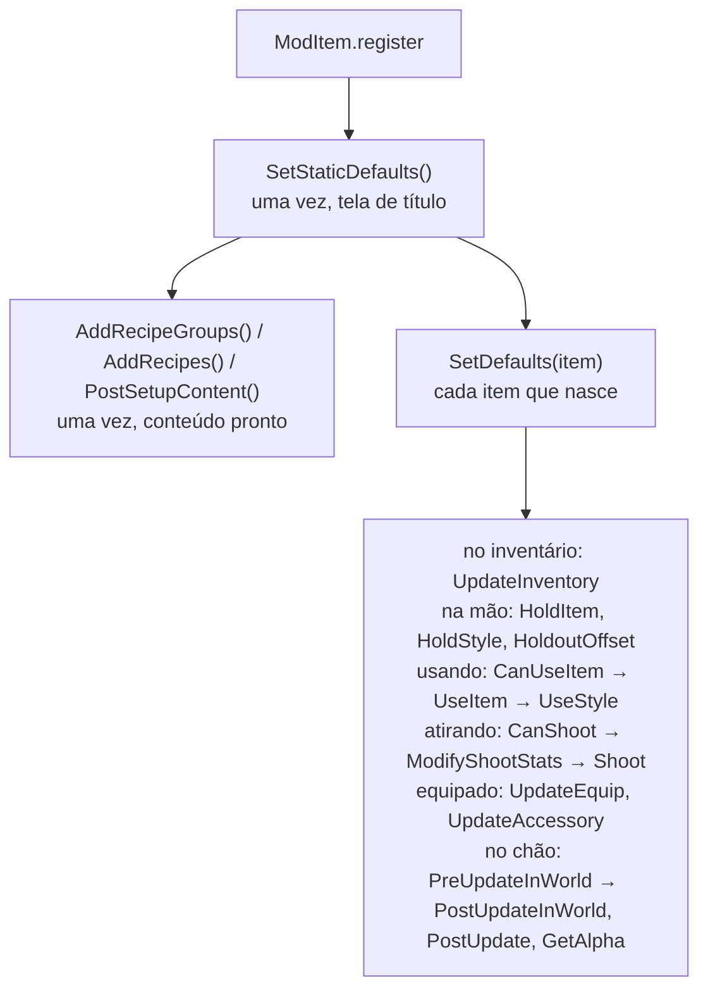
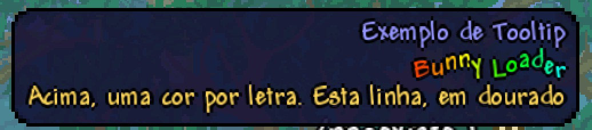

# 5. Itens

Um item novo é uma classe que estende `ModItem`. Este guia cobre o item em si
(atributos, uso, tiro, acessório), os prefixos, o tooltip, a vara de pesca, as
receitas e o `ModSystem`. Antes, leia as [ideias do guia 4](04-conteudo-novo.md): molde e
instância, `register`, texturas, tradução.

A lista completa de campos e métodos está na
[referência](../referencia/classes.md#moditem).

## O item mais simples

```js
export class ExampleItem extends ModItem {
    SetDefaults() {
        this.Item.width = 20;
        this.Item.height = 20;
        this.Item.maxStack = ModItem.CommonMaxStack;        // 9999
        this.Item.value = Terraria.Item.buyPrice(0, 0, 1, 0);
    }

    AddRecipes() {
        this.CreateRecipe(999)
            .AddIngredient(Terraria.ID.ItemID.DirtBlock, 10)
            .AddTile(Terraria.ID.TileID.WorkBenches)
            .Register();
    }
}
```

`this.Item` é o `Item` do jogo desta instância: todo campo do C# está ali
(`damage`, `useTime`, `shoot`, `rare`...). Ele também chega como argumento,
`SetDefaults(item)`.

O nome e a descrição vêm de `ItemName.ExampleItem` e `ItemTooltip.ExampleItem`
em `Localization/<idioma>.json`, ou dos campos `DisplayName` e `Tooltip` da
classe.

## Quando cada método roda

A vida de um item de mod, do registro ao uso:


```mermaid
flowchart TD
    R["ModItem.register"] --> S["SetStaticDefaults()<br/>uma vez, tela de título"]
    S --> P["AddRecipeGroups() / AddRecipes() / PostSetupContent()<br/>uma vez, conteúdo pronto"]
    S --> D["SetDefaults(item)<br/>cada item que nasce"]
    D --> U["no inventário: UpdateInventory<br/>na mão: HoldItem, HoldStyle, HoldoutOffset<br/>usando: CanUseItem → UseItem → UseStyle<br/>atirando: CanShoot → ModifyShootStats → Shoot<br/>equipado: UpdateEquip, UpdateAccessory<br/>no chão: PreUpdateInWorld → PostUpdateInWorld, PostUpdate, GetAlpha"]
```

| Método | Quando |
|---|---|
| `SetStaticDefaults()` | Uma vez, com o tipo já no jogo. Para tabelas por tipo (`Terraria.ID.ItemID.Sets...[this.Type]`). |
| `SetDefaults(item)` | Todo item deste tipo que nasce. Aqui vão os atributos. |
| `AddRecipeGroups()` | Uma vez, antes de qualquer receita (de todos os mods). |
| `AddRecipes()` | Uma vez, quando as receitas do jogo já existem. |
| `PostSetupContent()` | Uma vez, com todo o conteúdo de mod no jogo. |
| `OnCraft(item, player, recipe)` | Ao criar este item no menu; `item` é o que o jogador vai receber, e ainda dá para mudar. |
| `ModifyTooltipLines()` | Uma vez por idioma, com `this.TooltipLines` preenchido: mude as linhas. |
| `ModifyTooltips(item, tooltips)` | Toda vez que o tooltip aparece (ver [Tooltip](#tooltip)). |
| `PreDrawTooltip(item, lines, x, y)`, `PostDrawTooltip(item, lines)` | O desenho do tooltip inteiro (ver [Desenhar o tooltip](#desenhar-o-tooltip)). |
| `PreDrawTooltipLine(item, line, yOffset)`, `PostDrawTooltipLine(item, line)` | O desenho de cada linha. |
| `CanUseItem(item, player)` | `false` impede o uso. |
| `UseItem(item, player)` | A cada uso. Devolva `true` quando o item fez algo só aqui (invocar um chefe): conta como usado e o consumível é gasto. |
| `HoldItem(item, player)` | Todo quadro com o item na mão. |
| `UseStyle(...)`, `HoldStyle(...)` | Todo quadro de uso / de segurar, depois do estilo do jogo. |
| `HoldoutOffset(item, player)` | Desloca a arma na mão: devolva `{ X, Y }` em pixels. |
| `CanShoot(item, player)` | `false`: usa, mas não atira. |
| `ModifyShootStats(item, player, stats)` | Antes de cada projétil: mude `stats.position`, `velocity`, `type`, `damage`, `knockBack`. |
| `Shoot(item, player, position, velocity, type, damage, knockBack)` | `false`: o projétil do jogo não nasce (crie os seus aqui). |
| `OnHitNPC(item, player, npc, damageDone, knockBack, crit)` | Acerto corpo a corpo. |
| `UpdateInventory(item, player)` | Todo quadro, no inventário. |
| `UpdateEquip(item, player)`, `UpdateAccessory(item, player, vanity, hideVisual)` | Todo quadro, equipado. No acessório, `vanity` é o slot de vaidade (só o visual) e `hideVisual` o olho fechado. |
| `GetAlpha(item, lightColor)` | No chão: devolva a `Color` com que ele é desenhado (`Color.White` = brilha no escuro). O `item` só tem posição (`Center`) quando é o do chão; no inventário e na loja vem o `Item` sem posição: luz e poeira vão no `PostUpdate`. |
| `PostUpdate(item)` | A cada quadro, com o item no chão (`item` é a `WorldItem`: `Center`, `position`, `velocity`). Lugar da luz e da poeira, como a da Alma de Exemplo. |
| `PreUpdateInWorld(item, worldItem)`, `PostUpdateInWorld(item, worldItem)` | A cada quadro, em volta da atualização do item no chão (queda, água, ímã do jogador). `item` é o `Item`; `worldItem` é a `WorldItem` que o leva (`Center`, `position`, `velocity`). `false` no `Pre` pula a atualização do jogo naquele quadro (o item fica parado); o `Post` roda igual. No `GlobalItem` também, para qualquer item no chão. |
| `ModifyFishingLine(item, bobber, lineOriginOffset, lineColor)` | Vara de pesca: de onde a linha sai e a cor (ver [Vara de pesca](#vara-de-pesca)). |

Só os métodos que você escrever custam alguma coisa: o hook do jogo por trás
de cada um só é instalado quando alguma classe o sobrescreve, e quase todos só
entram no JS para **itens de mod** (ver o [guia de custo](03-custo-e-desempenho.md#as-classes-de-mod-já-são-econômicas)).

## Atalhos

```js
this.SetWeaponValues(50, 6, 6);        // dano, repulsão, crítico
this.SetDefaultWeaponStyle(20, true);  // useTime (e useAnimation), autoReuse
this.SetShopValues(ItemRarityID.Green, Terraria.Item.sellPrice(0, 1, 0, 0));  // raridade, preço
this.CloneDefaults(Terraria.ID.ItemID.Minishark);            // copia um item do jogo
this.DefaultToPlaceableTile(tileType);
this.DefaultToFood(buffType, buffTime);
this.DefaultToGolfBall(projType);                            // tee e taco, como as do jogo
this.DefaultToWhip(projType, dano, repulsao, velocidade);
this.DefaultToSpear(projType, velocidade, tempo);
this.SetItemAnimation(4, 6);                                 // no SetStaticDefaults: 4 quadros, 6 ticks cada
ModItem.sellPrice(platina, ouro, prata, cobre);
ModItem.buyPrice(platina, ouro, prata, cobre);
```

Raridade: `ItemRarityID.Green`, `ItemRarityID.Pink`... (este Terraria não traz
os nomes; o Bunny Loader traz).

## Uma arma que atira

```js
export class ExampleGun extends ModItem {
    SetDefaults() {
        this.Item.ranged = true;
        this.Item.shoot = Terraria.ID.ProjectileID.PurificationPowder;  // trocado pela munição
        this.Item.shootSpeed = 10;
        this.Item.useAmmo = Terraria.ID.AmmoID.Bullet;
        this.SetWeaponValues(20, 5, 0);
        this.SetDefaultWeaponStyle(10, true);
        this.Item.noMelee = true;
        this.Item.UseSound = Terraria.ID.SoundID.Item41;
    }

    HoldoutOffset() {
        return { X: -18, Y: 0 };
    }
}
```

E a munição aponta para o projétil de mod:

```js
this.Item.shoot = ModContent.ProjectileType('ExampleBulletProjectile');
this.Item.ammo = Terraria.ID.AmmoID.Bullet;
```

### O tiro, passo a passo

Quando o jogo vai atirar com um item de mod:

1. `CanShoot(item, player)`: `false`, e o uso acontece sem projétil;
2. para **cada** projétil que o jogo criaria (a espingarda cria vários):
   `ModifyShootStats(item, player, stats)`, com `stats.position`, `velocity`,
   `type` (já trocado pela munição), `damage` e `knockBack`, que você muda;
3. `Shoot(item, player, position, velocity, type, damage, knockBack)`: devolva
   `false` para o jogo não criar o projétil dele, e crie os seus. `position` e
   `velocity` são `Vector2` do jogo: dá para repassá-los direto a um
   `NewProjectile`.

```js
const NewProjectile = Terraria.Projectile['int NewProjectile(IEntitySource spawnSource, float X, float Y, float SpeedX, float SpeedY, int Type, int Damage, float KnockBack, int Owner, float ai0, float ai1, float ai2, NewProjectileModifier modifer)'];

Shoot(item, player, position, velocity, type, damage, knockBack) {
    for (let i = 0; i < 3; i++) {
        const v = Vector2.RotatedBy(velocity, MathHelper.ToRadians(-10 + i * 10));
        NewProjectile(player.GetProjectileSource_Item(item), position.X, position.Y, v.X, v.Y,
                      type, damage, knockBack, player.whoAmI, 0, 0, 0, null);
    }
    return false;   // os três acima no lugar do tiro do jogo
}
```

## Acessórios e armaduras

`UpdateEquip` roda todo quadro com o item equipado; `UpdateAccessory`, só para
acessório, com dois parâmetros a mais:

```js
export class ExampleShield extends ModItem {
    SetDefaults() {
        this.Item.accessory = true;
        this.Item.defense = 4;
    }

    UpdateAccessory(item, player, vanity, hideVisual) {
        if (vanity) return;                 // no slot de vaidade: só o visual
        player.GetModPlayer(ExampleDashPlayer).DashAccessoryEquipped = true;
    }
}
```

O acessório costuma ligar um campo num `ModPlayer`, e o `ModPlayer` faz o
efeito ([guia 8](08-jogador-e-buffs.md)). O `ResetEffects` do `ModPlayer`
desliga o campo a cada quadro; se o acessório ainda estiver equipado, ele liga
de novo.

### A textura no corpo

Como o `[AutoloadEquip]` do tModLoader, mas pelo nome do arquivo: ao lado da
textura do item, `<Textura>_<tipo>.png` vira a textura vestida. O
`ExampleHelmet.png` tem o `ExampleHelmet_Head.png`; o `ExampleWings.png`, o
`ExampleWings_Wings.png`. Os tipos (`EquipType`): `Head`, `Body`, `Legs`,
`HandsOn`, `HandsOff`, `Back`, `Front`, `Shoes`, `Waist`, `Wings`, `Shield`,
`Neck`, `Face`, `Beard`, `Balloon`.

Cada textura ganha um slot depois dos do jogo (`Item.headSlot`, `wingSlot`...),
já posto no `SetDefaults` do item. O corpo usa a folha composta do 1.4
(`ArmorIDs.Body.Sets.UsesNewFramingCode`), como no tModLoader. No
`SetStaticDefaults`, o `this.Item` é a amostra do jogo, com os slots:

```js
export class ExampleWings extends ModItem {
    SetStaticDefaults() {
        const stats = Terraria.ID.ArmorIDs.Wing.Sets.Stats[this.Item.wingSlot];
        stats.FlyTime = 180;              // o WingStats(180, 9, 2.5) do tModLoader
        stats.AccRunSpeedOverride = 9;
        stats.AccRunAccelerationMult = 2.5;
    }

    // Os cinco `ref` do WingMovement do jogo (Ref, .value).
    VerticalWingSpeeds(item, player, ascentWhenFalling, ascentWhenRising, maxCanAscendMultiplier, maxAscentMultiplier, constantAscend) {
        ascentWhenFalling.value = 0.85;
        ascentWhenRising.value = 0.15;
        maxCanAscendMultiplier.value = 1;
        maxAscentMultiplier.value = 3;
        constantAscend.value = 0.135;
    }
}
```

`EquipLoader.GetEquipSlot('ExampleHelmet', EquipType.Head)` devolve o slot
(-1 se não há). Os acessórios guardam o slot num `sbyte`: até 127 por tipo,
contando os do jogo. `SetWingStats(tempo, velocidade, aceleração, ...)` é o
atalho do WingStats (o do ExMod do TL).

As asas ainda têm `HorizontalWingSpeeds(item, player, speed, acceleration)`
(a corrida no ar, dois `Ref`) e `WingUpdate(player, inUse)`: `true` diz que o
mod anima as asas, e o `WingFrame` do jogo não roda.

#### Registrar à mão

Com `static AutoloadEquip = [EquipType.Body]` só os tipos da lista são achados
pelo nome; `[]` desliga (o `[AutoloadEquip]` do tModLoader). O resto, no
`Load()` do item, com `EquipLoader.AddEquipTexture(this.Mod, textura, tipo,
item, nome, equipTexture)`: o slot só existe depois, então
`GetEquipSlot(this.Mod, nome, tipo)` vale do `SetStaticDefaults` em diante. A
`EquipTexture` própria muda o comportamento só daquela textura:

```js
class BlockyHead extends EquipTexture {
    IsVanitySet(head, body, legs) { return true; }   // conjunto de vaidade sozinha
    UpdateVanitySet(player) { /* faíscas */ }
}

export class ExampleCostume extends ModItem {
    static AutoloadEquip = [];

    Load() {
        EquipLoader.AddEquipTexture(this.Mod, this.Texture + '_Head', EquipType.Head, this, null, new BlockyHead());
        EquipLoader.AddEquipTexture(this.Mod, this.Texture + 'Alt_Head', EquipType.Head, this, 'BlockyAlt', new BlockyHead());
        // ...
    }
}
```

O visual do corpo vem das tabelas do tModLoader, que aqui são do Bunny
Loader: `ArmorIDs.Head.Sets.DrawHead` (o `HidesHead` do jogo, ao contrário),
`ArmorIDs.Body.Sets.HidesTopSkin`/`HidesBottomSkin`/`HidesHands`/`HidesArms`
e `ArmorIDs.Legs.Sets.HidesTopSkin`/`HidesBottomSkin`, aplicadas depois do
`PlayerDrawSet.BoringSetup` do jogo.

#### Cabelo e chapéus

`Player.GetHairSettings` consulta `ArmorIDs.Head.Sets.DrawFullHair`,
`DrawHatHair` e `DrawsBackHairWithoutHeadgear`, com os padrões do tModLoader.
Esses Sets usam o slot de equipamento (`Item.headSlot`), já disponível no
`SetStaticDefaults`. Para um chapéu desenhado por cima do cabelo:

```js
SetStaticDefaults() {
    Terraria.ID.ArmorIDs.Head.Sets.DrawHatHair[this.Item.headSlot] = true;
}
```

`DrawFullHair` mostra o cabelo completo; `DrawHatHair` usa a textura de cabelo
para chapéus (`PlayerHairAlt`). `DrawsBackHairWithoutHeadgear` permite o cabelo
de trás inteiro. `ArmorIDs.Face.Sets.PreventHairDraw` e `player.faceHead` podem
ocultar o cabelo.

O penteado usa o próprio tipo em `Terraria.ID.HairID.Sets.DrawBackHair`. Um
`ModHair` pode marcar `HairID.Sets.DrawBackHair[this.Type] = true` no seu
`SetStaticDefaults` para desenhar o cabelo atrás do jogador. Os Sets novos
retornam `false` para slots de mod ainda não marcados.

#### Visual: FrameEffects, vaidade e manto

- `ModPlayer.FrameEffects(player)` roda a cada quadro depois de o jogo montar
  o que se desenha: trocar `player.head`/`body`/`legs` para um slot muda o
  desenho (o `ExampleCostumePlayer` veste o fantasia assim).
- `IsVanitySet(head, body, legs)` recebe os SLOTS desenhados (não itens) e é
  perguntado à textura de cada um; se `true`, `PreUpdateVanitySet(player)`
  (antes do FrameEffects), `UpdateVanitySet(player)` (depois) e
  `ArmorSetShadows(player)` (os `armorEffectDraw*`). Sem sobrescrever, é o
  `IsArmorSet` dos itens desses slots.
- `SetMatch(male, equipSlot, robes)` decide o slot desenhado da peça. O manto
  põe `robes.value = true` e as pernas dele em `equipSlot.value` (o
  `ExampleRobe`).
- `EquipFrameEffects(player, type)` roda com a textura do item vestida;
  `UpdateVanity(item, player)`, com o acessório no slot de vaidade.

O `FrameEffects` pode mudar o conjunto entre o `PreUpdateVanitySet` e o
`UpdateVanitySet`: o ExampleCostume usa `ExampleCostume` seco e `BlockyAlt`
quando `player.wet` é verdadeiro. Um `GlobalItem.IsVanitySet` que conta os
callbacks dos dois visuais precisa reconhecer os dois slots de cabeça.

O manequim (`TEDisplayDoll`) desenha as peças de mod como o jogador, e a
armadura de mod volta no lugar ao carregar o personagem (`tools/tests/armor`
e `armorsave`).

### Conjunto de armadura

`IsArmorSet(head, body, legs)` roda para cada peça vestida que é de mod; se
devolver `true`, o `UpdateArmorSet(item, player)` dela dá o bônus. O texto do
bônus vai em `player.setBonus`: o jogo mostra a linha "Bônus de Armadura" no
tooltip das peças vestidas.

```js
export class ExampleHelmet extends ModItem {
    IsArmorSet(head, body, legs) {
        return body.type === ModContent.ItemType('ExampleBreastplate') &&
               legs.type === ModContent.ItemType('ExampleLeggings');
    }

    UpdateArmorSet(item, player) {
        player.setBonus = ModLocalization.Translate('ArmorSetBonus.ExampleArmor').replace('{0}', 20);
        player.meleeDamage += 0.2;
        player.rangedDamage += 0.2;
        player.magicDamage += 0.2;
        player.minionDamage += 0.2;
    }
}
```

Esta versão do jogo não tem `DamageClass`: o dano é por classe
(`meleeDamage`, `rangedDamage`, `magicDamage`, `minionDamage`).

Para conjuntos de qualquer item (também os do jogo), o `GlobalItem`:
`IsArmorSet(head, body, legs)` devolve o NOME do conjunto (`''` = nenhum), e
`UpdateArmorSet(player, nome)` dá o efeito. Os de vaidade, sombras, `SetMatch`
e asas também existem no `GlobalItem`, como no tModLoader.

No multijogador vale o de sempre para item de mod: os dois lados com os mesmos
mods, na mesma ordem. O jogo manda o ITEM de cada casa da armadura, e cada
aparelho monta os slots sozinho (conferido em `tools/tests/mparmor`).

## Prefixos

Um prefixo novo é uma classe que estende `ModPrefix` (em `Content/Prefixes/`,
por exemplo). O `ExamplePrefix` do Example Mod, como o do tModLoader:

```js
export class ExamplePrefix extends ModPrefix {
    get Power() { return 1; }

    // Que itens podem ganhar: Melee, Ranged, Magic, Summon, AnyWeapon, Accessory ou Custom.
    get Category() { return PrefixCategory.AnyWeapon; }

    // O peso na rolagem; cada prefixo do jogo pesa 1.
    RollChance(item) { return 5; }

    // Os `ref` do tModLoader chegam como Ref.
    SetStats(damageMult, knockbackMult, useTimeMult, scaleMult, shootSpeedMult, manaMult, critBonus) {
        damageMult.value *= 1 + 0.20 * this.Power;
    }

    ModifyValue(valueMult) {
        valueMult.value *= 1 + 0.05 * this.Power;
    }
}
```

O nome vem de `PrefixName.ExamplePrefix` no `Localization/<cultura>.json` (ou
`Prefixes.ExamplePrefix.DisplayName`, como no tModLoader). O jogo monta o nome
do item com ele, na ordem do idioma (em português: "de Exemplo Lâmina da
Noite").

O resto é o jogo que faz, porque o `Item.Prefix` do celular é o do PC e chama
por método os pedaços certos: o Bunny Loader põe o prefixo na lista do item
(`GetRollablePrefixes`), no sorteio com o peso (`RollAPrefix`) e nos status
(`TryGetPrefixStatMultipliersForItem`); o jogo aplica dano, velocidade,
tamanho, mana e crítico, sobe a raridade, muda o preço e escreve no tooltip o
"+20% de dano", como faz com os dele. Por isso vale também a regra do jogo: se
algum status que o prefixo mexe não mudar de verdade no item (10% de uma arma
de dano 3), o prefixo não pega nesse item. A reforja, o item criado e o baú do
mundo gerado rolam os prefixos de mod do mesmo jeito.

Para o que não é status do jogo: `Apply(item)` (depois dos status),
`ApplyAccessoryEffects(player)` (a cada quadro, no acessório equipado) e
`GetTooltipLines(item)` (linhas a mais; o jogo só escreve as linhas dos
prefixos dele). O de acessório do Example Mod:

```js
export class ExampleAccessoryPrefix extends ModPrefix {
    get Category() { return PrefixCategory.Accessory; }

    ModifyValue(valueMult) { valueMult.value *= 1.2; }

    ApplyAccessoryEffects(player) { player.statDefense += 4; }

    GetTooltipLines(item) {
        const line = new TooltipLine(this.Mod, 'PrefixAccDefense', '+4' + Terraria.Lang.tip[25].Value);
        line.IsModifier = true;   // a cor verde das linhas de prefixo
        return [line];
    }
}
```

Um prefixo pode herdar de outro: o `ExampleDerivedPrefix` só troca o `Power`
(`get Power() { return super.Power * 2; }`) e ganha +40%.

### O item de mod e os prefixos

As tabelas do jogo que dizem quem é espada, arma de fogo ou mágica
(`PrefixLegacy.ItemSets`) não conhecem item de mod. Como no tModLoader, a
categoria vem da classe do item: `MeleePrefix`, `RangedPrefix`, `MagicPrefix`,
`SummonPrefix` e `WeaponPrefix` do `ModItem`, com o padrão pelo `melee`,
`ranged`, `magic` e `summon` do item. Só pega prefixo de arma o item com dano,
que não é munição nem consumível (no celular todo item tem `maxStack` 9999, então
não dá para decidir pela pilha). A `ExampleMultiplePrefixCategoryWeapon` é de
longo alcance e pega os de corpo a corpo e de magia:

```js
MeleePrefix(item) { return true; }
MagicPrefix(item) { return true; }
RangedPrefix(item) { return false; }
```

`ChoosePrefix(item, rand)` força um prefixo (é o jeito de dar um `Custom`),
`PrefixChance(item, pre, rand)` impede ou garante, `AllowPrefix(item, pre)`
tira um prefixo das opções e `ApplyPrefix(item, pre)` roda depois dos status.
Os quatro também existem no `GlobalItem`, para qualquer item.

### Save e multijogador

O jogo guarda o prefixo num byte, e o número de um prefixo de mod depende de
quais mods estão instalados e em que ordem carregam. O Bunny Loader grava o
prefixo de mod também pelo nome, no personagem e nos baús: com outro mod
instalado antes, o item volta com o prefixo certo, e sem o mod dele o item fica
sem o prefixo até o mod voltar (conferido em `tools/tests/prefix`).

No multijogador o prefixo viaja como o número de sempre, e cada lado aplica o
`ModPrefix` sozinho: os dois precisam dos mesmos mods, na mesma ordem, como
para item de mod (`tools/tests/mpprefix`).

## Tooltip

`ModifyTooltips(item, tooltips)` roda **toda vez** que o tooltip do item
aparece, com as linhas que o jogo montou: uma lista de `TooltipLine`, cada uma
com `Mod`, `Name`, `Text`, `OverrideColor`, `IsModifier` e `IsModifierBad`.
Mude à vontade: troque o texto, pinte a linha inteira com `OverrideColor`,
insira linhas novas (`splice`) ou esconda as que não quer (`line.Hide()`).



```js
ModifyTooltips(item, tooltips) {
    tooltips.splice(1, 0, new TooltipLine(this.Mod, 'Aviso', 'Logo abaixo do nome'));
    const descricao = tooltips.find((line) => line.Name === 'Tooltip0');
    if (descricao) descricao.OverrideColor = Color.new(255, 215, 90);
    const repulsao = tooltips.find((line) => line.Name === 'Knockback');
    if (repulsao) repulsao.Hide();
}
```

As linhas do jogo têm `Mod` `'Terraria'` e os nomes do tModLoader: `ItemName`,
`Favorite`, `NoSocial`, `Damage`, `CritChance`, `Speed`, `Knockback`,
`FishingPower`, `Equipable`, `Vanity`, `Defense`, `PickPower`, `AxePower`,
`HammerPower`, `TileBoost`, `HealLife`, `HealMana`, `UseMana`, `Placeable`,
`Ammo`, `Consumable`, `Material`, `Tooltip0`, `Tooltip1`... (a descrição, uma
por linha), `BuffTime`, `OneDropLogo`, `Expert`, `Master`, `PrefixDamage`,
`PrefixSpeed`, `PrefixCritChance`... (as do prefixo), `SetBonus`,
`JourneyResearch`, `Price` e `SpecialPrice`; e as do celular, `ReforgePrice` e
`CraftingMaterials`. As linhas do `GetTooltipLines` de um prefixo de mod entram
logo depois das do prefixo do jogo.

Para pintar **trechos**, use a tag `[c/RRGGBB:texto]` dentro do texto.
`TooltipLine.colorTag(texto, cor)` monta a tag de um `Color`, de `{ R, G, B }`
ou de `'#RRGGBB'`:

```js
const vermelho = TooltipLine.colorTag('fogo', Color.new(255, 60, 30));
tooltips.push(new TooltipLine(this.Mod, 'Elemento', 'Dano de ' + vermelho));
```

O logo da One Drop, o dos ioiôs licenciados do jogo, é uma linha sem texto com
`OneDropLogo = true`. O `ExampleYoyo` põe o dele no fim:

```js
ModifyTooltips(item, tooltips) {
    const logo = new TooltipLine('OneDropLogo', '');
    logo.OneDropLogo = true;
    tooltips.push(logo);
}
```

### Desenhar o tooltip

Quatro métodos mexem no desenho, como no tModLoader:

| Método | Quando |
|---|---|
| `PreDrawTooltip(item, lines, x, y)` | Antes das linhas, com a caixa já desenhada. `x` e `y` são `Ref`: mudar move as linhas. `false` não desenha nenhuma. |
| `PreDrawTooltipLine(item, line, yOffset)` | Antes de cada linha. `false` não desenha a linha (o mod pode desenhá-la do jeito dele). |
| `PostDrawTooltipLine(item, line)` | Depois de cada linha, também da que não foi desenhada. |
| `PostDrawTooltip(item, lines)` | Depois de todas, com as `DrawableTooltipLine`. |

A `line` é uma `DrawableTooltipLine`: tudo da `TooltipLine`, mais `Index`, `X`,
`Y` (e `OriginalX`, `OriginalY`), `Color` (a cor final, com a transparência do
tooltip), `Font`, `Rotation`, `Origin`, `BaseScale` e `Spread` (a distância da
sombra). Mudar `X`, `Y`, `Rotation`, `BaseScale` ou `Spread` no
`PreDrawTooltipLine` muda o desenho da linha; o texto e as linhas se mudam no
`ModifyTooltips`.

`yOffset` (um `Ref`, 0 no começo) é o espaço a mais **depois de cada linha**,
daquela em diante, como no tModLoader: `yOffset.value = 6` numa linha afasta
todas as seguintes; volte a 0 para parar. A caixa do tooltip é medida antes e
não cresce com ele.

No celular o tooltip tem uma escala própria (`Settings.Tooltips.Scale`, que o
PC não tem). Ela já vem na `BaseScale`: desenhe com `line.BaseScale.X` e o
texto sai do tamanho das outras linhas.

O `ExampleTooltipItem` do Example Mod (exemplo do GST378) põe a linha "Bunny
Loader" e a desenha no `PreDrawTooltipLine`, letra a letra, em onda; devolve
`false` para o jogo não desenhá-la de novo. O miolo:

```js
PreDrawTooltipLine(item, line, yOffset) {
    if (line.Name !== 'BunnyLoader') return true;

    const draw = 'void DrawString(SpriteFont spriteFont, string text, Vector2 position, Color color, float rotation, Vector2 origin, float scale, SpriteEffects effects, float layerDepth)';
    const time = Terraria.Main.GlobalTimeWrappedHourly * 8;
    const scale = line.BaseScale.X;
    for (let i = 0; i < line.Text.length; i++) {
        const x = line.X + line.Font['Vector2 MeasureString(string text)'](line.Text.substring(0, i)).X * scale;
        const y = line.Y + Math.sin(time + i * 1.15) * 3;
        Terraria.Main.spriteBatch[draw](line.Font, line.Text[i], Vector2.new(x, y), line.Color, line.Rotation, line.Origin, scale, 0, 0);
    }
    return false;
}
```

(O do Example Mod desenha também as quatro sombras e uma cor por letra.)

**Por trás**: com um desses métodos (ou o `ModifyTooltips`) num `ModItem`, num
`GlobalItem` ou num prefixo de mod, ou com raridade de mod no item, o Bunny
Loader desenha o tooltip daquele item em JS: um porte do
`Main.MouseText_DrawItemTooltip` do celular, feito pelo GST378, com os hooks de
mod no meio. Os outros itens usam o desenho do jogo, sem custo. O popup do guia
de criação (`GUICraftGuidePopup`) mostra as mesmas linhas, sem cor. O celular
desenha o texto cru, sem o leitor de tags do PC, então a linha com tag é
desenhada trecho a trecho (um hook no `SpriteBatch.DrawString` com `whileIn`,
só durante o tooltip), e a caixa é medida sem as tags. Se o porte quebrar numa
versão nova do jogo, o log diz uma vez e o tooltip volta a ser o do jogo.

## Raridade de mod

Uma raridade nova é uma classe que estende `ModRarity`, em qualquer arquivo de
`Content/`, como no tModLoader. O tipo sai no registro, depois das 12 do jogo;
o item usa `ModContent.RarityType(Classe)`:

```js
export class ExampleModRarity extends ModRarity {
    get RarityColor() {
        return Color.new(200, 215, 230);
    }

    // Prefixo bom (offset 1 ou 2): o item sobe para a raridade de cima.
    GetPrefixedRarity(offset, valueMult) {
        if (offset > 0) return ModContent.RarityType(ExampleHigherTierModRarity);
        return this.Type;
    }
}

// no ModItem:
SetDefaults() {
    this.Item.rare = ModContent.RarityType(ExampleModRarity);
}
```

`RarityColor` é lido a cada desenho e pode piscar (a
`ExampleHigherTierModRarity` usa o `Main.DiscoR/G/B`). A cor vale no nome do
tooltip, no nome do item no chão, no texto que sobe ao pegar o item e na
etiqueta `[i:]` do chat (esta com a cor do carregamento).

`GetPrefixedRarity(offset, valueMult)` decide a raridade quando um prefixo sobe
(`offset` 1 ou 2) ou desce (-1 ou -2) o item; o padrão é ficar na mesma. O jogo
prende toda raridade em 11 (roxo) ao pôr prefixo: sem isso, o item de mod
perderia a raridade ao cair no chão com prefixo. `ModContent.GetModRarity(tipo)`
devolve a instância.

## Classes de dano

`this.Item.DamageType = DamageClass.Melee` (ou `Ranged`, `Magic`, `Summon`...)
diz de quais bônus a arma se beneficia, que efeitos ativa e que prefixos
aceita. Bônus por classe no jogador e classes novas: [guia 15](15-classes-de-dano.md).

## Vara de pesca

O jogo só sabe onde fica a ponta das varas dele; sem o `ModifyFishingLine`, a
linha de uma vara de mod sai do centro do jogador. Como no tModLoader, os dois
últimos parâmetros são `Ref`: `lineOriginOffset.value` é de onde a linha sai,
em pixels a partir do centro do jogador olhando para a direita (o Bunny Loader
espelha para a esquerda e para a gravidade invertida); `lineColor.value` é a
cor, e a linha colorida que o jogador equipou ganha dela.

```js
ModifyFishingLine(item, bobber, lineOriginOffset, lineColor) {
    lineOriginOffset.value = Vector2.new(43, -30);
    lineColor.value = Color.new(255, 215, 0);
}
```

O jeito antigo, com três parâmetros (`item, bobber, line`) e
`line.lineOriginOffset` / `line.lineColor`, continua valendo.

`bobber` é a boia (o projétil): a `ExampleFishingRod` pinta a linha com a cor
que a `ExampleBobber` sorteou ao nascer (`bobber.ModProjectile`).

## Receitas

`this.CreateRecipe(quantidade)` dentro do `AddRecipes`, e uma corrente:

```js
this.CreateRecipe()
    .AddIngredient(Terraria.ID.ItemID.IronBar, 5)
    .AddIngredient(ModContent.ItemType('ExampleItem'), 10)
    .AddTile(Terraria.ID.TileID.Anvils)
    .SetProperty('needWater', true)
    .Register();
```

| Método | O que faz |
|---|---|
| `SetResult(tipo, n)` | O que a receita dá (o `CreateRecipe` já chama). |
| `AddIngredient(tipo, n)` | Até 15 ingredientes. |
| `AddRecipeGroup(grupo, n)` | Aceita qualquer item do grupo (veja abaixo). |
| `AddTile(tipo)` | A estação. Uma só por receita (o jogo guarda um número). |
| `SetProperty(nome, valor)` | `needWater`, `needLava`, `needHoney`, `needSnowBiome`, `needGraveyardBiome`, `needTorchGodsFavor`, `needMechdusa`, `notDecraftable`, `crimson`, `corruption`, `alchemy`. |
| `AddCustomShimmerResult(tipo, n)` | O que sai ao jogar o item no Brilho, no lugar dos ingredientes. |
| `Register()` | Põe a receita no jogo. |

Receita para um item **do jogo** também vale:
`new ModRecipe().SetResult(tipo, n).AddIngredient(...).Register()`.

### Grupos de receita

Um grupo faz a receita aceitar qualquer item de uma lista ("Qualquer barra de
ferro"). Os do jogo vão pelo nome, como estão em `Terraria.ID.RecipeGroups`
(`'IronBar'`, `'Wood'`, `'Sand'`, `'Fragment'`...):

```js
new ModRecipe()
    .SetResult(Terraria.ID.ItemID.SpikyBall, 50)
    .AddRecipeGroup('IronBar')          // barra de ferro OU de chumbo
    .AddTile(Terraria.ID.TileID.Anvils)
    .Register();
```

Grupo novo: `ModRecipe.CreateRecipeGroup(nome, [tipos])`, no `AddRecipeGroups`
(que roda antes de qualquer receita). O menu mostra "Qualquer <nome>". O nome
vem da tradução, em `RecipeGroups.<nome>`, e sem ela fica o próprio `nome`:

```js
AddRecipeGroups() {
    this.constructor.Group = ModRecipe.CreateRecipeGroup('ExampleItem', [
        ModContent.ItemType('ExampleItem'),
        ModContent.ItemType('ExampleSoul'),
    ]);
}
```

`AddRecipeGroup(grupo, n)` aceita o objeto, o nome de um grupo do jogo ou o
nome de um criado por mod. Se nenhum ingrediente já posto é do grupo, ele põe
o primeiro item do grupo com `n`. Se já há um, esse ingrediente passa a
aceitar o grupo todo (`.AddIngredient(ExampleItem, 50).AddRecipeGroup(grupo)`).

### O limite de receitas

O jogo tem 3600 posições de receita (`Recipe.maxRecipes`, fixo no código), e
as dele ocupam 3570. Passando disso, a tabela cresce, e o Bunny Loader percorre
o resto depois do jogo, como o Recipe Limit Fix do TL Pro: hooks no
`Recipe.FindRecipes` (menu de criação), no `GUICraftGuidePopup.FindRecipes`
(Guia) e no `Recipe.UpdateItemVariants`. A receita além de 3600 aparece no
menu como as outras, no fim da lista.

## ModSystem

Para o que é do mod inteiro, não de um item: receitas de itens do jogo,
grupos, preparação que depende de todo o conteúdo.

```js
export class ExampleRecipes extends ModSystem {
    AddRecipeGroups() { /* ModRecipe.CreateRecipeGroup(...) */ }
    AddRecipes() { /* new ModRecipe()... */ }
    PostSetupContent() {}
}
```

O `ModSystem` também acompanha o mundo (carregar, atualizar, sair) e salva
dados junto com ele: está no [guia 12](12-globais-e-mundo.md#modsystem-o-mundo).
Para mudar um item **do jogo** (dano da espada de cobre, tooltip do gel), o
caminho é um `GlobalItem`, do mesmo guia.

## Save

Item de mod no inventário, no cofre e nos baús é salvo **pelo nome** (mod +
classe), num arquivo ao lado do save do jogo. Desligar o mod não perde nada: o
item vira um "?" e volta ao normal quando o mod é religado.
