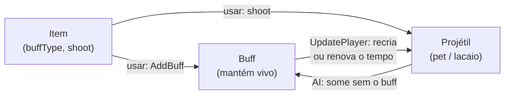

# 6. Projéteis

Tudo o que voa, gira ou fica no mundo por um tempo é um projétil: balas,
flechas, magias, ioiôs, lanças, chicotes, pets, lacaios, sentinelas, ganchos.
Um projétil novo é uma classe que estende `ModProjectile`.

Antes, leia as [ideias do guia 4](04-conteudo-novo.md). A lista completa de
campos e métodos está na [referência](../referencia/classes.md#modprojectile).

## O projétil mais simples

```js
export class ExampleBulletProjectile extends ModProjectile {
    constructor() {
        super();
        this.Texture = 'Projectiles/' + this.constructor.name;
    }

    SetDefaults() {
        this.Projectile.width = 8;
        this.Projectile.height = 8;
        this.Projectile.aiStyle = 1;          // a IA de bala do jogo
        this.Projectile.friendly = true;
        this.Projectile.ranged = true;
        this.Projectile.penetrate = 5;
        this.Projectile.timeLeft = 600;
    }
}

ModProjectile.register(ExampleBulletProjectile);
```

Registre o projétil **antes** do item que o usa: o item precisa do número dele
no `SetDefaults`.

## A IA: do jogo ou sua

Um projétil se move pela **IA**, que roda todo quadro. Há três jeitos de
escrevê-la:

1. **A de um projétil do jogo**, pelo `aiStyle`: `aiStyle = 1` é bala;
   o projétil se comporta como aquele estilo.
2. **A de um projétil específico do jogo**, pelo `AIType`: o tipo do projétil é
   trocado pelo `AIType` **só durante a IA**. É o que faz um mangual de mod
   balançar como o Sol Fundido, ou um pet voar como o Zephyr Fish: há IAs que
   olham o tipo, não só o `aiStyle`.

   ```js
   SetDefaults() {
       this.CloneDefaults(Terraria.ID.ProjectileID.Sunfury);
       this.AIType = Terraria.ID.ProjectileID.Sunfury;
   }
   ```

3. **A sua**, com `aiStyle = 0` e o movimento no `AI`:

   ```js
   AI(proj) {
       proj.rotation += 0.2;
       proj.velocity.Y += 0.15;       // gravidade
       if (++proj.ai[0] > 60) proj.velocity.X *= 0.98;
   }
   ```

`PreAI` roda antes e, devolvendo `false`, pula a IA do jogo **e** o `AI`;
`PostAI` roda depois de tudo. `OnSpawn` roda uma vez, no primeiro quadro de
vida.

`proj.ai` e `proj.localAI` guardam o estado da IA: no jogo são structs de 3
floats (`Float_FixedArray_3`), e a ponte aceita `[i]` neles como num array
(`proj.ai[0]++`, `proj.localAI[1] = 5`). Fora do tamanho, `RangeError`.

## Quando cada método roda

| Método | Quando |
|---|---|
| `SetStaticDefaults()` | Uma vez. `Terraria.Main.projFrames[this.Type] = n` aqui diz quantos quadros a textura tem. |
| `SetDefaults(proj)` | Todo projétil deste tipo que nasce. |
| `OnSpawn(proj)` | Uma vez, no primeiro quadro de vida. |
| `PreAI(proj)` | Antes da IA. `false` pula a IA do jogo e o `AI`. |
| `AI(proj)` | A IA sua, todo quadro. |
| `PostAI(proj)` | Depois da IA. |
| `OnTileCollide(proj, oldVelocity)` | Bateu num bloco e ia morrer: `false` o mantém vivo (para quicar, mude `proj.velocity`). `oldVelocity` é a de antes do choque. |
| `PreKill(proj, timeLeft)` | `false` tira os efeitos do jogo na morte (poeira, som); o projétil morre igual. |
| `OnKill(proj, timeLeft)` | Ao morrer (poeira, som, fragmentos). |
| `OnHitNPC(proj, npc)`, `OnHitPlayer(proj, player)` | Ao acertar. |
| `Colliding(proj, projHitbox, targetHitbox)` | `true`/`false` decide o acerto; `undefined` deixa o do jogo. |
| `CanDamage(proj)` | `false`: não causa dano. |
| `MinionContactDamage(proj)` | `true`: o lacaio (ou pet) fere ao encostar. |
| `ModifyDamageHitbox(proj, hitbox)` | Mude o `hitbox` (Rectangle) para o dano usar outra área. |
| `CanCutTiles(proj)`, `CutTiles(proj)` | Cortar grama e teia. |
| `GetAlpha(proj, lightColor)` | A cor final (uma `Color`), ou `undefined` para a do jogo. |
| `PreDraw(proj, lightColor)`, `PostDraw(proj, lightColor)` | Desenho: `false` no `PreDraw` não desenha o do jogo; desenhe o seu com `Main.EntitySpriteDraw`. |
| `CanUseGrapple(player, type)`, `UseGrapple(player, type)` | Gancho de escalar, no **molde**, antes de lançar: `false` impede; `UseGrapple` devolve o tipo a lançar. |
| `GrappleCanLatchOnTo(proj, player, tile)` | `true`/`false`: o gancho agarra neste bloco; `undefined` = o do jogo (bloco sólido). |

Todos entram no JS só para projéteis **de mod** (filtro nativo de tipo).

### Quicar

```js
OnTileCollide(proj, oldVelocity) {
    if (proj.velocity.X !== oldVelocity.X) proj.velocity.X = -oldVelocity.X;
    if (proj.velocity.Y !== oldVelocity.Y) proj.velocity.Y = -oldVelocity.Y * 0.8;
    return false;   // continua vivo
}
```

## Atalhos

- `this.CloneDefaults(ProjectileID.Spear)`: copia os valores de um projétil do
  jogo.
- `this.DefaultToSpear()`, `DefaultToYoyo()`, `DefaultToFlail()`,
  `DefaultToWhip()`, `DefaultToDrillOrChainsaw()`, `DefaultToKite()`: os
  padrões do jogo para cada família de projétil segurado. No **item**,
  `this.DefaultToWhip(projType, dano, repulsao, velocidade)` e
  `this.DefaultToSpear(projType, velocidade, tempo)`.

## Pets, lacaios e sentinelas

São um buff, um item e um projétil trabalhando juntos, como no tModLoader. O
Example Mod tem os quatro: o **Aviãozinho** (pet), a **Luz Irritante** (pet de
luz), o **Cajado do Lacaio de Exemplo** e o **Cajado da Sentinela de Exemplo**.



### Pet

O buff mantém o pet vivo. O jogo tem o método que cria o pet se faltar e
renova o buff; ele tem um parâmetro `ref bool`, então vai um `Ref`
([guia 2](02-ref-e-out.md)):

```js
const SpawnPet = Terraria.Player['void BuffHandle_SpawnPetIfNeededAndSetTime(int buffIndex, ref bool petBool, int petProjID, int buffTimeToGive)'];

export class ExamplePetBuff extends ModBuff {
    SetStaticDefaults() {
        Terraria.Main.buffNoTimeDisplay[this.Type] = true;
        Terraria.Main.vanityPet[this.Type] = true;     // lightPet para pet de luz
    }

    UpdatePlayer(player, buffIndex) {
        SpawnPet(player, buffIndex, new Ref(false), ModContent.ProjectileType('ExamplePetProjectile'), 18000);
    }
}
```

No item, `shoot` é o pet e `buffType` é o buff; no `UseItem`, o buff entra com
`player.AddBuff(item.buffType, 3600, false)`. O projétil marca
`Main.projPet[this.Type] = true` e, a cada quadro, fica vivo enquanto o dono
tiver o buff:

```js
AI(proj) {
    const player = Terraria.Main.player[proj.owner];
    if (!player.dead && player.FindBuffIndex(ModContent.BuffType('ExamplePetBuff')) >= 0) proj.timeLeft = 2;
}
```

Com `Main.vanityPet` (ou `Main.lightPet`) no buff, o item também entra no
**slot de pet** (ou de luz) do equipamento, e o jogo põe o buff sozinho. O
Aviãozinho usa a IA do Zephyr Fish: `this.CloneDefaults(ProjectileID.ZephyrFish)`
e `this.AIType = ProjectileID.ZephyrFish`. A IA do Zephyr Fish mantém o pet
vivo pelo `player.zephyrfish`; com ele em `false` no `PreAI`, quem decide é o
buff do mod.

### Lacaio

- No projétil: `Main.projPet[this.Type] = true`,
  `ProjectileID.Sets.MinionSacrificable` (o jogo troca o mais velho quando
  faltam vagas), `ProjectileID.Sets.MinionTargetingFeature` (segue o alvo
  marcado pelo chicote) e, no `SetDefaults`, `minion = true` e
  `minionSlots = 1`.
- No buff: `buffNoSave` e, no `UpdatePlayer`, `buffTime[i] = 18000` enquanto
  `player.ownedProjectileCounts[lacaio] > 0`; sem lacaio, `player.DelBuff(i)`.
- No item: `summon = true`, `buffType` e `shoot`; o `Shoot` põe o buff
  (`player.AddBuff(item.buffType, 2, false)`) e devolve `true` para o jogo
  criar o lacaio. No `ModifyShootStats`, `stats.position = Main.MouseWorld`
  põe o lacaio onde se tocou.
- `MinionContactDamage(proj)` devolvendo `true`: o lacaio fere ao encostar
  (o jogo não deixa pet nem lacaio ferir por contato).

O dano do lacaio sai do `originalDamage`, que o jogo recalcula a cada quadro
com os bônus de invocação. O Bunny Loader o preenche com o dano do item que
criou o projétil, como o tModLoader.

O contador de lacaios sob o ícone do buff:

```js
const counter = Terraria.DataStructures.CachedProjectileCounterBuffTextHandler.new(ModContent.ProjectileType('ExampleMinion'));
Terraria.ID.BuffID.Sets.BuffTextHandlers.Add(this.Type, counter);
```

### Sentinela

No item, `sentry = true`; no projétil, `sentry = true` e `timeLeft = 36000`
(10 minutos). O `Shoot` do Example Mod acha o chão com
`player.FindSentryRestingSpot(type, x, y, empurrao)` (três `out`), cria a
sentinela e chama `player.UpdateMaxTurrets()`, que tira a mais velha quando
passa do limite.

Para a sentinela pousar em plataforma: `decidesManualFallThrough = true` e
`shouldFallThrough = false` no `SetDefaults` (é o `TileCollideStyle` do
tModLoader). E `OnTileCollide` devolvendo `false`, para o chão não matá-la.

## Desenho próprio

`PreDraw` devolvendo `false` tira o desenho do jogo; desenhe o seu com
`Main.EntitySpriteDraw`. `lightColor` é a luz do lugar.

Método de instância guardado numa variável perde o objeto: use uma função que
o chama nele.

```js
const sb = Terraria.Main.spriteBatch;
const Draw = (...args) => sb['void Draw(Texture2D texture, Vector2 position, Nullable`1 sourceRectangle, Color color, float rotation, Vector2 origin, float scale, SpriteEffects effects, float layerDepth)'](...args);
```

## Diferenças do tModLoader

- `proj.ai`, `proj.localAI`, `proj.oldPos`, `proj.oldRot` não são arrays no
  celular (são structs de tamanho fixo), mas `[i]` funciona igual. O `ai`
  tem 3 posições.
- O projétil não tem `DamageType`: `melee`, `ranged`, `magic`, `minion` e
  `sentry` são campos `bool`. No item, `summon = true`.
- `player.HasBuff(t)` não existe no celular: `player.FindBuffIndex(t) >= 0`.
- `Main.ActiveNPCs` não existe: percorra `Terraria.Main.npc` (o último é
  vazio) e pule os `!npc.active`.
