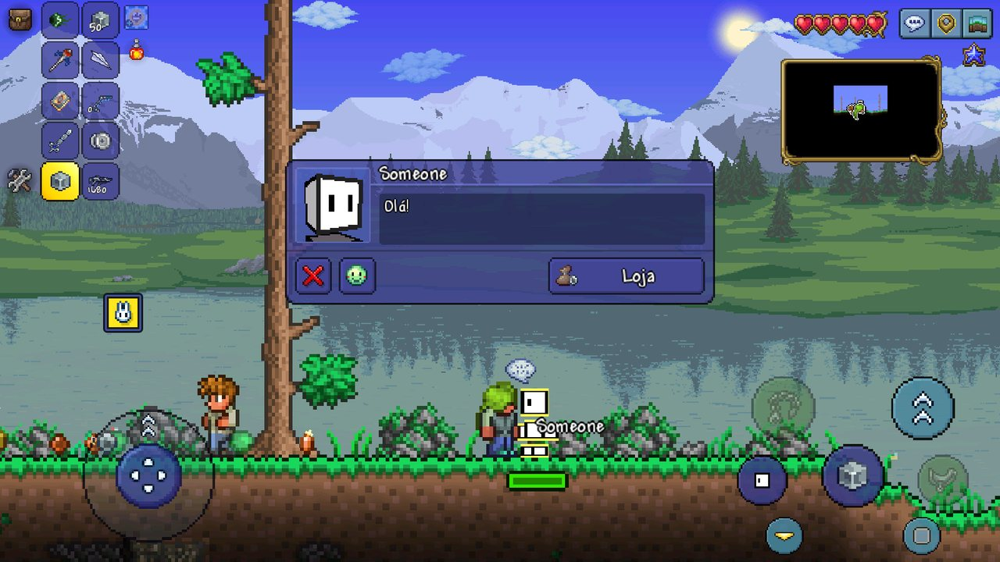
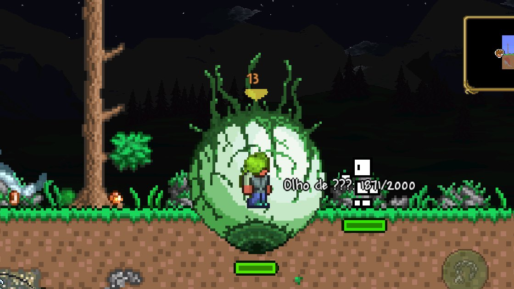

# 7. NPCs: inimigos, moradores e chefes

Todo ser vivo do mundo que não é jogador é um NPC: slimes, zumbis, chefes, o
Guia, a Enfermeira, os bichinhos. Um NPC novo é uma classe que estende
`ModNPC`. Este guia vai do inimigo simples (drop, spawn natural, Bestiário)
ao morador (casa, conversa, loja, humor) e ao chefe (IA própria e música).

Antes, leia as [ideias do guia 4](04-conteudo-novo.md). A lista completa de
campos e métodos está na [referência](../referencia/classes.md#modnpc).

## Um inimigo: o slime de exemplo

O `ExampleSlimeNPC` é um slime com dois quadros de animação, drop, spawn
natural de dia e entrada no Bestiário:

```js
const { SoundID, NPCID, ItemID } = Terraria.ID;
const { ItemDropRule } = Terraria.GameContent.ItemDropRules;
const Common = ItemDropRule['IItemDropRule Common(int itemId, int chanceDenominator, int minimumDropped, int maximumDropped)'];

export class ExampleSlimeNPC extends ModNPC {
    constructor() {
        super();
        this.Texture = 'NPCs/' + this.constructor.name;
    }

    SetStaticDefaults() {
        Terraria.Main.npcFrameCount[this.Type] = 2;   // a textura tem 2 quadros, em pé
    }

    SetDefaults() {
        this.NPC.width = 32;
        this.NPC.height = 24;
        this.NPC.aiStyle = 1;          // IA de slime do jogo
        this.NPC.damage = 7;
        this.NPC.defense = 2;
        this.NPC.lifeMax = 25;
        this.NPC.HitSound = SoundID.NPCHit1;
        this.NPC.DeathSound = SoundID.NPCDeath1;
        this.NPC.value = ModNPC.NPCValue(0, 0, 0, 25);
        this.AnimationType = NPCID.BlueSlime;   // anima como o slime azul
    }

    SpawnChance(info) {
        if (!info.CommonEnemy || !info.Day || !info.AboveSurface) return 0;
        return info.Rain ? 0.05 : 0.1;
    }

    ModifyNPCLoot(npcLoot) {
        npcLoot.Add(Common(ItemID.Gel, 1, 1, 2));
        npcLoot.Add(Common(ModContent.ItemType('ExampleItem'), 3, 5, 10));
    }
}

ModNPC.register(ExampleSlimeNPC);
```

- `SetDefaults` dá vida, dano e defesa **de base**. A escala de Expert e de
  Mestre é aplicada depois, pelo jogo, como nos NPCs dele.
- A textura é uma **tira vertical** de quadros; `Main.npcFrameCount[this.Type]`
  diz quantos.
- `AnimationType` faz o NPC animar como um do jogo. Para uma animação sua,
  escreva `FindFrame(npc, frameHeight)` e mude `npc.frame.Y`.

## A IA

Como no projétil ([guia 6](06-projeteis.md#a-ia-do-jogo-ou-sua)): o `aiStyle`
dá a IA de uma família do jogo (1 é slime, 3 é zumbi, 7 é morador), e
`aiStyle = -1` deixa tudo com o seu `AI`. `PreAI` devolvendo `false` pula a
IA do jogo e o `AI`; `PostAI` roda depois.

`npc.ai[0]` a `npc.ai[3]` e `npc.localAI[...]` guardam o estado, como no
projétil. `npc.target` é o índice do jogador alvo (`npc.TargetClosest()`
escolhe o mais perto).

## Métodos

| Método | Quando |
|---|---|
| `SetStaticDefaults()` | Uma vez. `Terraria.Main.npcFrameCount[this.Type] = n`: quadros da textura. |
| `SetDefaults(npc)` | Todo NPC deste tipo que nasce. Vida, dano e defesa aqui. |
| `ApplyBuffImmunity(npc)` | `npc.buffImmune[id] = true`. |
| `ModifyNPCLoot(npcLoot)` | Os drops: `npcLoot.Add(regra)`. Uma vez. |
| `SetBestiary(database, bestiaryEntry)` | A entrada no Bestiário: bioma, hora, texto. |
| `SpawnChance(info)` | Peso no spawn natural (`0` = não nasce). |
| `SpawnNPC(x, y)` | Como nasce quando é sorteado. Padrão: no ponto do sorteio. |
| `HitEffect(npc, hitDirection, damage)` | A cada golpe (poeira, gore). `npc.life <= 0` é o golpe que mata. |
| `PreAI(npc)`, `AI(npc)`, `PostAI(npc)` | A IA, todo quadro. |
| `FindFrame(npc, frameHeight)` | Animação sua: mude `npc.frame.Y`. |
| `CheckActive(npc)` | `false`: não some quando longe do jogador. |
| `PreKill(npc)`, `OnKill(npc)` | Na morte. `PreKill` devolvendo `false` cancela o drop. |

## Drops

`ItemDropRule` é a classe do jogo; pegue os métodos pela assinatura:

```js
const { ItemDropRule } = Terraria.GameContent.ItemDropRules;
const Common = ItemDropRule['IItemDropRule Common(int itemId, int chanceDenominator, int minimumDropped, int maximumDropped)'];
const NormalvsExpert = ItemDropRule['IItemDropRule NormalvsExpert(int itemId, int chanceDenominatorInNormal, int chanceDenominatorInExpert)'];

npcLoot.Add(Common(ItemID.Gel, 1, 1, 2));              // sempre, 1 a 2
npcLoot.Add(Common(meuItem, 3, 5, 10));                // 1 em 3, 5 a 10
npcLoot.Add(NormalvsExpert(ItemID.SlimeStaff, 10000, 7000));
```

Item de mod vale em qualquer regra. O drop do jogo (`CommonCode.DropItem*`)
recusava tipo acima dos do jogo, com o limite fixo no código; o Bunny Loader
troca esse limite pelo total de itens, como o tModLoader. Os drops aparecem no
Bestiário sozinhos.

## Spawn natural

`SpawnChance(info)` devolve um **peso**. Quando o jogo faz nascer um inimigo,
o sorteio é entre o do jogo (peso 1) e os de mod com peso maior que zero:
`0.1` é "de vez em quando"; `1` empata com o do jogo.

`info` é um `NPCSpawnInfo`, com:

- `SpawnTileX`, `SpawnTileY`, `Player`;
- altura: `Sky`, `Surface`, `Underground`, `Cavern`, `Underworld`,
  `AboveSurface`, `BelowSurface`;
- hora e evento: `Day`, `Night`, `Rain`, `SlimeRain`, `BloodMoon`,
  `SolarEclipse`, `PumpkinMoon`, `FrostMoon`, `AnyEvent`, `Invasion`,
  `AnyTower`;
- mundo: `HardMode`, `Expert`, `Master`;
- bioma: `Corruption`, `Crimson`, `Hallow` (e `Underground...` de cada um),
  `Snow`, `Ice`, `Jungle`, `UndergroundJungle`, `Mushroom`, `SurfaceMushroom`,
  `Ocean`, `Desert`, `DesertCave`, `Meteor`, `Marble`, `Granite`,
  `Graveyard`, `Dungeon`, `Lihzahrd`;
- `CommonEnemy`: sem invasão, evento ou pilar. O caso normal.

## Bestiário

```js
const { BestiaryDatabaseNPCsPopulator, FlavorTextBestiaryInfoElement } = Terraria.GameContent.Bestiary;

SetBestiary(database, bestiaryEntry) {
    const { SpawnConditions } = BestiaryDatabaseNPCsPopulator.CommonTags;
    bestiaryEntry.Info.Add(SpawnConditions.Biomes.Surface);
    bestiaryEntry.Info.Add(SpawnConditions.Times.DayTime);

    const texto = FlavorTextBestiaryInfoElement.new();
    texto['void .ctor(string languageKey)'](ModLocalization.Translate('Bestiary.ExampleSlimeNPC'));
    bestiaryEntry.Info.Add(texto);
}
```

O retrato, os drops e a contagem de mortes o Bestiário monta sozinho.
`HideFromBestiary = true` tira o NPC do Bestiário.

## Morador

Um NPC que se muda para uma casa, conversa, vende e tem humor, como os do
jogo. O Example Mod tem a **Pessoa** (`ExamplePerson`).



```js
export class ExamplePerson extends ModNPC {
    constructor() {
        super();
        this.Texture = 'NPCs/ExamplePerson/' + this.constructor.name;
    }

    SetStaticDefaults() {
        Terraria.Main.npcFrameCount[this.Type] = 25;
        NPCID.Sets.ExtraFramesCount[this.Type] = 9;
        NPCID.Sets.AttackFrameCount[this.Type] = 4;
        NPCID.Sets.DangerDetectRange[this.Type] = 700;
        NPCID.Sets.AttackType[this.Type] = 1;        // 0 arremesso, 1 tiro, 2 magia
        NPCID.Sets.AttackTime[this.Type] = 60;
        NPCID.Sets.AttackAverageChance[this.Type] = 35;
        this.Happiness
            .SetNPCAffection(NPCID.Nurse, AffectionLevel.Love)
            .SetBiomeAffection('Desert', AffectionLevel.Hate);
    }

    SetDefaults() {
        this.NPC.townNPC = true;
        this.NPC.friendly = true;
        this.NPC.aiStyle = 7;                        // a IA de morador do jogo
        this.AnimationType = NPCID.Guide;
        // ...vida, defesa, sons
    }

    CanTownNPCSpawn(numTownNPCs) { /* true: pode se mudar */ }
    CheckConditions(left, right, top, bottom) { return bottom <= Terraria.Main.worldSurface; }
    SetNPCNameList() { return ['Someone', 'Somebody', 'Blocky', 'Colorless']; }
    GetChat(npc) { return ModLocalization.GetTextValue('NPCChat.ExamplePerson_1'); }
}
```

| Método | Quando |
|---|---|
| `CanTownNPCSpawn(numTownNPCs)` | De tempos em tempos, enquanto não há um deste tipo no mundo: `true` e ele se muda para a próxima casa vaga. |
| `CheckConditions(left, right, top, bottom)` | A sala (em tiles) serve para ele? Vale na mudança e no menu de casas. |
| `SetNPCNameList()` | Os nomes próprios; um é sorteado quando ele chega. |
| `GetChat(npc)` | A fala ao conversar (texto). |
| `SetChatButtons(npc, buttons)` | Os botões da conversa: `buttons.button` e `buttons.button2` (o celular mostra até dois). |
| `OnChatButtonClicked(npc, firstButton)` | Tocou num botão. Devolva o nome de uma loja para abri-la. |
| `AddShops()` | As lojas, uma vez (ver abaixo). |
| `TownNPCAttackProj(npc, attack)` | O projétil do ataque: `attack.projType` e `attack.attackDelay`. |
| `TownNPCAttackStrength(npc, attack)` | `attack.damage` e `attack.knockback`. |
| `TownNPCAttackProjSpeed(npc, attack)` | `attack.speed`, `attack.gravityCorrection` (mirar acima) e `attack.randomOffset`. |

### Cabeça e texturas

Ao lado da `Texture`, pelo nome:

| Arquivo | Para quê |
|---|---|
| `_Head.png` | A cabeça no mapa e no menu de casas. **Sem ela o morador nunca se muda.** |
| `_Shimmer_Head.png` | A cabeça depois do shimmer. |
| `_Party.png`, `_Shimmer.png`, `_Shimmer_Party.png` | Com festa, depois do shimmer, e os dois. |
| `_Portrait.png`, `_Shimmer_Portrait.png` | O retrato da conversa (200x200). Sem ele, a conversa mostra o quadro do sprite. |

### Loja

```js
SetChatButtons(npc, buttons) {
    buttons.button = Terraria.Localization.Language['string GetTextValue(string key)']('LegacyInterface.28');   // "Loja"
}

OnChatButtonClicked(npc, firstButton) {
    if (firstButton) return 'Shop';
}

AddShops() {
    new NPCShop(this.Type, 'Shop')
        .Add(ModContent.ItemType('ExampleGun'))
        .Add(ModContent.ItemType('ExampleYoyo'), { condition: () => !Terraria.Main.dayTime })
        .Add(ModContent.ItemType('ExampleSwingingEnergySword'), { currency: ExampleCustomCurrency.CurrencyId, price: 10 })
        .Register();
}
```

Opções de cada item: `condition` (uma função; `false` e ele não aparece),
`price` (o preço) e `currency` (uma moeda própria). O preço passa pela
felicidade do morador, como nas lojas do jogo.

Moeda própria, paga com um item (a do Example Mod é o Exemplo de Item):

```js
const { CustomCurrencyManager, CustomCurrencySingleCoin } = Terraria.GameContent.UI;
const currency = CustomCurrencySingleCoin.new();
currency['void .ctor(int coinItemID, long currencyCap)'](ModContent.ItemType('ExampleItem'), 999);
currency.CurrencyTextKey = ModLocalization.Translate('CustomCurrency.ExampleItemCurrency');
const id = CustomCurrencyManager.RegisterCurrency(currency);
```

### Felicidade

`this.Happiness` (no `SetStaticDefaults`) grava os gostos no banco de
personalidades do próprio jogo, que calcula o humor e o preço da loja:
`SetNPCAffection(npcDoJogo, nível)` e `SetBiomeAffection('Forest' | 'Desert' |
'Snow' | 'Jungle' | 'Ocean' | 'Underground' | 'Hallow' | 'Mushroom' | 'Dungeon'
| 'Corruption' | 'Crimson', nível)`, com `AffectionLevel.Love`, `Like`,
`Dislike` ou `Hate`.

As falas de humor vêm de `TownNPCMood.<Classe>` no `Localization/<idioma>.json`:
`Content`, `NoHome`, `FarFromHome`, `LoveSpace`, `LikeBiome`, `LoveNPC`,
`DislikeCrowded`... O `{0}` vira o nome do bioma ou do NPC.

### Ataque

Com `NPCID.Sets.AttackType` e os outros sets de ataque, a IA de morador do jogo
leva ele a atacar: escolhe a hora e anima. O projétil vem do
`TownNPCAttackProj` e sai no inimigo à vista mais perto, com o dano escalado
pelo jogo.

### Gore

Todo PNG em `Textures/Gores/` do mod vira um gore, com o nome do arquivo:

```js
const NewGore = Terraria.Gore['int NewGore(Vector2 Position, Vector2 Velocity, int Type, float Scale)'];
NewGore(npc.position, npc.velocity, ModGore.getTypeByName('ExamplePerson_Gore_Head'), 1);
```

### Save

O morador vai para `<mundo>.wld.npcs.bl`, **pelo nome**: posição, casa, nome
próprio, variação, a sala guardada e se passou pelo shimmer. O `.wld` fica sem
ele, então o mundo abre sem o mod, e o morador volta quando o mod volta.

### Diferenças do tModLoader

- O celular mostra até dois botões na conversa (`SetChatButtons`).
- Ainda não há `ModifyNPCHappiness`, `CanGoToStatue` (estátua do rei ou da
  rainha) nem os ataques `TownNPCAttackCooldown`, `Shoot`, `Magic` e `Swing`.
- O alvo do tiro é o inimigo à vista mais perto (o do jogo fica em variáveis
  que o mod não alcança).

## Chefe

O Example Mod tem um chefe, o **Olho de ???** (`ExampleBoss`), invocado à
noite pelo `ExampleBossSummonItem`.



- `this.NPC.boss = true`: barra de vida de chefe, e o jogo o trata como chefe
  (não some longe, não conta no spawn natural);
- `aiStyle = -1` e a IA no `AI`: persegue o jogador; na metade da vida acelera
  e troca a animação; de dia, foge (`npc.EncourageDespawn(10)`);
- a invocação é um item comum que chama o jogo:

  ```js
  CanUseItem(item, player) {
      return !Terraria.Main.dayTime && !Terraria.NPC.AnyNPCs(ModContent.NPCType('ExampleBoss'));
  }
  UseItem(item, player) {
      if (player.whoAmI !== Terraria.Main.myPlayer) return;
      PlaySound(SoundID.Roar, player.position, 0, 0);
      Terraria.NPC.SpawnOnPlayer(player.whoAmI, ModContent.NPCType('ExampleBoss'), 0, 0, 0, 0);
  }
  ```

- a **música** da luta é o campo `Music` ([guia 10](10-sons-e-musica.md#música)):

  ```js
  SetDefaults() {
      // ...
      this.Music = MusicLoader.GetMusicSlot('Music/Ropocalypse2');
  }
  ```

Ícone de chefe no mapa, sacola de tesouro e a marca de chefe derrotado ainda
não têm atalho no Bunny Loader.
