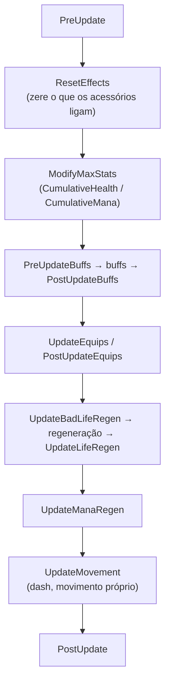

# 8. Jogador e buffs

Dois tipos de conteúdo que moram no **jogador**:

- `ModPlayer`: dados e comportamento de cada jogador (um dash, um contador de
  mortes, um bônus que um acessório liga);
- `ModBuff`: um buff ou debuff novo, com ícone e efeito.

Antes, leia as [ideias do guia 4](04-conteudo-novo.md). A lista completa está
na referência: [`ModPlayer`](../referencia/classes.md#modplayer) e
[`ModBuff`](../referencia/classes.md#modbuff).

## ModPlayer

Cada jogador tem a **própria instância** de cada `ModPlayer` registrado,
criada na primeira vez que alguém pergunta por ela. No multijogador, o escudo
de um jogador liga o dash só dele, e não o de todos.

```js
export class ExampleDashPlayer extends ModPlayer {
    DashAccessoryEquipped = false;

    ResetEffects(player) {
        this.DashAccessoryEquipped = false;   // o acessório liga de novo, se estiver equipado
    }

    UpdateMovement(player) {
        if (this.DashAccessoryEquipped) { /* ... */ }
    }
}

ModPlayer.register(ExampleDashPlayer);
```

E no acessório:

```js
UpdateAccessory(item, player, vanity, hideVisual) {
    player.GetModPlayer(ExampleDashPlayer).DashAccessoryEquipped = true;
}
```

Esse é o padrão de quase todo efeito de equipamento: o `ResetEffects` **desliga**
a cada quadro, o item **liga** enquanto estiver equipado, e o `ModPlayer` faz o
efeito. Tirou o item, o efeito some no quadro seguinte, sem ninguém precisar
perceber a troca.

### Achar a instância

| | |
|---|---|
| `player.GetModPlayer(Classe)` | A instância daquele jogador (também por nome: `GetModPlayer('ExampleDashPlayer')`). |
| `Classe.get(player)` | O mesmo. |
| `this.Player` | O jogador desta instância. Os métodos também o recebem como primeiro argumento. |
| `ModPlayer.getByName(nome)` | A instância do jogador **local**. Serve para código de uma só tela (interface), não para lógica de jogo. |

### Um quadro do jogador

Os métodos, na ordem em que rodam num quadro:



| Método | Quando |
|---|---|
| `PreUpdate(player)` | Início do quadro do jogador. |
| `ResetEffects(player)` | Logo depois do jogo zerar os efeitos: zere aqui o que os acessórios ligam. |
| `ModifyMaxStats(player)` | Depois do `ResetEffects`: `this.CumulativeHealth`/`CumulativeMana` somam à vida/mana máxima. |
| `PreUpdateBuffs(player)`, `PostUpdateBuffs(player)` | Em volta dos buffs. |
| `UpdateEquips(player)` (ou `PostUpdateEquips`) | Depois dos equipamentos e acessórios. |
| `UpdateBadLifeRegen(player)`, `UpdateLifeRegen(player)` | Antes e depois da regeneração de vida. |
| `UpdateManaRegen(player)` | Depois da regeneração de mana. |
| `UpdateMovement(player)` | Movimento próprio (dash): perto do fim do quadro. |
| `PostUpdate(player)` | Fim do quadro. |
| `UpdateDead(player)` | Todo quadro morto (no lugar dos outros). |

Outros:

| Método | Quando |
|---|---|
| `Initialize()` | Uma vez, quando a instância nasce. |
| `OnEnterWorld(player)` | O jogador entrou no mundo. |
| `OnRespawn(player)` | Voltou a viver. |
| `CanUseItem(player, item)` | `false` impede usar. |
| `ModifyWeaponDamage(player, item, dano)` | Devolva o dano novo (ou ponha em `this.WeaponDamage`). |
| `ImmuneTo(player, fonte, cooldown, esquivavel)` | `true`: o golpe não acontece. |
| `FreeDodge(player, fonte, dano, ...)` | `true`: esquiva. |
| `ModifyHurt(player, mod)` | Mude `mod.damage`, `mod.hitDirection`, `mod.crit`... antes do golpe. |
| `OnHurt(player, fonte, dano, ...)`, `PostHurt(...)` | Depois do golpe (`PostHurt`, só se sobreviveu). |
| `PreKill(player, fonte, dano, direcao, pvp)` | `false` impede a morte (dê vida ao jogador, senão ele segue com 0). |
| `Kill(player, fonte, dano, direcao, pvp)` | Morreu. |

Mais de um mod com `ModPlayer`: roda na ordem de carga dos mods (pelo uid) e,
dentro de um mod, na ordem do `register`.

### Dados salvos

O que o jogador deve lembrar entre sessões vai no `SaveData` e volta no
`LoadData`:

```js
SaveData(data) {
    data.mortes = this.mortes;
}

LoadData(data) {
    this.mortes = data.mortes ?? 0;
}
```

`data` é um objeto JS comum (vira JSON), gravado em
`Players/<personagem>.plr.bl.json`, ao lado do save do jogo, **sempre que o
jogo salva o personagem** (ao sair, na morte, no autosave). Com o mod
desligado, os dados dele ficam guardados no arquivo e voltam quando ele é
religado. Personagem salvo na nuvem fica de fora.

### Dash e toque duplo no celular

No celular, o primeiro toque numa direção põe o `player.doubleTapCardinalTimer`
em **30**, e não em 15 como no PC. O segundo toque só conta com o timer abaixo
de 30. Um dash copiado do tModLoader com `timer < 15` não sai no aparelho. O
`ExampleDashPlayer` usa 30 e aceita também o botão de dash do jogo
(`player.controlDash`).

No multijogador, **só o dono** decide o dash
(`player.whoAmI === Main.myPlayer`). Os outros aparelhos recebem os controles
pela rede com atraso, e o timer de lá dá toque duplo onde não houve. O
movimento chega aos outros pela posição do jogador.

## ModBuff

Um buff (ou debuff) novo. **Uma instância por tipo** (buff não é entidade: é
um número e um tempo numa lista do jogador ou do NPC). Os métodos recebem o
jogador ou o NPC e a posição do buff na lista dele.

```js
export class ExampleDefenseBuff extends ModBuff {
    constructor() {
        super();
        this.Texture = 'Buffs/' + this.constructor.name;   // 32x32
        this.DefenseBonus = 10;
    }

    ModifyDescription() {
        this.Description = this.Description.replace('{0}', this.DefenseBonus);
    }

    UpdatePlayer(player, buffIndex) {
        player.statDefense += this.DefenseBonus;
    }
}

ModBuff.register(ExampleDefenseBuff);
```

Um item que dá o buff: `this.Item.buffType = ModContent.BuffType('ExampleDefenseBuff')`
e `this.Item.buffTime = 5400` (em quadros; 60 = 1 segundo). Registre o buff
antes do item.

Nome e descrição vêm de `BuffName.<Classe>` e `BuffDescription.<Classe>` em
`Localization/*.json` (ou de `this.DisplayName`/`this.Description`).
`ModifyDisplayName`/`ModifyDescription` rodam uma vez por idioma.

| Método | Quando |
|---|---|
| `SetStaticDefaults()` | Uma vez, com o tipo nas tabelas: `Terraria.Main.debuff[this.Type] = true`, `buffNoSave`, `buffNoTimeDisplay`, `persistentBuff`, `BuffID.Sets...`. |
| `UpdatePlayer(player, i)` | Todo quadro, com o buff ativo no jogador (depois do `ResetEffects`, como os do jogo). Pode tirar o próprio buff com `player.DelBuff(i)`: o buff que vier para a posição `i` ainda roda no mesmo quadro. |
| `UpdateNPC(npc, i)` | Todo quadro, com o buff ativo no NPC. |
| `ApplyPlayer(player, tempo)`, `ApplyNPC(npc, tempo)` | Quando o buff entra. |
| `ReApplyPlayer(player, tempo, i)`, `ReApplyNPC(npc, tempo, i)` | Quando entra de novo, já ativo. `false` impede o jogo de renovar o tempo. |
| `CanRemove(player, tempo, i, debuff)` | Ao tocar no ícone para tirar. `true`/`false` decide; `null` deixa com o jogo (debuff não sai). |
| `OnRemove(player, tempo, i)` | Depois de tirado pelo toque. |

Buff de mod ativo no personagem é salvo pelo **nome**, como o item. Com o mod
desligado, ele fica guardado no arquivo e volta quando o mod é religado.

O buff também serve de "motor" para pets e lacaios ([guia 6](06-projeteis.md#pets-lacaios-e-sentinelas)).
