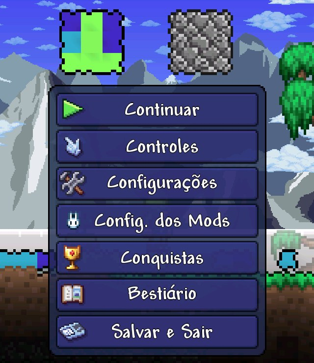
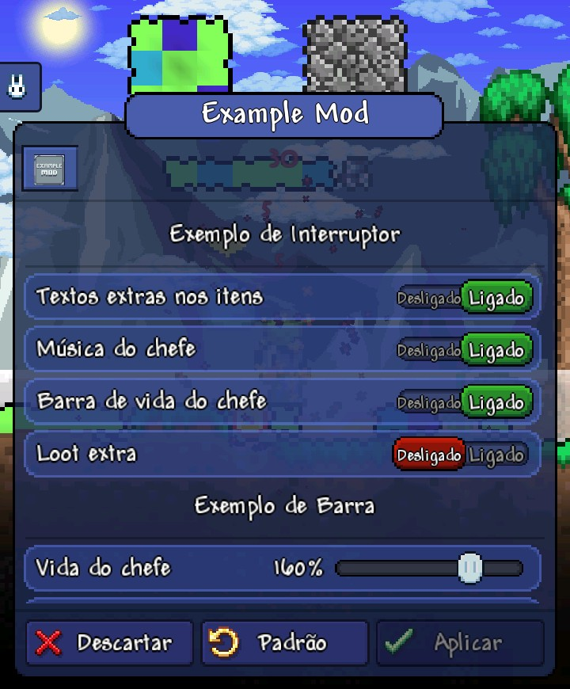
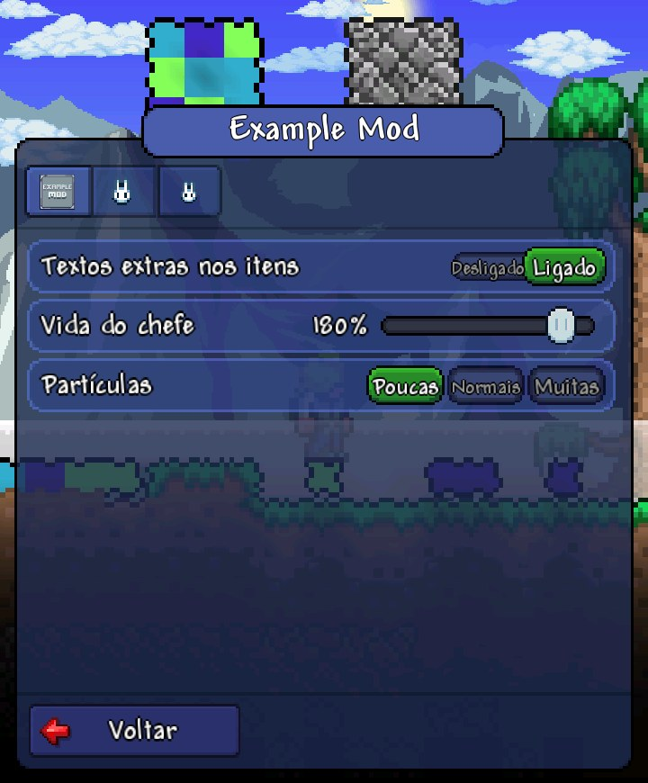

# 14. Opções do mod (`ModConfig`)

O jogador muda as opções do seu mod pelo menu de pausa, no botão
**Config. dos Mods**, logo abaixo de Configurações, com o coelho do Bunny
Loader de ícone.



A tela que ele abre é a de Configurações do jogo: as mesmas peças, os mesmos
sons, o mesmo Voltar. Mod sem `ModConfig` não aparece nela.

É o `ModConfig` do tModLoader, com as opções declaradas num objeto em vez de
atributos C#.

## A tela

<table>
<tr>
<td width="50%"></td>
<td width="50%"></td>
</tr>
<tr>
<td>Um mod com opções: uma aba só, da largura da fileira.</td>
<td>Três mods: uma aba por mod. O mod sem <code>icon.png</code> ganha o coelho.</td>
</tr>
</table>

- **As abas**, no topo, são os mods: uma por mod que tem opções, com o
  `icon.png` dele. Tocar numa aba mostra as opções daquele mod, e o nome dele
  vai para o título.
- **As linhas** são as opções do mod escolhido, na ordem em que foram
  declaradas.
- **A lista rola** como a de Configurações: arraste para cima ou para baixo, e
  ao soltar ela segue no embalo até parar. A linha na borda aparece cortada.
- **Interruptor**: toque na linha para trocar entre Desligado e Ligado.
- **Barra**: arraste a bolinha. Só a barra onde o dedo encostou se mexe;
  arrastar a lista por cima das barras não muda nenhuma.
- **Escolha única**: toque na escolha. Tocar no nome da linha passa para a
  próxima.
- O **Voltar** (ou o voltar do Android) fecha a tela e grava as mudanças.

## Declarando

Uma classe que estende `ModConfig`, exportada de qualquer arquivo de `Content/`
ou `Common/` (o carregador acha sozinho, como o resto do conteúdo):

```js
// Common/Configs/ExampleConfig.js
export class ExampleConfig extends ModConfig {
    static Options = {
        ShowFlavorText: ModConfig.Toggle(true),
        BossHealth: ModConfig.Range(100, { min: 50, max: 200, step: 10, suffix: '%' }),
        Particles: ModConfig.Radio('normal', ['low', 'normal', 'high']),
    };

    OnChanged(key) {
        bl.log(`ExampleConfig: ${key} = ${this[key]}`);
    }
}
```

| Controle | Na tela | O valor |
|---|---|---|
| `ModConfig.Header()` | Um título de seção, em dourado, com um fio embaixo | Nenhum |
| `ModConfig.Toggle(padrão)` | O interruptor "Desligado / Ligado" do jogo | `true` ou `false` |
| `ModConfig.Range(padrão, { min, max, step, suffix })` | A barra deslizante do jogo, com o valor ao lado (`suffix` vai depois do número) | Um número de `min` a `max`, sempre num degrau de `step` |
| `ModConfig.Radio(padrão, [escolhas])` | Um botão por escolha, lado a lado; a escolhida fica verde | O texto da escolha |
| `ModConfig.Dropdown(padrão, [escolhas])` | A lista suspensa do jogo (como a "Pausa Automática"): toque na linha e escolha; até 12 escolhas | O texto da escolha |
| `ModConfig.Cycle(padrão, [escolhas])` | `< Escolha >` à direita; cada toque passa para a próxima | O texto da escolha |
| `ModConfig.Color('#RRGGBB')` | Uma amostra da cor e as barras de tom, saturação e leveza do jogo | `'#RRGGBB'` |
| `ModConfig.Button('Método')` | Um botão à direita da linha; o toque chama o método da config (ou a função passada) | Nenhum |
| `ModConfig.Link('https://...')` | Um botão à direita da linha que abre o endereço no navegador | Nenhum |

Qualquer opção aceita `enabledWhen`: o nome de outra opção (a linha só vale
quando ela está ligada) ou uma função que recebe a config. Desabilitada, a linha
fica apagada como o "Mapa" das Configurações do jogo e não aceita toque.

```js
EnablePets: ModConfig.Toggle(false),
PetGlow: ModConfig.Toggle(true, { enabledWhen: 'EnablePets' }),
```

Um `Button` pode chamar os métodos que toda config tem: `ResetToDefaults()`
volta tudo ao padrão, e `SetOption(chave, valor)` muda uma opção pela tela (é
gravada e avisa o `OnChanged`), como o "Sortear" do Example Mod:

```js
RandomGlow: ModConfig.Button('RandomizeGlow'),
ResetAll: ModConfig.Button('ResetToDefaults'),

RandomizeGlow() {
    this.SetOption('GlowColor', '#' + Math.floor(Math.random() * 0x1000000).toString(16).padStart(6, '0'));
}
```

O número da barra aparece com as casas decimais do `step`: `step: 0.1` mostra
`1.5x`, `step: 10` mostra `150%`.

As opções aparecem na ordem em que foram escritas. Um mod pode ter mais de uma
classe `ModConfig`: as opções de todas entram na mesma aba, uma classe depois
da outra.

O [`ExampleConfig`](../../samples/ExampleMod/content/Common/Configs/ExampleConfig.js)
do Example Mod tem uma seção de exemplo para cada tipo ("Exemplo de
Interruptor", "Exemplo de Lista Suspensa", "Exemplo de Cor"...).

## Lendo

O valor atual de cada opção é uma propriedade da instância:

```js
const config = ModContent.GetInstance(ExampleConfig);
if (config.ShowFlavorText) { ... }
npc.lifeMax = Math.round(npc.lifeMax * config.BossHealth / 100);
```

Leia na hora de usar, não guarde numa variável no carregamento: o jogador pode
mudar a opção com o jogo aberto.

## Os textos

Como no tModLoader, do `Localization/<cultura>.json` do mod:

```json
{
  "Configs": {
    "ExampleConfig": {
      "BossHealth": { "Label": "Vida do chefe" },
      "Particles": { "Label": "Partículas", "low": "Poucas", "normal": "Normais", "high": "Muitas" }
    }
  }
}
```

`Configs.<Classe>.<Opção>.Label` é o nome da linha (num `Header`, o título).
Num `Radio`, `Dropdown` ou `Cycle`, cada escolha tem a sua chave
(`Configs.<Classe>.<Opção>.<escolha>`), e num `Button` ou `Link` o texto do
botão vem de `Configs.<Classe>.<Opção>.Text`. Sem o arquivo, vale o
`label` passado na opção (`ModConfig.Toggle(true, { label: 'Modo rápido' })`, e
`labels: [...]` para as escolhas de um `Radio`); sem ele, o nome da opção
separado ("BossHealth" vira "Boss Health"). O "Ligado" e o "Desligado" do
interruptor vêm do próprio jogo, no idioma dele.

Prefira nomes curtos: a linha de uma barra divide o espaço com o valor e com a
barra, e um nome longo encosta no número (no Example Mod, "Quantidade de
minério" virou "Minério"). As escolhas de um `Radio` encolhem para caber no
botão.

## Onde fica salvo

Em `mod_data/<uid do mod>/<Classe>.json`, só o que difere do padrão. Grava ao
soltar o dedo e ao fechar a tela. Um valor salvo que não serve mais (a opção foi
removida, o `Radio` perdeu a escolha, o número saiu da faixa nova) volta ao
padrão: uma versão nova do mod não quebra por causa da config da antiga.

## Ganchos

- `OnLoaded()`: os valores acabaram de ser lidos do arquivo, no carregamento do
  mod.
- `OnChanged(key)`: o jogador mudou a opção `key` na tela.

## O que ainda não tem

- **Opções do servidor.** Toda opção é do aparelho (o `ClientSide` do
  tModLoader): no multijogador, cada jogador tem as suas.
- Campo de texto e número digitado (`Text` e `Number`): dependem do teclado do
  Android aberto de dentro do menu de pausa, que ainda não funciona direito.
- Lista de itens e escolha de item.
- Com muitos mods, as abas não rolam: cabem as da largura da fileira.
