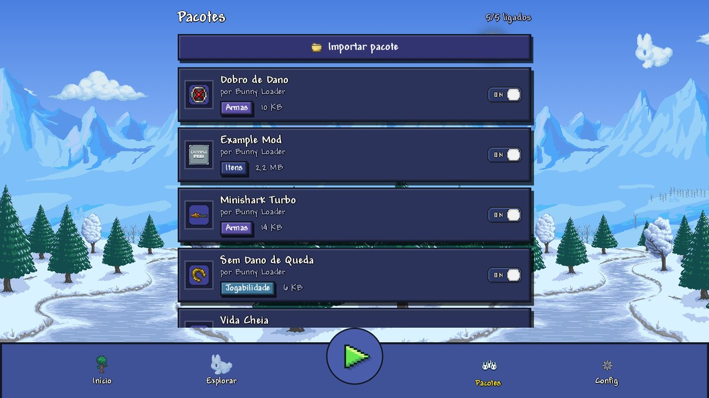
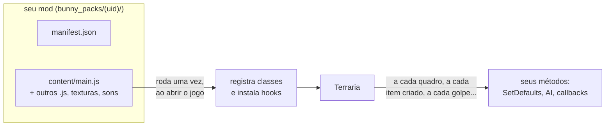

# Criando mods para o Bunny Loader

Um mod do Bunny Loader é **JavaScript que roda dentro do Terraria Mobile**. Ele
lê e escreve os campos do jogo, chama os métodos dele, intercepta (hook)
qualquer método para mudar o que ele faz, e cria conteúdo novo: itens, armas,
projéteis, inimigos, chefes, moradores, blocos, buffs, sons e músicas.

Não precisa compilar nada nem mexer no jogo: um mod é uma pasta com um
`manifest.json` e um `main.js`. Para quem vem do tModLoader, as classes têm os
mesmos nomes e o mesmo formato (`ModItem`, `ModNPC`, `SetDefaults`, `AI`...).



## Como um mod roda



1. Ao abrir o jogo, o Bunny Loader roda o `main.js` de cada mod ligado, **uma
   vez**. É ali que o mod registra as classes dele e instala os hooks.
2. Depois, é o **jogo** que chama o mod: a cada quadro, a cada item que nasce,
   a cada golpe. O código do mod roda dentro desses momentos.
3. Todos os mods rodam no **mesmo motor JavaScript** (o QuickJS), então um mod
   pode chamar o outro como uma função comum.

## Os guias

Leia na ordem; cada um usa o anterior.

| Guia | O que ensina |
|---|---|
| **A ponte com o jogo** | |
| [1. Hooks: mudar o que o jogo já tem](01-hooks-do-zero.md) | O primeiro mod. Classes, campos, métodos, structs e, principalmente, hooks. |
| [2. `ref` e `out`](02-ref-e-out.md) | Chamar e hookar métodos que devolvem por parâmetro: pesca, taxa de spawn, colisão. |
| [3. Custo e desempenho](03-custo-e-desempenho.md) | Quanto custa cada coisa, quantas vezes o jogo chama cada método, e como fazer um mod leve. |
| **Conteúdo novo** | |
| [4. Conteúdo novo: as ideias](04-conteudo-novo.md) | Estender e registrar, molde e instância, `ModContent`, texturas, tradução, Mod Menu, saves. |
| [5. Itens](05-itens.md) | `ModItem`: armas, tiro, acessórios, tooltip colorido, vara de pesca, receitas, `ModSystem`. |
| [6. Projéteis](06-projeteis.md) | `ModProjectile`: IA, colisão, desenho; pets, lacaios e sentinelas. |
| [7. NPCs](07-npcs.md) | `ModNPC`: inimigos, drops, spawn natural, Bestiário, moradores com loja e chefes. |
| [8. Jogador e buffs](08-jogador-e-buffs.md) | `ModPlayer` (dash, dados salvos) e `ModBuff`. |
| [9. Blocos](09-blocos.md) | `ModTile`: blocos 1x1, e como o mundo salvo continua abrindo sem o mod. |
| [10. Sons e música](10-sons-e-musica.md) | `SoundStyle`, `SoundEngine.PlaySound`, música de chefe. |
| **Entre mods** | |
| [11. Conversa entre mods](11-conversa-entre-mods.md) | Achar outro mod e chamar o que ele oferece (`ModLoader.TryGetMod` + `Call`). |

Para consultar:

- [O que cada classe tem hoje](../referencia/classes.md): todo campo e todo
  método de `ModItem`, `ModNPC`... e o que ainda não existe;
- [A ponte e o `bl`](../referencia/ponte-e-bl.md): a sintaxe da ponte e todas
  as funções `bl.*`.

## Os exemplos

Os mods de [`samples/`](../../samples) são exemplos completos:

| Mod | O que mostra |
|---|---|
| [`DobroDeDano`](../../samples/DobroDeDano) | O menor mod que faz algo: um hook em `Item.SetDefaults`. |
| [`VidaCheia`](../../samples/VidaCheia), [`SemQueda`](../../samples/SemQueda) | Hook em `Player.Update`, mexendo em campos do jogador. |
| [`HelloMod`](../../samples/HelloMod) | A Minishark mais rápida; o comentário do topo documenta a API inteira. |
| [`ExampleMod`](../../samples/ExampleMod) | O `ExampleMod` do tModLoader portado: dezenas de itens, projéteis, NPCs, um morador, um chefe, blocos, buffs, receitas, tradução, som e música. |

---

## O pacote

Um mod é uma pasta (ou um zip dela) com esta cara:

```
MeuMod/
  manifest.json      quem é o mod (obrigatório)
  icon.png           ícone quadrado, aparece na lista (recomendado)
  banner.png         capa da ficha do mod, ~3,4:1, ex. 384x112 (opcional)
  thumbnails/        imagens extras da ficha, .png ou .jpg (opcional)
  content/           o mod em si
    main.js          o arquivo de entrada (o nome vem do manifesto)
    ...              o que mais ele usar: outros .js, texturas, traduções, sons
```

Tudo o que o mod lê (outro `.js`, uma textura, um `.json`) fica dentro de
`content/`, e os caminhos no código são relativos a ela.

### O `manifest.json`

```json
{
  "uid": "7c2e9d41-5b3a-4f8e-9a61-2d0c4e8b7f15",
  "id": "meumod",
  "name": "Meu Mod",
  "version": "1.0.0",
  "author": "Seu Nome",
  "category": "Jogabilidade",
  "summary": "Uma linha, para o cartão da lista.",
  "description": "Um parágrafo, para a ficha do mod.",
  "updated": "2026-09-24",
  "blVersion": 1,
  "entry": "main.js"
}
```

| Campo | |
|---|---|
| `uid` | **Obrigatório.** Um UUID em minúsculas. É a identidade do mod e o nome da pasta dele: dois mods com o mesmo `uid` são o mesmo mod (instalar um substitui o outro). Gere um uma vez e nunca mude: `python -c "import uuid; print(uuid.uuid4())"`. |
| `id` | Apelido curto, só letras. É por ele que outro mod acha o seu (`ModLoader.TryGetMod`, [guia 11](11-conversa-entre-mods.md)) e que `ModContent` acha o seu conteúdo (`'meumod/Espada'`). Não precisa ser único, mas dois mods instalados com o mesmo `id` só se acham pelo `uid`. |
| `name`, `author`, `version` | O que a lista mostra. |
| `category` | Texto livre. `Textura`, `Armas`, `Jogabilidade`, `Cheat`, `Utilidade` e `Itens` ganham cor e ícone próprios. |
| `summary`, `description`, `updated` | O cartão e a ficha do mod. `updated` é `AAAA-MM-DD`. |
| `blVersion` | Versão da API do Bunny Loader que o mod usa. Hoje, `1`. Um mod que pede uma versão maior que a do app é recusado na importação. |
| `entry` | O arquivo de entrada, relativo a `content/`. Padrão: `main.js`. |

## Instalando

Os mods instalados moram em

```
Android/data/com.bunnyloader/bunny_packs/<uid>/
```

a mesma pasta dos saves (`Players/`, `Worlds/`), e é **dali** que o jogo
carrega. Três jeitos de pôr um mod lá:

1. **Importar**: na aba *Pacotes*, "Importar pacote", escolha o zip. O zip
   (`.bmod` ou `.zip`) tem `manifest.json`, `icon.png` e `content/` na raiz, ou
   dentro de uma pasta só, que o app ignora. Se o manifesto estiver errado, o
   app diz o quê e não instala nada.
2. **Copiar a pasta**: com um gerenciador de arquivos, ponha a pasta do mod em
   `bunny_packs/`. Ela aparece na lista quando o app volta à frente. Com outro
   nome (`bunny_packs/MeuMod/`), o app renomeia para o `uid` do manifesto.
3. **adb**, o mais rápido para desenvolver. Mande um `.tar` e extraia no
   aparelho (em alguns aparelhos e emuladores, o `adb push` de uma pasta com
   subpastas para `Android/data` chega pela metade):

   ```bash
   tar -C MeuMod -cf mod.tar .
   adb push mod.tar /data/local/tmp/mod.tar
   adb shell "P=/sdcard/Android/data/com.bunnyloader/bunny_packs/7c2e9d41-5b3a-4f8e-9a61-2d0c4e8b7f15; rm -rf \$P; mkdir -p \$P && tar -xf /data/local/tmp/mod.tar -C \$P && chmod -R 777 \$P"
   ```

   O `chmod` importa: arquivo posto pelo adb pertence ao usuário `shell`, e sem
   ele o app lê o mod mas não consegue apagá-lo nem atualizá-lo depois.

Para mudar um mod instalado, edite os arquivos dentro de `bunny_packs/<uid>/` e
**reabra o jogo**: os mods são lidos quando o jogo sobe, não enquanto ele
roda. O interruptor na aba *Pacotes* liga e desliga o mod para o próximo boot.

## Vendo o que o mod faz

Tudo o que o mod escreve com `bl.log(...)`, e todo erro de JavaScript, vai para
um arquivo de texto, um por vez que o jogo abre:

```
Android/data/com.bunnyloader/logs/bunny_2026-09-25_14-03-27.txt
```

Ficam os 3 mais recentes (o mais velho é apagado), então o log da vez em que o
jogo fechou sozinho ainda está lá quando você reabre. Cada linha tem a hora e o
nível (`I` informação, `W` aviso, `E` erro):

```
14:03:31.204 I [mod] Dano em Dobro: ativo
```

Do próprio Bunny Loader, o arquivo traz só o resumo de cada sistema (`itens de
mod: 97 instalado(s)...`, `tiles de mod: limites do codigo trocados em 19 de
19`), os saves e os erros. O detalhe (cada tabela aumentada, cada hook, cada
tipo registrado) só entra no arquivo com **Configurações > Log detalhado**
ligado; para investigar um problema do próprio loader, ligue e mande o
arquivo.

Pelo computador, o mesmo sai no logcat, com a tag `BunnyLoader` (lá o detalhe
aparece sempre):

```bash
adb logcat -s BunnyLoader
```

`bl.log` aceita vários valores, como o `console.log`, e objeto ou array vira
JSON: `bl.log('vida', player.statLife, { x: 1 })` escreve `vida 400 {"x":1}`.

### Quando dá erro

- Um erro no **topo** do `main.js` impede o mod de carregar e aparece no log
  com a linha. Os outros mods carregam normalmente.
- Um erro dentro de um **hook** não derruba o jogo: é logado a **cada**
  chamada (um erro num hook de todo quadro enche o log rápido), e se o
  callback quebrou antes de chamar o `original`, o Bunny Loader chama o método
  do jogo por você.
- Nos métodos das **classes** (`SetDefaults` de um `ModItem`, `AI` de um
  `ModNPC`...), o erro é logado **uma vez** por método e o resto segue.

Com **Mostrar erro dentro do jogo** ligado (aba *Config*), o primeiro erro
também aparece na tela, dentro do jogo, com um botão para copiar o log.

## Multijogador

Os mods rodam em cada aparelho: o de quem hospeda e o de quem entra. Duas
regras:

- **Todos precisam dos mesmos mods de conteúdo.** Item e NPC de mod ganham um
  número na ordem em que são registrados; se um lado tiver um mod a mais ou a
  menos, o número de um item aponta para outra coisa no outro lado.
- **Hook roda para todos os jogadores.** `Player.Update` é chamado para cada
  jogador do mundo, não só para o seu. Para mexer só no seu, confira o índice:
  `if (i !== Terraria.Main.myPlayer) return;` (ver o [guia 1](01-hooks-do-zero.md#hook-roda-para-todos)).

## Por dentro

Como o Bunny Loader entra no jogo, intercepta métodos, divide o motor entre as
threads e põe conteúdo novo nas tabelas está na [documentação do núcleo](../nucleo/README.md).
