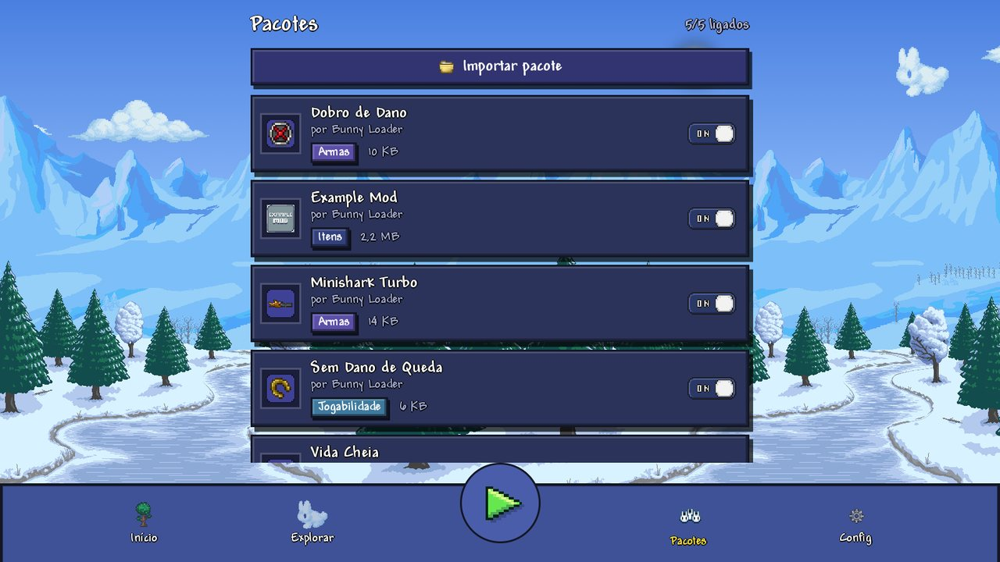
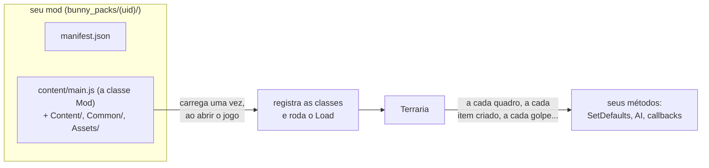
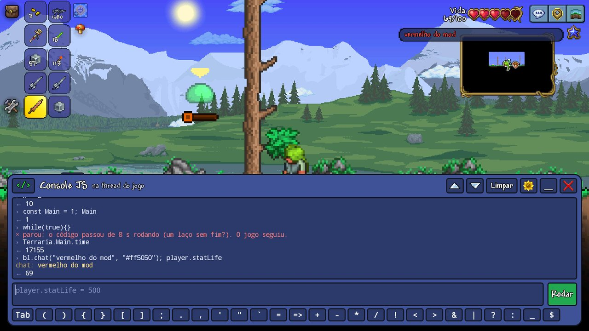

# Criando mods para o Bunny Loader

Um mod do Bunny Loader é **JavaScript que roda dentro do Terraria Mobile**. Ele
lê e escreve os campos do jogo, chama os métodos dele, intercepta (hook)
qualquer método para mudar o que ele faz, e cria conteúdo novo: itens, armas,
projéteis, inimigos, chefes, moradores, blocos, buffs, sons e músicas.

Não precisa compilar nada nem mexer no jogo: um mod é uma pasta com um
`manifest.json` e um `main.js`. Para quem vem do tModLoader, as classes têm os
mesmos nomes e o mesmo formato (`ModItem`, `ModNPC`, `SetDefaults`, `AI`...), e
o pacote tem a mesma estrutura: a classe `Mod` no arquivo de entrada, e as
pastas `Assets/`, `Common/`, `Content/` e `Localization/`.



## Como um mod roda


```mermaid
flowchart LR
    subgraph Pacote["seu mod (bunny_packs/(uid)/)"]
        M["manifest.json"]
        J["content/main.js (a classe Mod)<br/>+ Content/, Common/, Assets/"]
    end
    J -- "carrega uma vez,<br/>ao abrir o jogo" --> R["registra as classes<br/>e roda o Load"]
    R --> G["Terraria"]
    G -- "a cada quadro, a cada<br/>item criado, a cada golpe..." --> C["seus métodos:<br/>SetDefaults, AI, callbacks"]
```

1. Ao abrir o jogo, o Bunny Loader carrega cada mod ligado, **uma vez**: roda
   o `main.js` e os arquivos de `Content/` e `Common/`, registra sozinho toda
   classe de conteúdo que eles exportam e chama o `Load()` da classe `Mod`,
   onde o mod instala os hooks dele.
2. Depois, é o **jogo** que chama o mod: a cada quadro, a cada item que nasce,
   a cada golpe. O código do mod roda dentro desses momentos.
3. Todos os mods rodam no **mesmo motor JavaScript** (o QuickJS), então um mod
   pode chamar o outro como uma função comum.

## Os guias

Leia na ordem; cada um usa o anterior.

| Guia | O que ensina |
|---|---|
| **Antes de começar** | |
| [0. Como funciona: do TL Pro ao Bunny Loader](00-como-funciona.md) | O fluxo inteiro, do boot ao `UseItem`: quem hooka, o que é C++ e o que é JS, e a diferença para o ExMod do TL Pro. Opcional. |
| **A ponte com o jogo** | |
| [1. Hooks: mudar o que o jogo já tem](01-hooks-do-zero.md) | O primeiro mod. Classes, campos, métodos, structs e, principalmente, hooks. |
| [2. `ref` e `out`](02-ref-e-out.md) | Chamar e hookar métodos que devolvem por parâmetro: pesca, taxa de spawn, colisão. |
| [3. Custo e desempenho](03-custo-e-desempenho.md) | Quanto custa cada coisa, quantas vezes o jogo chama cada método, e como fazer um mod leve. |
| **Conteúdo novo** | |
| [4. Conteúdo novo: as ideias](04-conteudo-novo.md) | Estender e registrar, molde e instância, `ModContent`, texturas, tradução, Mod Menu, saves. |
| [5. Itens](05-itens.md) | `ModItem`: armas, tiro, acessórios, tooltip colorido, vara de pesca, receitas, `ModSystem`. |
| [6. Projéteis](06-projeteis.md) | `ModProjectile`: IA, colisão, desenho; pets, lacaios e sentinelas. |
| [7. NPCs](07-npcs.md) | `ModNPC`: inimigos, drops, spawn natural, Bestiário, moradores com loja e chefes. |
| [8. Jogador e buffs](08-jogador-e-buffs.md) | `ModPlayer` (dash, dados salvos) e `ModBuff`. |
| [9. Blocos](09-blocos.md) | `ModTile`: blocos e móveis (`TileObjectData`), e como o mundo salvo continua abrindo sem o mod. |
| [10. Sons e música](10-sons-e-musica.md) | `SoundStyle`, `SoundEngine.PlaySound`, música de chefe. |
| **Entre mods** | |
| [11. Conversa entre mods](11-conversa-entre-mods.md) | Achar outro mod e chamar o que ele oferece (`ModLoader.TryGetMod` + `Call`). |
| [12. Globais e o mundo](12-globais-e-mundo.md) | Mexer no que o jogo já tem (`GlobalItem`, `GlobalNPC`, `GlobalProjectile`), drops, e o `ModSystem` com os dados do mundo. |
| **Publicar** | |
| [13. A página do pacote](13-pagina-do-pacote.md) | A ficha do mod no launcher: `description.md`, `changelog.md`, `license.md`, autores com foto, links, abas e cores próprias, e o Markdown que ela entende. |
| [14. Opções do mod](14-opcoes-do-mod.md) | O `ModConfig`: interruptor, barra e escolha única na tela "Config. dos Mods" do menu de pausa, os textos e onde fica salvo. |

Para consultar:

- [O que cada classe tem hoje](../referencia/classes.md): todo campo e todo
  método de `ModItem`, `ModNPC`... e o que ainda não existe;
- [A ponte e o `bl`](../referencia/ponte-e-bl.md): a sintaxe da ponte e todas
  as funções `bl.*`.

## Os exemplos

Os mods de [`samples/`](../../samples) são exemplos completos:

| Mod | O que mostra |
|---|---|
| [`DobroDeDano`](../../samples/DobroDeDano) | O menor mod que faz algo: um hook em `Item.SetDefaults`. |
| [`VidaCheia`](../../samples/VidaCheia), [`SemQueda`](../../samples/SemQueda) | Hook em `Player.Update`, mexendo em campos do jogador. |
| [`HelloMod`](../../samples/HelloMod) | A Minishark mais rápida; o comentário do topo documenta a API inteira. |
| [`ExampleMod`](../../samples/ExampleMod) | O `ExampleMod` do tModLoader portado: dezenas de itens, projéteis, NPCs, um morador, um chefe, blocos, buffs, receitas, tradução, som e música. |

---

## O pacote

Um mod é uma pasta (ou um zip dela) com esta cara:

```
MeuMod/
  manifest.json      quem é o mod (obrigatório)
  description.md     a descrição da ficha do mod, em Markdown (recomendado)
  changelog.md       as novidades de cada versão (opcional)
  license.md         a licença (opcional)
  authors/           as fotos dos autores (opcional)
  icon.png           ícone quadrado, aparece na lista (recomendado)
  banner.png         capa da ficha do mod, ~3,4:1, ex. 384x112 (opcional)
  thumbnails/        imagens extras da ficha, .png ou .jpg (opcional)
  content/           o mod em si
    main.js          o arquivo de entrada: a classe Mod (o nome vem do manifesto)
    Assets/
      Textures/      PNGs: Items/, NPCs/, Projectiles/, Tiles/, Buffs/, Gores/...
      Sounds/        efeitos (.ogg, .wav, .mp3)
      Music/         músicas
    Common/          o que não é coisa nova: ModPlayer, ModSystem, Global*
    Content/         o que é novo: itens, NPCs, projéteis, blocos, buffs...
    Localization/    en-US.json, pt-BR.json...
```

É a estrutura do tModLoader. Tudo o que o mod lê (outro `.js`, uma textura, um
`.json`) fica dentro de `content/`, e os caminhos no código são relativos a ela.

### O arquivo de entrada

Ele **precisa** exportar a classe do mod, que estende `Mod`, como o
`public class ExampleMod : Mod` do tModLoader:

```js
// content/main.js
export default class MeuMod extends Mod {
    Load() {
        // hooks e o que mais for do mod inteiro
    }
}
```

Sem ela o mod não carrega, e o log diz por quê. O Bunny Loader cria a classe
sozinho (nada de `new`): o objeto dela é o `bl.mod` do seu mod e o que outro mod
recebe no `ModLoader.GetMod` ([guia 11](11-conversa-entre-mods.md)).

### O registro automático

Toda classe **exportada** pelo `main.js` ou por um `.js` de `Content/` e
`Common/` que estende `ModItem`, `ModNPC`, `ModProjectile`, `ModTile`, `ModBuff`,
`ModPlayer`, `ModSystem`, `GlobalItem`, `GlobalNPC`, `GlobalProjectile` ou
`GlobalLoot` é registrada sozinha, sem `import` no `main.js` nem `register`:

```js
// content/Content/Items/Espada.js
export class Espada extends ModItem {
    SetDefaults() { this.Item.damage = 30; }
}
```

- A **textura** fica ao lado do arquivo, com o mesmo nome, como no
  tModLoader: `Content/Items/Espada.js` usa `Content/Items/Espada.png`.
  `get Texture() { return 'Arte/OutraImagem'; }` (ou `this.Texture = ...`)
  escolhe outra. Os mods de antes, com as texturas em `Assets/Textures/` no
  espelho do arquivo, seguem funcionando.
- A ordem é fixa (buffs, jogadores, NPCs, projéteis, itens, blocos, sistemas e
  globais; dentro de cada um, pelo caminho do arquivo), então o tipo de cada
  coisa é o mesmo em todo aparelho, o que o multijogador exige.
- `static Autoload = false` deixa uma classe de fora: uma base que outras
  estendem (as `abstract` do tModLoader; ver
  [classes base](04-conteudo-novo.md#classes-base-do-seu-mod-as-abstract-do-tmodloader)),
  ou uma que você registra na mão no `Load()` com `ModItem.register(X)`.
- Uma classe que não é de mod (um ajudante exportado) é ignorada.

### O `manifest.json`

```json
{
  "uid": "7c2e9d41-5b3a-4f8e-9a61-2d0c4e8b7f15",
  "id": "meumod",
  "name": "Meu Mod",
  "version": "1.0.0",
  "authors": [{ "name": "Seu Nome", "avatar": "voce.png" }],
  "category": "Jogabilidade",
  "summary": "Uma linha, para o cartão da lista.",
  "license": "MIT",
  "updated": "2026-09-24",
  "blVersion": 2,
  "entry": "main.js"
}
```

| Campo | |
|---|---|
| `uid` | **Obrigatório.** Um UUID em minúsculas. É a identidade do mod e o nome da pasta dele: dois mods com o mesmo `uid` são o mesmo mod (instalar um substitui o outro). Gere um uma vez e nunca mude: `python -c "import uuid; print(uuid.uuid4())"`. |
| `id` | Apelido curto, só letras. É por ele que outro mod acha o seu (`ModLoader.TryGetMod`, [guia 11](11-conversa-entre-mods.md)) e que `ModContent` acha o seu conteúdo (`'meumod/Espada'`). Não precisa ser único, mas dois mods instalados com o mesmo `id` só se acham pelo `uid`. |
| `name`, `version` | O que a lista mostra. |
| `authors` | Quem fez o mod: nomes soltos ou objetos com foto (`authors/`), papel, cor e link. `author`, um nome só, ainda vale. Ver o [guia 13](13-pagina-do-pacote.md#os-autores). |
| `category` | Texto livre. `Textura`, `Armas`, `Jogabilidade`, `Cheat`, `Utilidade` e `Itens` ganham cor e ícone próprios. |
| `summary`, `updated` | A linha do cartão da lista e a data da última versão (`AAAA-MM-DD`). A descrição longa vai em `description.md` ([guia 13](13-pagina-do-pacote.md)); o campo `description` antigo só vale sem ele. |
| `license`, `links`, `pages`, `theme` | A licença, botões de link, abas a mais e as cores da ficha. Ver o [guia 13](13-pagina-do-pacote.md). |
| `blVersion` | O formato do pacote. Hoje, `2`: a estrutura acima, com a classe `Mod` no arquivo de entrada. O `1` (sem a classe `Mod`) não carrega mais: o app o mostra como "Formato antigo" e recusa na importação, assim como um pacote que pede uma versão maior que a do app. |
| `entry` | O arquivo de entrada, relativo a `content/`. Padrão: `main.js`. |

## Instalando

Os mods instalados moram em

```
Android/data/com.bunnyloader/bunny_packs/<uid>/
```

a mesma pasta dos saves (`Players/`, `Worlds/`), e é **dali** que o jogo
carrega. Quatro jeitos de pôr um mod lá:

1. **Baixar do catálogo**: na aba *Explorar*, os mods publicados no catálogo
   online do Bunny Loader. "Baixar Mod" instala, e um mod instalado com
   versão nova no catálogo ganha o botão "Atualizar para v…". Quem publica é o mantenedor
   do repositório (ver [Catálogo online](../../tools/README.md#catálogo-online)).
2. **Importar**: na aba *Pacotes*, "Importar pacote", escolha o zip. O zip
   (`.bmod` ou `.zip`) tem `manifest.json`, `icon.png` e `content/` na raiz, ou
   dentro de uma pasta só, que o app ignora. Se o manifesto estiver errado, o
   app diz o quê e não instala nada.
3. **Copiar a pasta**: com um gerenciador de arquivos, ponha a pasta do mod em
   `bunny_packs/`. Ela aparece na lista quando o app volta à frente. Com outro
   nome (`bunny_packs/MeuMod/`), o app renomeia para o `uid` do manifesto.
4. **adb**, o mais rápido para desenvolver. Mande um `.tar` e extraia no
   aparelho (em alguns aparelhos e emuladores, o `adb push` de uma pasta com
   subpastas para `Android/data` chega pela metade):

   ```bash
   tar -C MeuMod -cf mod.tar .
   adb push mod.tar /data/local/tmp/mod.tar
   adb shell "P=/sdcard/Android/data/com.bunnyloader/bunny_packs/7c2e9d41-5b3a-4f8e-9a61-2d0c4e8b7f15; rm -rf \$P; mkdir -p \$P && tar -xf /data/local/tmp/mod.tar -C \$P && chmod -R 777 \$P"
   ```

   O `chmod` importa: arquivo posto pelo adb pertence ao usuário `shell`, e sem
   ele o app lê o mod mas não consegue apagá-lo nem atualizá-lo depois.

Para mudar um mod instalado, edite os arquivos dentro de `bunny_packs/<uid>/` e
**reabra o jogo**: os mods são lidos quando o jogo sobe, não enquanto ele
roda. O interruptor na aba *Pacotes* liga e desliga o mod para o próximo boot.

## Testando rápido: Reiniciar e o console

O jogo lê os mods **uma vez**, ao abrir. O ciclo de quem desenvolve é:

1. editar os arquivos do mod direto em `bunny_packs/<uid>/` (com root, pelo
   gerenciador de arquivos, ou `adb push`);
2. no jogo, abrir o **Mod Menu** (o coelho) e tocar em **Reiniciar**. O jogo
   fecha e abre de novo, lendo os mods da pasta. Dentro de um mundo, **Salvar e
   reiniciar** salva o jogador e o mundo antes, como o "Salvar e Sair".


Para não passar pelo título a cada vez, ligue o **Início rápido** no launcher
(*Config* > *Desenvolvedor*) e escolha o personagem e o mundo. O jogo abre
direto nesse mundo, sem a logo da Re-Logic e sem nenhum toque, e o
**Reiniciar** volta direto para ele. No emulador, do toque em Jogar até estar
no mundo caiu de ~17 s só para chegar ao título para ~11 s já no mundo. A
opção "Nenhum: parar no título" deixa só a abertura rápida.

Na mesma seção há três interruptores para o que aparece dentro do jogo: o
**Mod Menu** (o coelho), o **Editor de JS** e o **Reiniciar**. Sem o Mod Menu e
com o Editor, o botão flutuante vira o de JS e abre direto o Editor; sem o Mod
Menu, nenhum poder volta ligado da partida anterior.

Se o personagem ou o mundo não existe mais (ou um é de Jornada e o outro não),
o jogo avisa no painel de erro e para no título ou na lista de mundos. O log
de sessão mostra os tempos de cada etapa, nas linhas `inicio rapido: ...`.

Para testar uma linha sem reiniciar, há o **Editor** de JavaScript: no Mod Menu, ou
**segurando** o botão do coelho. Ele fica no pé da tela, e o jogo continua
visível e jogável acima dele.



- O código roda na **thread do jogo**, no próximo quadro, como num hook. `Main`,
  `ID` e `player` (o seu jogador) já estão prontos:
  `player.statLife = 500`, `Main.dayTime = false`.
- A saída mostra o resultado de cada execução (`←`), os erros com a linha
  (`×`), o que foi ao chat, e o **log ao vivo**: o `bl.log` dos mods, e os erros
  dos hooks e das classes deles.
- `print(...valores)` escreve no **chat do jogo**; `bl.chat(texto, cor)` faz o
  mesmo com cor (`'#ff5050'`, `{ R, G, B }` ou um `Color`). Os dois valem em
  qualquer mod, não só no editor.
- `let` e `const` valem só naquela execução, e o mesmo trecho roda de novo sem
  erro de redeclaração. Para guardar algo de uma execução para a outra: `var`
  ou `globalThis.x`.
- Um laço sem fim para sozinho depois de **8 s**, com um aviso, e o jogo segue.
- O editor tem cores de sintaxe, recuo automático e o histórico nas setas ▲▼.
  O histórico e o rascunho sobrevivem ao Reiniciar. Num teclado físico,
  Ctrl+Enter roda.
- Com o teclado aberto, o painel sobe junto e fica logo acima dele, sem a tela
  cheia de edição do Android e sem empurrar o jogo.
- **Tela cheia** cobre o jogo e o **congela** (a pausa do próprio jogo, a do
  inventário aberto): nada anda no mundo até você minimizar ou fechar. O
  código que você roda continua valendo. Só no modo um jogador; num mundo com
  outras pessoas o jogo não para.
- `_` minimiza: o painel vira um ícone flutuante de JS, que dá para arrastar e
  que reabre o Editor em tela cheia. O X fecha o Editor e tira o ícone.

## Vendo o que o mod faz

Tudo o que o mod escreve com `bl.log(...)`, e todo erro de JavaScript, vai para
um arquivo de texto, um por vez que o jogo abre:

```
Android/data/com.bunnyloader/logs/bunny_2026-09-25_14-03-27.txt
```

Ficam os 3 mais recentes (o mais velho é apagado), então o log da vez em que o
jogo fechou sozinho ainda está lá quando você reabre. Cada linha tem a hora e o
nível (`I` informação, `W` aviso, `E` erro):

```
14:03:31.204 I [mod] Dano em Dobro: ativo
```

Do próprio Bunny Loader, o arquivo traz só o resumo de cada sistema (`itens de
mod: 97 instalado(s)...`, `tiles de mod: limites do codigo trocados em 19 de
19`), os saves e os erros. O detalhe (cada tabela aumentada, cada hook, cada
tipo registrado) só entra no arquivo com **Configurações > Log detalhado**
ligado; para investigar um problema do próprio loader, ligue e mande o
arquivo.

Pelo computador, o mesmo sai no logcat, com a tag `BunnyLoader` (lá o detalhe
aparece sempre):

```bash
adb logcat -s BunnyLoader
```

`bl.log` aceita vários valores, como o `console.log`, e objeto ou array vira
JSON: `bl.log('vida', player.statLife, { x: 1 })` escreve `vida 400 {"x":1}`.

### Quando dá erro

- Um erro no **topo** de um arquivo do mod, no registro de uma classe ou no
  `Load()` impede o mod de carregar e aparece no log com a linha (e, no
  registro, com a classe e o arquivo). Um arquivo de entrada sem
  `export default class ... extends Mod` também. Os outros mods carregam
  normalmente.
- Um erro dentro de um **hook** não derruba o jogo: é logado a **cada**
  chamada (um erro num hook de todo quadro enche o log rápido), e se o
  callback quebrou antes de chamar o `original`, o Bunny Loader chama o método
  do jogo por você.
- Nos métodos das **classes** (`SetDefaults` de um `ModItem`, `AI` de um
  `ModNPC`...), o erro é logado **uma vez** por método e o resto segue.

Com **Mostrar erro dentro do jogo** ligado (aba *Config*), o primeiro erro
também aparece na tela, dentro do jogo, com um botão para copiar o log.

## Multijogador

Os mods rodam em cada aparelho: o de quem hospeda e o de quem entra. Duas
regras:

- **Todos precisam dos mesmos mods de conteúdo.** Item e NPC de mod ganham um
  número na ordem em que são registrados; se um lado tiver um mod a mais ou a
  menos, o número de um item aponta para outra coisa no outro lado.
- **Hook roda para todos os jogadores.** `Player.Update` é chamado para cada
  jogador do mundo, não só para o seu. Para mexer só no seu, confira o índice:
  `if (i !== Terraria.Main.myPlayer) return;` (ver o [guia 1](01-hooks-do-zero.md#hook-roda-para-todos)).
- **Cada aparelho tem o seu estado.** Um campo que o servidor mudou não muda
  sozinho no cliente: dados de mod vão pela rede com `NetSend`/`NetReceive` e
  pacotes próprios (ver o [guia 12](12-globais-e-mundo.md#rede)).

## Por dentro

Como o Bunny Loader entra no jogo, intercepta métodos, divide o motor entre as
threads e põe conteúdo novo nas tabelas está na [documentação do núcleo](../nucleo/README.md).
