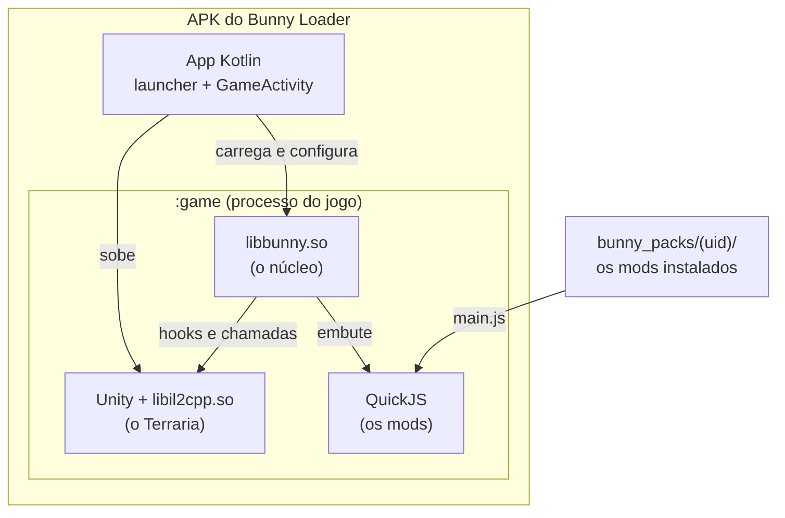

# Por dentro do Bunny Loader: o núcleo nativo

Esta parte da documentação é para quem quer entender, ou mexer, no **C++** do
Bunny Loader: como ele entra no jogo, como intercepta métodos, como divide o
motor JS entre as threads e como põe conteúdo novo num jogo compilado. Para
**escrever mods**, os [guias de mod](../mods/README.md) bastam.

| Documento | Assunto |
|---|---|
| Este | O que é o núcleo, o boot, as pastas, as regras gerais. |
| [Hooks por dentro](hooks.md) | ShadowHook, a cadeia de hooks, os slots, o despachante, `original()`, os filtros nativos. |
| [Threads e o motor JS](threads-e-motor-js.md) | Quem roda código de mod, a trava do motor, a pilha por thread, `ifBusy`. |
| [A ponte JS ↔ jogo](ponte.md) | Nomes, tipos, structs, chamadas, âncoras do coletor, identidade dos objetos. |
| [Conteúdo novo por dentro](conteudo.md) | Tabelas por tipo, limites compilados, instalação, saves. |

## O que é o núcleo

O Terraria Mobile é um jogo Unity cujo C# foi compilado para ARM64 pelo
**IL2CPP**: o código do jogo é a `libil2cpp.so`, código de máquina, com os
nomes das classes e métodos guardados à parte, nos metadados
(`global-metadata.dat`). Não há máquina virtual .NET para carregar uma DLL de
mod.

O núcleo é a `libbunny.so`, escrita em C++20, que roda **dentro do processo do
jogo** e faz o papel que o tModLoader faz no PC:

1. **sobe junto com o jogo** e espera o IL2CPP ficar pronto;
2. **acha as classes e métodos do jogo pelo nome**, pela API de embutir do
   IL2CPP (`il2cpp_class_from_name`, `il2cpp_class_get_method_from_name`...);
3. **intercepta métodos** do jogo (hooks inline);
4. **hospeda o motor dos mods**, o [QuickJS](https://github.com/quickjs-ng/quickjs)
   (JavaScript ES2020, sem JIT), e a **ponte** entre o JS e os objetos do
   jogo;
5. **põe conteúdo novo** (itens, NPCs, projéteis, buffs, blocos) nas tabelas
   do jogo, e salva esse conteúdo ao lado dos saves do jogo;
6. **o Mod Menu**, os superpoderes e o painel de erro dentro do jogo.



## O processo

O Bunny Loader é **um app só**. O runtime do jogo (as `.so` da Unity e do
IL2CPP e os dados em `assets/bin/Data/`) entra **na própria build**: para o
Android, o Bunny Loader **é** um app Unity. Esses arquivos ficam fora do Git
(ver o [README da raiz](../../README.md)).

Dois processos:

- o **principal**, com o launcher (`LauncherActivity`, Jetpack Compose): lista
  de mods, importar, ligar e desligar, configurações;
- o **`:game`**, com a `GameActivity`, que sobe a Unity. É neste que o jogo e o
  núcleo rodam. Um crash do jogo não leva o launcher junto.

## O boot

```mermaid
sequenceDiagram
    participant A as GameActivity (Kotlin)
    participant B as libbunny.so
    participant U as Unity / IL2CPP
    participant S as sonda (thread do núcleo)
    participant G as thread do jogo
    A->>A: elegibilidade (Terraria oficial instalado)
    A->>U: System.loadLibrary: c++_shared, main, unity, il2cpp
    A->>B: System.loadLibrary("bunny")
    B->>B: construtor: hook em il2cpp_init, inicia a sonda
    A->>B: NativeBridge.init(config: pasta dos mods, ligados, log)
    A->>U: cria a UnityPlayer
    U->>B: il2cpp_init (hookado)
    B->>U: deixa terminar; carrega a API do IL2CPP, resolve GameRefs
    S->>S: espera o jogo assentar
    S->>B: QuickJS + bindings + ModClasses.js
    S->>B: ModLoader: roda o main.js de cada mod ligado
    S->>B: saves de conteúdo, Mod Menu (botão na tela)
    G->>B: 1º Main.DoUpdate (hook C++)
    B->>G: a cada quadro: tabelas de conteúdo, poderes, pedidos do menu
```

Em ordem:

1. **Kotlin.** A `GameActivity` confere a elegibilidade (o Terraria oficial da
   Play instalado no aparelho), confere que o runtime está na build, carrega
   as `.so` do jogo por nome e, depois delas, a `libbunny.so`.
2. **Construtor da `libbunny`.** `bl_on_load`
   ([`boot/Entry.cpp`](../../app/src/main/cpp/boot/Entry.cpp)) instala o hook
   em `il2cpp_init` ([`boot/LibWatcher.cpp`](../../app/src/main/cpp/boot/LibWatcher.cpp))
   e dispara a **sonda**, uma thread do núcleo.
3. **`NativeBridge.init`** ([`boot/jni_entry.cpp`](../../app/src/main/cpp/boot/jni_entry.cpp)):
   o Kotlin passa a configuração (pasta dos mods, quais estão ligados, arquivo
   de log, "Log detalhado", "Mostrar erro dentro do jogo").
4. **`il2cpp_init`.** Antes dele terminar, a `libil2cpp.so` está carregada mas
   não há domínio, classes nem metadados. O hook deixa o original terminar e
   só então carrega a API (`il2cpp_*` por `dlsym`,
   [`il2cpp/Api.cpp`](../../app/src/main/cpp/il2cpp/Api.cpp)) e confere as
   referências essenciais do jogo (`GameRefs`): se algo não resolve, é versão
   incompatível e os mods ficam desligados.
5. **A sonda** ([`boot/Probe.cpp`](../../app/src/main/cpp/boot/Probe.cpp))
   espera o jogo assentar (chamar a API do IL2CPP durante a inicialização
   derruba o processo), sobe o QuickJS, instala a ponte e as classes de mod, e
   roda o `main.js` de cada mod ligado. Depois instala os saves de conteúdo e
   o Mod Menu. O motor JS nasce e carrega os mods na **mesma** thread (ver
   [threads](threads-e-motor-js.md#a-trava-jslock)).
6. **Thread do jogo.** O núcleo tem um hook C++ no `Main.DoUpdate`
   ([`menu/Cheats.cpp`](../../app/src/main/cpp/menu/Cheats.cpp), `hkDoUpdate`).
   No primeiro quadro, ele marca qual é a thread do jogo; em todos, roda os
   *ticks*: instalação de conteúdo na tela de título, tabelas pendentes,
   `bl.onContentReady`, superpoderes, pedidos do Mod Menu e da rede.

### Os mods: módulos, em duas passadas

[`mods/ModLoader.cpp`](../../app/src/main/cpp/mods/ModLoader.cpp):

- cada `main.js` é um **módulo ES** (modo estrito, escopo próprio). Dois mods
  podem ter um `const Update` cada um sem colidir; `import` relativo funciona
  dentro do mod, com o módulo nomeado `<uid>/<caminho>`;
- a carga tem **duas passadas**: primeiro todos os manifestos são lidos e
  todo mod ganha o seu objeto `Mod` (com `id`, `name`, `version`); só depois
  os `main.js` rodam, em ordem de `uid`. Assim `ModLoader.TryGetMod` acha um
  mod cujo `main.js` ainda não rodou ([guia 11](../mods/11-conversa-entre-mods.md));
- o núcleo sabe **qual mod** está chamando pela pilha de módulos do QuickJS, e
  é assim que `bl.mod`, `bl.loadTexture('x.png')` e `bl.file.read('...')`
  resolvem caminhos relativos para a pasta certa, mesmo dentro de um hook,
  muito depois da carga;
- um mod que lança erro no topo do `main.js` fica marcado como falho; os
  outros carregam normalmente.

## As pastas

```
app/src/main/cpp/
  boot/       Entrada e boot: Entry (construtor), jni_entry (NativeBridge),
              LibWatcher (hook de il2cpp_init), Boot, Probe (a sonda)
  core/       Config global e log (logcat + arquivo de sessão)
  il2cpp/     A API do IL2CPP (Api: il2cpp_* por dlsym), Resolver
              (nome → classe/método/campo), Signature (casar assinaturas)
  hook/       HookManager (hooks encadeados) e CodePatch (limites compilados)
  mods/       ModLoader: acha os pacotes e roda o main.js de cada um
  content/    O conteúdo de mod nas tabelas do jogo
    common/     ModContent (bl.onContentReady), TypeTables (tabelas por tipo),
                ContentAssets (textura, nome), GameRefs, TileAccess
    items/ npcs/ projectiles/ buffs/ tiles/    um loader por tipo, com o save
    sounds/     AndroidAudio (som e música de mod pelo Android)
  menu/       Mod Menu dentro do jogo: CheatButton (a ponte com o Java), Cheats
              (o hook de DoUpdate e as ações), Powers, MapReveal, ModMenu,
              MenuCatalog, NetRequests (pedidos do cliente no multijogador)
  script/
    bridge/     A ponte JS ↔ IL2CPP: ScriptEngine (QuickJS, JsLock, JsSuspend),
                Bindings (os objetos JS), JsHook (hooks), Invoke e Abi
                (chamadas), Value e Marshal (tipos), Members (cache de nomes),
                Roots e WrapperMap (objetos segurados), ExtraFields, Ref,
                QuickJsExt.c
    api/        O bl.* dos mods: itens, NPCs, projéteis, buffs, tiles,
                texturas, arquivos, sons; ModClasses.cpp embute o JS
    js/         ModClasses.js (ModItem, ModNPC... e os hooks das classes) e
                ModHelpers.js (Vector2, Color, Rand...)
  third_party/  QuickJS (clonado à parte, ver o README de lá)
```

As classes de mod (`ModItem`, `ModNPC`...) são escritas **em JavaScript**
([`script/js/ModClasses.js`](../../app/src/main/cpp/script/js/ModClasses.js)),
embutidas na `libbunny.so` pelo CMake e avaliadas no escopo global antes dos
mods. Elas usam a mesma ponte e os mesmos hooks que um mod usaria, mais os
loaders nativos (`bl.items.register`...) para o que só o C++ faz.

## Regras gerais

1. **Tudo por nome.** Nenhum offset ou endereço do jogo fica fixo no código:
   classes, campos e métodos são resolvidos pela API do IL2CPP. Uma
   atualização do jogo muda todos os endereços; os nomes quase nunca.
2. **Mod quebrado não quebra o jogo.** Erro de JS num hook é logado, e o
   método do jogo roda mesmo assim. Nas classes de mod, o erro é logado uma
   vez por método.
3. **Conferir antes de escrever.** Limite compilado só é trocado se o padrão
   casa exatamente; tabela só cresce se tem o tamanho de fábrica. Senão, nada
   é escrito e o log diz por quê.
4. **Save do jogo limpo.** O arquivo do jogo nunca leva conteúdo de mod; ele
   vai ao lado, pelo nome.
5. **Só a thread do jogo cria objetos da Unity** e mexe nas tabelas de
   conteúdo.
6. **Um motor, uma trava.** Toda entrada no QuickJS passa pelo `JsLock`.

## O log

O núcleo escreve no logcat (tag `BunnyLoader`) e num arquivo por sessão,
`Android/data/com.bunnyloader/logs/bunny_<data>.txt` (os 3 mais recentes
ficam). Os níveis são `I` informação, `W` aviso, `E` erro e `D` detalhe. O `D`
(cada tabela aumentada, cada hook, cada tipo registrado) só entra no arquivo
com **Configurações > Log detalhado**; no logcat, sempre. Sem ele, uma sessão
com o Example Mod fica em ~4 KB de log.

O primeiro erro (`E`) abre o **painel de erro dentro do jogo**, se a opção
estiver ligada: um overlay de Views do Android com o log acumulado e um botão
de copiar.

## Onde testar

O desenvolvimento é feito no MuMu Player (x86_64, que roda o ARM do jogo por
tradução) e conferido em aparelho ARM de verdade. Os testes são mods em
[`tools/tests/`](../../tools/tests), rodados por
[`tools/bench/run.sh`](../../tools/bench/run.sh), que instala o mod, abre o
jogo, entra no mundo de teste e espera a linha `FIM` no log. Ver
[`tools/README.md`](../../tools/README.md).

## Histórico

As decisões de arquitetura, as investigações de crash e as rodadas de
otimização, com os dados brutos, estão em [`../historico/`](../historico/README.md).
