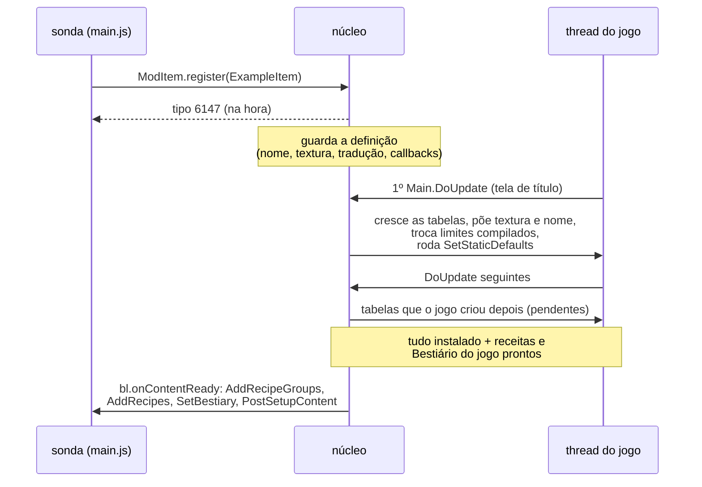

# Conteúdo novo por dentro

> Parte da documentação do núcleo ([visão geral](README.md)). Para **criar**
> conteúdo num mod, veja o [guia 4](../mods/04-conteudo-novo.md). Aqui está o
> que o núcleo faz para um item, projétil, NPC, buff ou bloco novo existir num
> jogo que foi compilado sem saber dele.

## O problema

O Terraria identifica cada tipo de conteúdo por um número: o item 98 é a
Minishark, o NPC 4 é o Olho de Cthulhu. Os números vão de 0 até uma constante
fixa, e o jogo inteiro foi escrito assumindo isso:

| Conteúdo | Tipos do jogo | Constante | Tipo do 1º de mod |
|---|---:|---|---:|
| Item | 0–6146 | `ItemID.Count` = 6147 | 6147 |
| Projétil | 0–1110 | `ProjectileID.Count` = 1111 | 1111 |
| NPC | 0–696 | `NPCID.Count` = 697 | 697 |
| Buff | 0–388 | `BuffID.Count` = 389 | 389 |
| Bloco (tile) | 0–752 | `TileID.Count` = 753 | 753 |

Um tipo novo precisa de um número acima disso, e cada lugar do jogo que
assume o limite tem de ser encontrado e ajustado. São quatro tipos de lugar:

1. **Tabelas por tipo.** Centenas de arrays estáticos com exatamente `Count`
   posições: texturas (`TextureAssets.Item`), nomes, os `ItemID.Sets`,
   `Main.tileSolid`... O jogo lê `tabela[tipo]` sem conferir o tamanho: **este
   build do IL2CPP não confere limite de array**. Um tipo 6147 numa tabela de
   6147 posições lê (e **escreve**) além do fim, sem erro nenhum, corrompendo
   o que estiver depois.
2. **Limites compilados.** `if (type >= NPCID.Count) return;` não é um array: é
   `cmp w8, #696` direto no código de máquina. O `NPC.NPCLoot` saía por ali
   (NPC de mod sem drop) e o `Main.DrawNPCs` pulava o NPC (invisível).
3. **Métodos que recusam o número.** `Item.SetDefaults` zera tipo desconhecido;
   `Lang.GetItemName` devolve texto vazio acima de `ItemID.Count`.
4. **Arquivos salvos.** O `.plr` e o `.wld` do jogo gravam o número. Com o mod
   desligado, o jogo leria um número que não conhece.

## A linha do tempo

1. **Registro (thread da sonda).** O `register` de cada classe chama o loader
   nativo do tipo (`bl.items.register`...), que **reserva o número na hora**
   (`Count` + ordem de registro) e guarda a definição: nome estável
   (`<uid do mod>/<Classe>`), caminho da textura, nomes por idioma, callbacks.
   O mod já pode usar o número. O jogo ainda não sabe de nada.
2. **Instalação (thread do jogo).** O núcleo tem um hook C++ no
   `Main.DoUpdate`, que roda uma vez por quadro, antes do jogo. Nele, cada
   loader tem um `tick` (`tickModItems`, `tickModNpcs`...). Na tela de título,
   com as tabelas do jogo já criadas, o `tick` instala tudo de uma vez:
   cresce as tabelas, carrega as texturas, registra os nomes, troca os limites
   compilados e roda o `SetStaticDefaults` de cada classe. A instalação
   precisa ser na thread do jogo: textura da Unity só nasce nela, e é nela
   que o jogo troca essas tabelas.
3. **Pendentes (a cada quadro).** Algumas tabelas só nascem **depois** da
   tela de título (o jogo as cria sob demanda). Ler um campo estático não roda
   o construtor estático, então uma tabela ainda nula fica **pendente** e é
   aumentada no quadro em que aparecer. Tabelas que o jogo **refaz** (a troca
   de idioma refaz os caches de nome) são vigiadas e recebem de volta o que é
   dos mods.
4. **Conteúdo pronto.** Quando todos os loaders terminaram e o jogo já montou
   as receitas dele, o banco de drops (`ItemDropsDB`) e o Bestiário
   (`BestiaryDB`), o `tickContentReady` chama o `bl.onContentReady`. É aí que
   rodam o `AddRecipeGroups` (de todos os mods, antes de qualquer receita), o
   `AddRecipes`, o `SetBestiary`, as lojas e o `PostSetupContent`.

## As tabelas: achadas, não listadas

[`content/common/TypeTables.cpp`](../../app/src/main/cpp/content/common/TypeTables.cpp)
não tem uma lista de tabelas. Para cada tipo de conteúdo, há uma lista de
**classes** onde procurar, e toda tabela estática nelas com exatamente `Count`
posições é uma tabela daquele tipo. Para itens, a busca acha ~127 (117 só em
`ItemID.Sets`); para tiles, ~220.

A lista de classes foi conferida contra **toda** alocação daquele tamanho na
`libil2cpp.so`: o `mov` da constante antes de um `new[]` (a ferramenta é
`tools/disasm/scan_movs.py`). Esquecer uma classe não dá erro, só corrompe
memória: foi assim que o tooltip de item de mod sumiu uma vez
(`ArmorSetBonuses.SetsContaining` ficou de fora, a leitura pegou lixo e o
jogo lançava `NullReferenceException` a cada quadro).

Crescer uma tabela é criar um array novo com o tamanho novo, copiar e pôr o
novo no campo estático. As posições novas nascem com:

- o valor da posição **0** (o "nada" de item, projétil e buff), ou
- o valor **mais comum** da tabela (tiles): a posição 0 dos tiles é a terra, e
  copiar faria o bloco de mod se comportar como terra para a grama e a
  corrupção. O mais comum é o padrão com que o jogo criou a tabela: `false` no
  `tileSolid`, `-1` no `tileGlowMask`.

Duas ou três tabelas moram dentro de **objetos**, não em estáticos
(`QuickStacking`, o filtro "Diversos" do inventário, os contadores de projétil
de cada `Player`). Essas crescem num hook no construtor do objeto.

## Os limites compilados

[`hook/CodePatch.cpp`](../../app/src/main/cpp/hook/CodePatch.cpp) troca
constantes dentro do código de máquina, e só quando o padrão casa exatamente.
Há quatro formas, cada uma com a sua ferramenta de busca em `tools/disasm/`:

| Forma no código | Exemplo | Função | Busca |
|---|---|---|---|
| `cmp wN, #limite` + desvio de ordem (`b.hi`, `b.gt`...) | `if (type >= 697)` | `patchCompareLimit` | `scan_limits.py` |
| laço em **bytes** (`cmp xN, #729`: 697 + 32 do cabeçalho do array) | `for (i = 0; i < 697; i++) a[i]` | `patchLoopEnd` | `scan_loops.py` |
| `0 < x < N` com N par, compilado pela metade (`(x-1) >> 1 <= imm`) | o drop de item (`CommonCode.DropItem*`) | `patchHalvedLimit` | `scan_halved.py` |
| `mov wN, #tamanho` antes de `new T[tamanho]` | tabela criada dentro de um método | `patchMovImmediate` | `scan_movs.py` |

Regras que evitam estrago:

- o método é achado pelo **nome**, e a busca fica dentro dele (do
  `methodPointer` até o próximo método da classe);
- só a comparação **seguida do desvio certo** é trocada. Igualdade (`b.ne`,
  `b.eq`) fica de fora: `if (type == 696)` é um NPC específico, não um
  limite. Trocar isso uma vez deixou o slime de mod invisível;
- se o padrão não casa (outra versão do jogo), nada é escrito, e o log diz o
  motivo (`describeCompareMiss`: ausente, já trocado ou escrita recusada, com
  o endereço e as 4 primeiras instruções do método);
- o log resume: `limites do codigo trocados em 19 de 19`.

## Os métodos que recusam o número

Cada um tem um hook C++ no loader do tipo:

- **`Item.SetDefaults`** zera tipo acima de `Count`: para item de mod, o hook
  não chama o original e preenche o item pelo `SetDefaults` do mod.
- **`Projectile.SetDefaults`** não zera, mas o `else` do `switch` desativa o
  projétil (`active = false`): o hook reativa depois do `SetDefaults` do mod.
- **`Lang.GetItemName`** converte o tipo para `short` e devolve texto vazio
  acima de `ItemID.Count`: o hook devolve o nome gravado pelo núcleo para item
  de mod. O `Lang.GetNPCName` tem o limite compilado, trocado pelo
  `CodePatch`.
- **`ContentSamples`**: o jogo consulta dicionários de amostras
  (`ItemsByType[tipo]`) para tooltip, pesquisa da Jornada e ordenação; as
  amostras de mod são acrescentadas.
- **`NPC.FindFrame`**: a altura do quadro vem da textura e do
  `npcFrameCount` do NPC emprestado no `AnimationType`; o hook troca o tipo e
  a textura durante a chamada.

## Texturas e nomes

[`content/common/ContentAssets.cpp`](../../app/src/main/cpp/content/common/ContentAssets.cpp):

- **Textura**: o PNG é lido do disco, decodificado pela própria Unity
  (`ImageConversion.LoadImage` num `Texture2D` do Unity), posto em filtro
  *point* (pixel art; a Unity nasce bilinear e a textura sairia borrada) e
  embrulhado no `Texture2D` do jogo e num `Asset<Texture2D>` já carregado. É o
  mesmo tipo que o jogo guarda em `TextureAssets.Item[i]`, e o mesmo que o
  `ModContent.Request` devolve.
- **Nome**: um `LocalizedText` com o texto do idioma atual, gravado também no
  dicionário do `LanguageManager` sob a chave. Partes do jogo buscam o nome
  pela chave, não pela tabela (a plaquinha do Bestiário, por exemplo).

## Os saves: o mundo abre sem o mod

A regra de todos os saves: **o arquivo do jogo nunca leva tipo de mod**. O
conteúdo de mod vai num arquivo ao lado, **pelo nome** (`<uid>/<Classe>`), e
volta pelo nome. Assim, desligar um mod, trocar a ordem dos mods ou abrir o
save no Terraria sem o Bunny Loader não quebra nada.

| O quê | Arquivo ao lado | Com o mod ausente |
|---|---|---|
| Itens no inventário, cofres | `<personagem>.plr.bl` | O item vira um "?" (de uma reserva de 64 tipos) e volta ao religar o mod. |
| Itens em baús do mundo | `<mundo>.wld.bl` | Idem. |
| Blocos de mod | `<mundo>.wld.tiles.bl` | O `.wld` guarda ar no lugar; o bloco volta ao religar. |
| Moradores de mod | `<mundo>.wld.npcs.bl` | O morador volta ao religar. |
| Buffs de mod ativos | `<personagem>.plr.bl` | Guardados, voltam ao religar. |
| `ModPlayer.SaveData` | `<personagem>.plr.bl.json` | Os dados ficam no arquivo. |

Os saves seguem o jogo 1:1: o nosso grava **depois** do original do método de
save do jogo (`InternalSavePlayerFile`, `SaveWorld`...), então salva quando e
onde o jogo salvar (morte, autosave, sair).

O "?" é como o `UnloadedItem` do tModLoader: um tipo de uma reserva registrada
**depois** dos mods, para que os números dos mods não mudem. Um baú do celular
guarda `ChestItem` (um struct de 6 bytes: tipo, pilha, prefixo), sem espaço
para metadados, então o item ausente precisa de um tipo de verdade para
existir ali.

## Multijogador

Os números de mod saem da ordem de registro. Por isso **todos** os aparelhos
precisam dos mesmos mods de conteúdo: com um mod a mais num lado, o número de
um item aponta para outra coisa no outro. Ainda não há um aperto de mão entre
os aparelhos que confira isso.

## Adicionando um tipo de conteúdo novo ao núcleo

A receita que funcionou para buffs e tiles:

1. `python tools/disasm/scan_movs.py <Count>`: onde nascem arrays desse
   tamanho. Cada classe achada entra na lista do `TypeTables`; um `.ctor` de
   `Player` ou `NPC` é tabela por instância (crescer no hook do construtor).
2. `python tools/disasm/scan_limits.py <Count-2> <Count-1> <Count>`:
   comparações compiladas. Conferir cada uma com `da.py` (os números colidem
   com IDs de outras coisas) e trocar as certas com `patchCompareLimit`.
3. `scan_loops.py` e `scan_halved.py` para as formas que o `scan_limits` não
   vê.
4. Hook nos métodos que recusam o número, e o save ao lado.
5. Um mod de teste em `tools/tests/` que usa o tipo de verdade.

Foi assim que apareceu, por exemplo, que o `GUIBuffs.Draw` **zera** buff com
tipo ≥ 389 a cada quadro.
