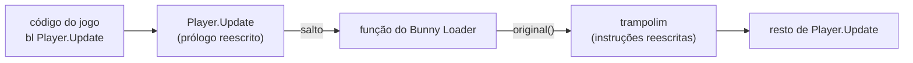
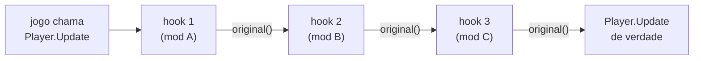
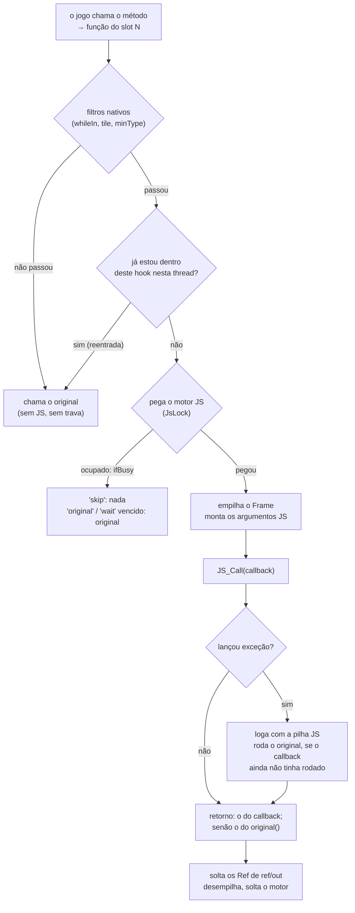

# Hooks por dentro

> Parte da documentação do núcleo ([visão geral](README.md)). Para **usar**
> hooks num mod, veja o [guia 1](../mods/01-hooks-do-zero.md). Aqui está o que
> acontece em C++ entre o jogo chamar um método e o seu callback rodar.

## O que é um hook, e por que ele é "inline"

Um hook é um desvio. Toda chamada a um método do jogo passa primeiro por uma
função nossa, que decide o que fazer: chamar o original, mudar os argumentos,
trocar o retorno ou não deixar o original rodar.

No Terraria Mobile, o C# do jogo foi compilado para ARM64 **antes** de ir para
o celular (o IL2CPP converte C# em C++ e compila tudo, AOT). Não existe
máquina virtual para trocar um método por reflexão, nem uma tabela de
ponteiros para redirecionar. Um método é só um trecho de código de máquina
dentro da `libil2cpp.so`, e o código que o chama salta direto para o endereço
dele.

Por isso o hook é **inline**: reescrevemos as primeiras instruções do próprio
método com um salto para a nossa função. Qualquer chamador, de qualquer lugar,
entra pelo começo do método, e cai no desvio. As instruções reescritas vão para
um **trampolim**, que as executa e segue para o resto do método. O trampolim é
o "original".



São três camadas, cada uma com um trabalho:

| Camada | Arquivo | O que faz |
|---|---|---|
| ShadowHook | biblioteca externa (via Gradle) | Reescreve o prólogo e monta o trampolim. |
| `HookManager` | [`hook/HookManager.cpp`](../../app/src/main/cpp/hook/HookManager.cpp) | Deixa **vários** hooks no mesmo método, em cadeia. |
| `JsHook` | [`script/bridge/JsHook.cpp`](../../app/src/main/cpp/script/bridge/JsHook.cpp) | Transforma a chamada nativa numa chamada ao callback JS, e volta. |

## Camada 1: ShadowHook

O [ShadowHook](https://github.com/bytedance/android-inline-hook) (ByteDance) faz
o trabalho de baixo nível: descobre quantas instruções precisa mover, corrige
as que dependem da posição (saltos relativos, `adrp`), monta o trampolim e
troca o prólogo de forma segura com outras threads rodando.

Usamos dois jeitos de pedir um hook:

- **por endereço** (`shadowhook_hook_func_addr`), para métodos do jogo: o
  endereço vem do `MethodInfo` que o IL2CPP nos dá (`methodPointer`). É o
  caminho de todo hook de mod, e funciona também no MuMu, que roda ARM
  traduzido para x86;
- **por nome de símbolo** (`shadowhook_hook_sym_name`), só para o
  `il2cpp_init` no boot (ver [README](README.md#o-boot)).

O ShadowHook roda em modo `UNIQUE`: um endereço aceita **uma** substituição.
Um segundo pedido no mesmo método seria recusado. É aí que entra a camada 2.

## Camada 2: HookManager, a cadeia

Dois mods querem hookar `Player.Update`. O ShadowHook aceita um só. O
`HookManager` resolve isso encadeando: o segundo hook vira o "original" do
primeiro, e o original do segundo é a função real.



- O **primeiro instalado fica por fora**: ele vê a chamada antes de todos, e o
  que ele passar ao `original()` é o que o segundo recebe.
- Pôr um elo novo é trocar **um ponteiro**: o `original` do último elo passa a
  apontar para o novo, e o novo aponta para onde o último apontava. Nada é
  desinstalado, e nenhum trampolim é liberado enquanto outra thread pode estar
  dentro dele.
- A troca é atômica (`__atomic_store_n` com *release*), e quem chama o
  original lê o ponteiro atomicamente **a cada chamada**. Por isso o código
  nunca guarda uma cópia do `original` (ver o aviso no
  [`HookManager.h`](../../app/src/main/cpp/hook/HookManager.h)).

Todo método gerado pelo IL2CPP recebe, como **último** argumento, o próprio
`const MethodInfo*`. Uma função de substituição escrita em C++ precisa declarar
esse parâmetro a mais:

```cpp
using DoUpdateFn = void (*)(Il2CppObject* self, Il2CppObject* gameTime, const MethodInfo*);
DoUpdateFn g_origDoUpdate = nullptr;

void hkDoUpdate(Il2CppObject* self, Il2CppObject* gt, const MethodInfo* m) {
    // ... trabalho do Bunny Loader, na thread do jogo ...
    g_origDoUpdate(self, gt, m);
}

hook::install(doUpdateMethod, hkDoUpdate, &g_origDoUpdate);
```

É assim que o próprio núcleo hooka o jogo onde não há JS: o `Main.DoUpdate`
(o "tick" do Bunny Loader, ver [conteúdo](conteudo.md)), o
`Lang.GetItemName`, o save dos itens de mod e outros.

## Camada 3: JsHook, do registrador ao callback

`Terraria.Player['void Update(int i)'].hook(cb)` precisa de uma função nativa
que o ShadowHook possa instalar, e essa função precisa saber **qual** hook ela
é, para chamar o `cb` certo. Uma função genérica não serve: o ShadowHook
precisa de uma função de substituição por alvo, e a função não recebe nada
além dos registradores da chamada.

### Slots: uma função pronta por hook

A solução são **slots**: funções geradas em tempo de compilação, cada uma
sabendo o próprio número. `stubInt<37>` é a função do slot 37; ela chama o
despachante com `37` e ele acha tudo o que precisa em `g_hooks[37]`.

```cpp
template <int Slot>
static intptr_t stubInt(BL_HOOK_PARAMS) { return dispatch(BL_HOOK_ARGS, Slot).i; }
```

Instalar um hook é pegar o primeiro slot livre, preencher `g_hooks[slot]`
(callback, plano da ABI, filtros) e mandar o HookManager instalar
`g_stubs[slot]` no método.

O **tipo de retorno** da função faz parte da ABI do ARM64: inteiro e ponteiro
voltam em `x0`, `float` em `s0`, `double` em `d0`, e um struct pequeno em
vários registradores. Uma função C declarada devolvendo `intptr_t` não tem como
pôr um valor em `s0`. Por isso há uma **família** de slots por forma de
retorno:

| Retorno do método | Família | Slots |
|---|---|---:|
| `void`, `int`, `bool`, objeto, string | `stubInt` | 1024 |
| `float` | `stubFlt` | 64 |
| `double` | `stubDbl` | 64 |
| struct de até 8 bytes (`Color`, `Point`...) | `stubStruct<S8>` | 32 |
| struct de até 16 bytes (`Rectangle`...) | `stubStruct<S16>` | 32 |
| 1 a 4 `float` (`Vector2`, `Vector3`, `Vector4`) | `stubStruct<H1F..H4F>` | 32 cada |
| 1 a 4 `double` | `stubStruct<H1D..H4D>` | 32 cada |

Um slot custa ~108 bytes de código e ~240 bytes de tabela, e **nada** na
chamada: a função do slot já sabe o número e vai direto ao contexto dela. Um
hook instalado num método que o jogo não chama não custa nada.

### A captura dos argumentos

Todas as funções de slot têm a mesma assinatura:

```cpp
#define BL_HOOK_PARAMS                                                    \
    intptr_t a0, ..., intptr_t a7,     /* x0-x7: inteiros e ponteiros */  \
    double f0, ..., double f7,         /* d0-d7: ponto flutuante      */  \
    intptr_t s0, ..., intptr_t s7      /* 8 casas da pilha            */
```

Pela convenção de chamada do ARM64 (AAPCS64), inteiros e ponto flutuante vão
em **filas separadas**: os 8 primeiros inteiros em `x0`–`x7`, os 8 primeiros
floats em `d0`–`d7`, e o que sobra na pilha. Declarar a função assim faz o
compilador entregar exatamente esses registradores, sem uma linha de assembly.
Um método com menos argumentos deixa lixo nos registradores que não usa. Nós
só lemos, e repassamos ao original, que ignora o que não declarou.

Os limites de um hook saem daqui:

- até **16 argumentos inteiros**, contando o `this` e cada `ref`/`out` (que é
  um ponteiro): 8 em registrador e 8 na pilha;
- até **8 de ponto flutuante** (o 9º iria intercalado na pilha, e isso não é
  reproduzido);
- retorno de struct **até 16 bytes** (ou até 4 floats/doubles). Acima disso o
  valor volta pela memória, por um endereço em `x8`, que não é registrador de
  argumento. O hook é recusado com mensagem.

### O plano da ABI

Na instalação, [`Abi.cpp`](../../app/src/main/cpp/script/bridge/Abi.cpp)
monta um **plano**: para cada parâmetro, em que registrador (ou casa da pilha)
ele chega, de que tipo é, se é `ref`/`out`, se é struct por valor; e onde o
retorno viaja. O mesmo plano serve à **chamada direta** (quando o mod chama um
método do jogo): antes, cada lado tinha a sua cópia, e um deles sempre errava
algum tipo.

Um detalhe que custou caro: um `float` viaja nos 32 bits **baixos** do
registrador (`s0`), não no registrador todo. Ler os 64 bits como `double` dá
um número absurdo (`180.0f` virava `5.57e-315`). Por isso o `Frame` guarda os
**bits crus** de `d0`–`d7`, e cada parâmetro é interpretado pelo tipo
declarado.

## O despachante, passo a passo

`dispatch()` é o coração do hook. Ele roda para **toda** chamada a um método
hookado, então a ordem dos passos importa: o que é barato e descarta chamadas
vem primeiro.



1. **Filtros nativos.** Antes de qualquer trava ou JS, o despachante confere
   os filtros do hook (ver abaixo). Quem não passa vai direto ao original. É o
   que deixa um hook em `NPC.AI` quase de graça para os NPCs do jogo.
2. **Reentrada.** `g_depth[slot]` conta, por thread, quantas vezes estamos
   dentro deste hook. Se o corpo real do método, rodando pelo `original()`,
   chamar o **mesmo** método de novo, a chamada de dentro vai direto ao
   original, sem callback. Sem isso, um método recursivo dispararia o callback
   em cascata até estourar a pilha do JS.
3. **O motor.** `JsLock` pega o motor JS, esperando no máximo 3 s (ou nada,
   com `ifBusy`). Ver [threads e o motor JS](threads-e-motor-js.md).
4. **O Frame.** Os registradores recebidos vão para um `Frame`, empilhado num
   `vector` por thread (`g_frames`). O `original()` lê dali.
5. **Os argumentos JS.** `argv[0]` é a função `original` (criada uma vez na
   instalação, não a cada chamada). Depois vem o `self`: um wrapper do objeto
   ou, em método de struct, uma **vista** dos dados (para que `original(self)`
   repasse o mesmo endereço). Depois, cada parâmetro convertido pelo plano;
   `ref`/`out` vira um `Ref` preso ao endereço do jogo.
6. **A chamada.** `JS_Call` roda o callback.
7. **Exceção.** Um callback que lança não pode quebrar o jogo. O erro vai ao
   log com o nome do método e a pilha JS e, se o callback lançou **antes** de
   chamar o original, o despachante chama o original por ele. Sem essa regra,
   um mod quebrado em `Item.SetDefaults` fez **todo** item do jogo nascer sem
   atributos. Um callback que termina sem chamar o original, sem erro, está
   suprimindo o método de propósito, e isso é respeitado.
8. **O retorno.** O que o callback devolve vira o retorno do método. Se ele
   não devolve nada (`undefined`) e chamou o original, vale o que o original
   devolveu.
9. **A saída.** Os `Ref` de `ref`/`out` se soltam (guardam o último valor e
   esquecem o endereço, que era da pilha de quem chamou), os valores JS são
   liberados, o `Frame` sai da pilha.

### Um erro de 2026-09-24 que ensina a regra

O `original()` guardava `Frame& f = g_frames.back()` e, depois de chamar o
jogo, gravava o resultado em `f`. Mas o método do jogo pode disparar **outro**
hook na mesma thread; o `push_back` desse outro hook realocava o `vector`, e
a gravação (~200 bytes) caía em memória já devolvida, que o IL2CPP reusava
nas tabelas de genéricos. O sintoma era o jogo travar ao criar ou carregar
mundo, "às vezes". A regra que ficou, escrita no código: **nunca segure uma
referência a um `Frame` atravessando uma chamada ao jogo; guarde o índice**.
A investigação inteira está em [`historico/`](../historico/PONTE-OTIMIZACAO.md).

## `original()`

A função que o callback recebe como primeiro argumento:

- **Sem argumentos**, `original()` reexecuta o método com os registradores
  exatos que chegaram.
- **Com argumentos**, cada um **substitui** o seu, na ordem (`self` primeiro,
  se for método de instância); os que faltarem ficam como vieram. O `const
  MethodInfo*` escondido no fim também fica intacto, porque o ponto de partida
  são os registradores salvos, não um conjunto montado do zero.
- Só vale **dentro do próprio hook, durante a chamada**. Guardada numa
  variável e chamada depois, ela rodaria com os registradores de outra
  chamada: o despachante recusa com `TypeError`.
- Ela solta o motor JS enquanto o método do jogo roda (`JsSuspend`, ver
  [threads](threads-e-motor-js.md)). Um `Player.Update` inteiro pode rodar
  sem segurar o motor.
- Se o método do jogo lançar uma exceção C#, não há para quem devolvê-la
  (quem chamou foi o jogo, não o JS): ela é logada (`o metodo original lancou
  excecao no jogo`) e o retorno fica zerado.

## Filtros nativos

As opções de `.hook(cb, opções)` que decidem **antes** do JS. Elas existem
porque a parte cara de um hook é entrar no motor (ver [custo](../mods/03-custo-e-desempenho.md)):
se a maioria das chamadas não interessa ao mod, é melhor nem entrar.

| Opção | O que o despachante faz | Quem usa |
|---|---|---|
| `{ minType: N }` | Lê o campo `type` (int) do `self` direto da memória; abaixo de `N`, original sem JS. | `NPC.AI`, `Projectile.AI` das classes de mod: só NPCs/projéteis de mod entram. |
| `{ minType: N, on: i }` | O mesmo, no parâmetro `i` (que tem de ser um objeto). | `ItemCheck_Shoot` (o item é o parâmetro 1). |
| `{ minType: N, on: i, field: 'shoot' }` | O mesmo, com outro campo int. | O gancho de escalar (`item.shoot`). |
| `{ minType: N, tile: i }` | O parâmetro `i` é um `Tile`: o tipo do bloco é lido do mundo. | Hooks do `ModTile`: bater em terra não entra no JS. |
| `{ minType: N, tileAt: [i, j] }` | Os parâmetros `i` e `j` são a posição; o tipo é lido do mundo. | `WorldGen.KillTile`, `CanKillTile`. |
| `{ whileIn: outroMetodo }` | Só entra se esta thread estiver dentro do hook JS de `outroMetodo` (lê o `g_depth` do slot dele). | `SpriteBatch.DrawString` só durante o desenho do tooltip. |
| `{ ifBusy: 'original' \| 'skip' }` | O que fazer se o motor estiver com outra thread. | Os hooks da música de mod. |

Os filtros por tipo leem memória crua (`std::memcpy` de 4 bytes no offset do
campo), sem wrapper, sem trava. O offset é resolvido uma vez, na instalação.
Um filtro impossível (parâmetro que não é objeto, campo que não existe,
`whileIn` num método sem hook JS, `skip` num método que devolve valor) é
recusado na instalação, com a mensagem dizendo o porquê.

## Quem instala hooks

- **Os mods**, com `.hook()`. Cada chamada ocupa um slot.
- **As classes de mod** (`ModItem`, `ModNPC`...), em
  [`ModClasses.js`](../../app/src/main/cpp/script/js/ModClasses.js). Cada
  método do jogo por trás de um método de classe só é hookado quando **alguma**
  classe registrada sobrescreve aquele método, e **uma vez** para todos os
  mods (`once(...)`). Quase todos com filtro nativo de tipo.
- **O próprio núcleo**, em C++, com `hook::install` (sem slot, sem JS): o
  tick no `Main.DoUpdate`, os limites de tipo, os saves.

Com o Example Mod e os mods de teste juntos, os `.hook()` escritos em mods
passam pouco de 80 slots. O teste de estresse (`tools/tests/hookslots`)
instala mais de 430 de uma vez, e encadeia 55 no mesmo método (o limite ali é
a pilha do motor JS, 256 KB, não o número de slots).

## Além dos hooks: troca de constantes compiladas

Nem todo limite do jogo está num método que dá para hookar. `if (type >=
NPCID.Count) return;` vira `cmp w8, #696` direto na instrução. Para esses
casos, [`hook/CodePatch.cpp`](../../app/src/main/cpp/hook/CodePatch.cpp) acha o
método pelo nome, procura o padrão exato (a comparação **e** o desvio de
ordem que vem depois) e troca só o número. Se o padrão não casa (outra versão
do jogo), nada é escrito e o log diz o motivo. Ver [conteúdo](conteudo.md).
