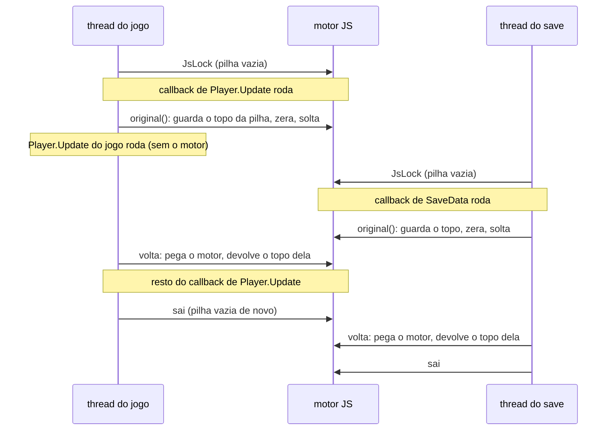

# Threads e o motor JS

> Parte da documentação do núcleo ([visão geral](README.md)). Para o lado de
> quem escreve mod, o que importa daqui está resumido no [guia de
> custo](../mods/03-custo-e-desempenho.md#quando-o-motor-está-ocupado-ifbusy).

## O problema em uma frase

O Terraria roda código em **várias threads** ao mesmo tempo, e o motor que
executa os mods (o QuickJS) é **um só** e não aceita duas threads dentro dele
ao mesmo tempo.

Todo mod mora no mesmo `JSRuntime` e no mesmo `JSContext`. É isso que deixa um
mod chamar o outro com uma chamada de função comum ([guia 11](../mods/11-conversa-entre-mods.md)).
Mas um hook pode disparar em qualquer thread que chame o método hookado, e o
QuickJS não é *thread-safe*: dois `JS_Call` ao mesmo tempo no mesmo runtime
corrompem o heap do motor, e o jogo cai "às vezes", sem padrão.

Este documento explica como o núcleo organiza isso: quem pode entrar no motor,
quando, e o que acontece com quem precisa esperar.

## Quem roda código de mod

| Thread | O que roda de mod | Exemplos |
|---|---|---|
| **Thread do jogo** (a principal da Unity) | Quase tudo: hooks de todo quadro, desenho, IA, as classes de mod. | `Main.DoUpdate`, `Main.DoDraw`, `Player.Update`, `NPC.AI`, `ModItem.UseItem`. |
| **Sonda** (thread do Bunny Loader) | O topo de cada `main.js`: `register`, `import`, `.hook()`. Roda uma vez, no boot. | `ModItem.register(ExampleItem)`. |
| **Geração de mundo** (do jogo) | Hooks nos métodos que a geração chama. | `Item.SetDefaults` dos itens de baú. |
| **Carga do mundo** (do jogo) | Hooks na carga. | `Item.SetDefaults`, os saves de tile e de morador. |
| **Save** (do jogo, `ThreadPool`) | Hooks no save do personagem e do mundo. | `Player.InternalSavePlayerFile` → `ModPlayer.SaveData`. |
| **Rede** (do jogo) | Hooks no caminho da rede, no multijogador. | Save do personagem no cliente. |

As threads de áudio do Android (SoundPool, MediaPlayer) e a de interface do
app **não** rodam JS: o áudio de mod é comandado da thread do jogo e segue
sozinho.

A thread do jogo é identificada no primeiro `Main.DoUpdate`
(`runtime::noteGameThread`, em [`boot/Boot.cpp`](../../app/src/main/cpp/boot/Boot.cpp)).
Algumas operações só valem nela, porque a Unity só aceita criar objetos na
thread principal: `bl.loadTexture`, `bl.loadTextureAsset`,
`ModContent.Request`, e o crescimento das tabelas de conteúdo. Chamadas fora
dela lançam erro dizendo isso, em vez de derrubar a Unity.

## A trava: `JsLock`

Toda entrada no QuickJS passa por um `JsLock`
([`script/bridge/ScriptEngine.h`](../../app/src/main/cpp/script/bridge/ScriptEngine.h)):
o despachante dos hooks, a carga dos mods, o `bl.onContentReady`, os
callbacks nativos das classes de mod.

- É um `std::timed_mutex` global, **recursivo por thread**: um contador por
  thread (`depth`) deixa a mesma thread entrar de novo sem travar. É o caso
  normal de callback → método do jogo → outro método hookado → callback, tudo
  na mesma thread.
- Quem entra do zero anota que é o **dono** (a thread e, no hook, o método).
  Isso só serve para o aviso de quem esperou demais (abaixo).
- Ao pegar a trava, `JS_UpdateStackTop` **realinha o limite de pilha** do
  QuickJS com a thread atual. O QuickJS deduz o limite a partir do ponteiro de
  pilha de quando foi chamado. Sem isso, os mods, carregados na thread da
  sonda, recebiam `Maximum call stack size exceeded` na primeira chamada na
  thread do jogo, com um script de 20 linhas.
- Hooks esperam **no máximo 3 s**. Se outra thread segurar o motor esse tempo
  todo, o mais provável é um impasse (ela esperando por algo desta), e rodar o
  método sem o mod é melhor que congelar o jogo. A carga dos mods espera o
  quanto for preciso.

O limite de pilha do motor é **256 KB** (`JS_SetMaxStackSize`). O QuickJS
supõe 1 MB, e a thread do Android tem exatamente isso: a guarda dele só
disparava **depois** do estouro de verdade, e um mod com recursão infinita
matava o processo sem erro e sem tombstone. Com folga, o mesmo mod recebe
`Maximum call stack size exceeded` e o jogo segue. É também esse limite que
cabe ~55 hooks encadeados no mesmo método.

## Segurar o motor durante o método do jogo

Um hook típico:

```js
Terraria.Player['void Update(int i)'].hook((original, self, i) => {
    original(self, i);          // o Player.Update do jogo inteiro roda aqui
    if (self.statLife < 100) self.statLife = 100;
});
```

Se o motor ficasse preso durante o `original()`, ele ficaria preso durante o
`Player.Update` **inteiro**, que não é JS nenhum. Pior: um hook na thread do
save seguraria o motor durante o save inteiro, e a thread do jogo, caindo em
qualquer hook, ficaria esperando (até 3 s, e depois rodaria sem o mod, com o
aviso "motor JS ocupado").

Por isso o `original()` **solta** o motor enquanto o método do jogo roda, e o
pega de volta depois (`JsSuspend`, usado por `callRaw(..., suspend = true)`).

### Por que soltar não é só dar `unlock`

O QuickJS guarda a pilha de frames JS em execução **no runtime**
(`rt->current_stack_frame`), não na thread. E desempilhar é uma atribuição
absoluta: ao sair de uma função, `rt->current_stack_frame = sf->prev_frame`.

Imagine duas threads, cada uma no meio de um callback, as duas no `original()`
ao mesmo tempo. A thread A voltaria e desempilharia pondo o `prev_frame`
**dela**, por cima da pilha da B. Quando a B voltasse, o runtime apontaria para
frames que já não existem.

A versão antiga resolvia deixando **uma thread estacionada por vez**. Mas a
thread do jogo passa quase o quadro inteiro dentro de algum `original()`, e
então um hook na thread do save não conseguia estacionar e segurava o motor o
método inteiro. Foi isso que produziu o aviso "motor JS ocupado por outra
thread há 3000 ms" no hook da música, num aparelho de usuário.

### A solução: cada thread leva a sua pilha

Desde 2026-09-26, ao soltar o motor, a thread **guarda o topo da sua pilha de
frames e deixa a do runtime vazia**; ao pegar de volta, **devolve o topo**.
O limite de pilha segue a mesma ideia: os 256 KB de uma thread são contados de
onde ela **entrou** no motor pela primeira vez (`rt->stack_top`), e toda
entrada aninhada (um hook que dispara de dentro de um `original()`) e toda
volta de um `original()` reusam esse topo.



A invariante que sustenta tudo: **motor livre ⇒ pilha do runtime vazia**.
Quem entra do zero começa numa pilha vazia e sai deixando-a vazia. O
destrutor do `JsLock` confere isso e, se sobrar frame, zera e loga (seria um
defeito nosso).

Os campos `current_stack_frame` e `stack_top` ficam dentro da struct
`JSRuntime`, que é opaca fora do `quickjs.c`. Em vez de mexer no clone do
QuickJS, [`script/bridge/QuickJsExt.c`](../../app/src/main/cpp/script/bridge/QuickJsExt.c)
faz `#include "quickjs.c"` e expõe o **endereço** da pilha de frames e o
acesso ao topo da pilha nativa; o CMake compila esse arquivo no lugar do
`quickjs.c`. Guardar e devolver a pilha vira uma leitura e uma escrita de
ponteiro, sem chamada. Se um dia um campo mudar de nome, o build quebra ali, e
não o motor em silêncio.

Por que o topo da pilha nativa também: o `JS_UpdateStackTop` do QuickJS só
sabe pôr o ponteiro de pilha **atual**. Com o motor solto dentro de um
`original()`, o hook aninhado entra "do zero", e realinhar ali (mais fundo na
pilha do que quando a cadeia começou) reabria os 256 KB a cada nível: uma
cadeia de hooks podia estourar a pilha nativa sem o `Maximum call stack size
exceeded`. Foi assim por algumas horas no mesmo dia (o `hookslots` passou de 53
para 120 hooks encadeados) até a correção: cada thread guarda o seu topo base
e um contador de `original()` em andamento. Com ela, cabem 55.

Com isso, qualquer número de threads pode estar num `original()` ao mesmo
tempo, e o motor fica preso **só enquanto o JS roda de verdade**.

### O custo

Medido no MuMu, alternando builds: um hook que chama o `original()` foi de
~595 para ~750 ns; sem `original()`, igual; tempo de quadro, igual. Parte
dessa diferença é de onde o código caiu na memória (o MuMu traduz ARM para x86
e sente isso), não do que ele faz. Soltar o motor custa quatro operações
atômicas, então só o **hook** solta: uma chamada que o mod faz ao jogo
(`player.GetWeaponDamage(item)`) segura o motor, porque o método é curto e
soltar custaria mais que a chamada (uma propriedade C# foi de 4 para 11 ms por
10 mil chamadas quando soltava sempre).

O teste [`tools/tests/enginethreads`](../../tools/tests/enginethreads)
reproduz o caso extremo: a thread do jogo dorme 100 ms em todo quadro dentro
de um `original()`, e a thread do save dorme 1,5 s dentro do `SaveData` de um
`ModPlayer`. Com a regra antiga, 0 quadros andavam em 1,5 s; com a nova, os
quadros seguem, e depois de acordar cada thread vê a própria pilha JS
(`Error.stack`) e o `try`/`catch` funciona.

## Quando o motor está ocupado: `ifBusy`

Mesmo com o motor preso só durante JS, uma thread pode esperar: se o save
roda um `SaveData` pesado, a thread do jogo que cair num hook naquele instante
espera o JS do save terminar. O padrão é esperar até 3 s.

Para um hook de **todo quadro** que pode ficar **um quadro sem o mod**, o mod
escolhe não esperar:

| `ifBusy` | Com o motor ocupado | Para quê |
|---|---|---|
| `'wait'` (padrão) | Espera até 3 s. Se não der, roda o método sem o mod e avisa uma vez. | O normal: o mod precisa rodar. |
| `'original'` | Roda na hora só o método do jogo. | Efeito que pode pular um quadro: um fade, uma cor. |
| `'skip'` | Não roda nada (só em método `void`): fica valendo o quadro anterior. | Uma decisão que o quadro anterior já tomou. |

A música de mod usa as duas: `UpdateAudio_DecideOnNewMusic` com `'skip'` (a
música escolhida no quadro anterior continua valendo) e `UpdateAudio` com
`'original'` (o fade do jogo roda, o do mod pula um quadro). O teste
[`tools/tests/ifbusy`](../../tools/tests/ifbusy) prende o motor numa thread de
save e confere as três opções.

## O aviso "motor JS ocupado"

```
hook Main.UpdateAudio_DecideOnNewMusic: motor JS ocupado ha 3000 ms por
thread 15840 (Thread-7), no hook Player.InternalSavePlayerFile; rodando o
metodo sem o mod (aviso unico por hook)
```

Como ler:

- o **primeiro** método é o hook que esperou e desistiu;
- `thread 15840 (Thread-7)` é quem estava com o motor (o `tid` do Linux e o
  nome da thread, lido de `/proc/self/task/<tid>/comm`);
- `no hook ...` é onde ela estava. "fora de hook" quer dizer carga de mod ou
  de conteúdo (`bl.onContentReady`);
- sai **uma vez por hook**, para não inundar o log.

Se aparecer, a thread dona está rodando JS demorado (um laço grande num
`SaveData`, por exemplo). Encurtar o que ela faz resolve; `ifBusy` no hook que
esperou evita a espera.

## Exceções entre as camadas

- **Erro no JS de um hook**: logado com a pilha JS, e o original roda se o
  callback não o chamou ([hooks](hooks.md#o-despachante-passo-a-passo)).
- **Exceção C# num método que o mod chamou** (um `NullReferenceException` lá
  dentro, por exemplo): vira `InternalError` no JS (`'NomeDoMetodo' lancou
  excecao no jogo`), que o mod pode pegar com `try`/`catch`.
- **Exceção C# dentro do `original()` de um hook**: quem chamou foi o jogo, e
  não há para quem devolvê-la. Ela é logada e o retorno fica zerado.
- O `JsSuspend` fica **fora** do `try` da chamada de propósito: no caminho da
  exceção, o motor precisa ser pego de volta depois do `catch`, não durante o
  desenrolar da pilha.

## Resumo das regras

1. Toda entrada no QuickJS passa por `JsLock`.
2. Só o hook solta o motor durante o método do jogo; chamadas feitas pelo mod
   seguram.
3. Motor livre ⇒ pilha do runtime vazia. Cada thread leva a sua ao soltar.
4. Hook espera no máximo 3 s (`ifBusy` muda isso); carga de mod espera o
   necessário.
5. Objeto da Unity (textura) só nasce na thread do jogo.
6. A pilha do motor tem 256 KB, em qualquer thread.
