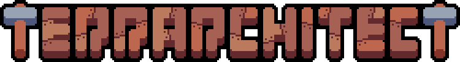
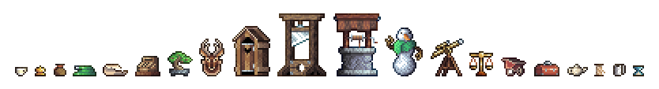

# 

[c/DA9C6E:Terrarchitect is a furniture / build mod that adds a wide variety of custom-made, high-quality decorational items and blocks to Terraria! It also aims to make some previously ubobtainable or unplacable vanilla items available.]

[c/DA9C6E:Whether you're a dedicated builder who wants to add more detail to his creations our you're more interested in the game's progression but still want your base to look good, this mod has something for everybody.]

---

{w=100%}

[c/DA9C6E:We want to add more content in the future, so stay tuned!]

> To keep up with the development process, feel free to join our subreddit **r/Terrarchitect**.