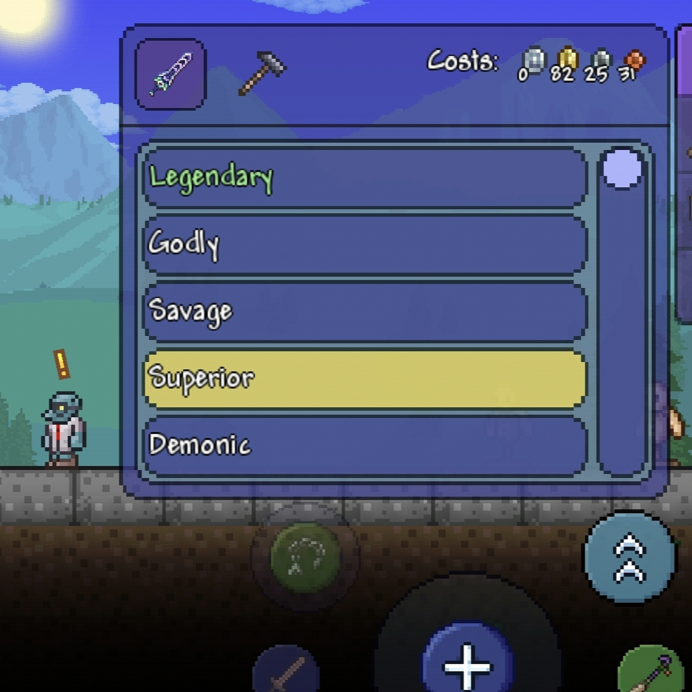

## Info

Replaces the traditional Goblin Tinkerer interface with a new system that allows you to browse and select item prefixes directly.

This update introduces a cleaner and more modern interface that blends seamlessly with Terraria's visual style, making reforging easier and more intuitive.

> Fully compatible with all prefixes available in the game