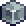
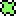
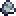
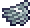
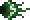

Uma parte do **ExampleMod do tModLoader**, refeita para o Bunny Loader. Tudo é
conteúdo **novo**, sem trocar nada do jogo, e aparece no Mod Menu, na pasta
*Itens* do mod.

> [!TIP]
> Comece pelo  **Exemplo de Item**:
> 10 [i:2] Blocos de Terra numa [i:36] Bancada dão 999. Quase tudo do mod sai
> dele. As receitas estão na aba **Receitas**.

## Blocos e móveis

- O  **Bloco de Exemplo** sai
  por receita e o  **Minério de
  Exemplo** pelo Mod Menu.
- A **Pia de Exemplo** é um móvel 2x2 que conta como água para as receitas.
- A  **Bancada de
  Exemplo** faz cadeira, mesa, cama, porta, baú, relógio, lustre, tocha e o resto:
  - a cadeira senta, a cama marca o nascimento, a porta abre e o baú guarda;
  - a fogueira dá o buff, e a caixa de música toca a música do chefe.

## Armaduras e acessórios

| Peça | O que faz |
|---|---|
| Capacete, Peitoral e Calças de Exemplo | Conjunto: [c/5FB86A:+20% de dano] |
|  Asas de Exemplo | Voam |
| Barba de Exemplo | Pinta com a cor do cabelo |
| Fantasia de Exemplo | Vira um boneco quadrado perto dos moradores |
| Manto de Exemplo | Cobre as pernas |

## Prefixos

Os prefixos do Exemplo aparecem na reforja e no item criado: [c/F9E141:+20%] e
[c/F9E141:+40%] de dano em qualquer arma, e [c/6FA3E8:+4 de defesa] no
acessório. A *Arma de Exemplo de Várias Categorias* pega os prefixos de corpo a
corpo **e** de magia.

## Pets, lacaios e a Pessoa

- Os pets **Aviãozinho** e **Luz Irritante** vão no slot de pet e de luz.
- O Cajado do Lacaio e o da Sentinela invocam quem luta por você.
-  A **Pessoa** se muda para
  uma casa quando alguém tem o Exemplo de Item, conversa, vende armas do mod (uma
  delas na moeda do Exemplo de Item) e defende a vila.

## O chefe

O **Olho de ???** nasce à noite com o
 item de invocação
e traz a própria música. Ele pode soltar a máscara dele.

> [!NOTE]
> Itens, blocos e moradores ficam salvos no personagem e no mundo, e o mundo
> continua abrindo **sem** o mod.
